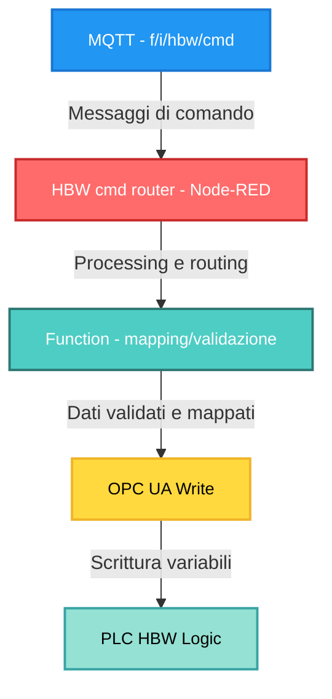

# CONTROLLO MANUALE HBW TRAMITE MQTT
## Relazione Tecnica di Progetto

---

## 1. INTRODUZIONE

Nel contesto della microfactory didattica Industry 4.0, il modulo HBW (High-Bay Warehouse, magazzino verticale automatizzato) è normalmente controllato tramite una dashboard HMI basata su Node-RED, che comunica con il PLC Siemens S7-1500 mediante protocollo OPC UA.

L'obiettivo di questo lavoro è stato quello di estendere il sistema esistente introducendo la possibilità di controllare manualmente il modulo HBW tramite comandi MQTT, senza modificare la logica PLC originale e senza compromettere la stabilità dell'impianto.

---

## 2. OBIETTIVO DEL LAVORO

L'obiettivo principale del progetto è stato:

- Permettere il **controllo manuale del modulo HBW via MQTT**
- Replicare fedelmente le funzionalità disponibili nell'HMI ufficiale
- Mantenere il **PLC come unica autorità decisionale**
- Evitare interventi invasivi sul sistema esistente

In particolare, il sistema doveva consentire:

- Attivazione/disattivazione della modalità di posizionamento manuale
- Selezione di posizioni preconfigurate
- Esecuzione delle fasi di movimento previste dal PLC (START, OFFSET, FINAL, HOME)

---

## 3. PRINCIPIO CHIAVE

### ⚠️ Il PLC rimane l'unica fonte di verità

Il principio fondamentale su cui si basa l'intero progetto è il seguente:

- **MQTT non comanda direttamente i motori**
- **MQTT non scrive nello stato del sistema**
- **MQTT simula l'interazione dell'operatore con l'HMI**

### Flusso di controllo

Ogni comando MQTT viene tradotto nel seguente percorso:

```
MQTT → Node-RED → OPC UA Write → PLC → Attuatori HBW
```

Questo approccio garantisce:

- **Sicurezza** operativa
- **Compatibilità** con la logica originale del PLC
- **Nessun rischio** di crash o deadlock
- **Tracciabilità** delle operazioni

---

## 4. ARCHITETTURA DEL SISTEMA

### 4.1 Flusso logico dei dati

L'architettura adottata si basa su una integrazione **non intrusiva** tra MQTT, Node-RED e PLC:


### 4.2 Ruoli dei componenti

- **MQTT**: interfaccia di comando ad alto livello
- **Node-RED**: livello di traduzione, validazione e routing
- **OPC UA**: protocollo standard di comunicazione industriale
- **PLC**: esecuzione della logica di controllo reale

---

## 5. SCELTE PROGETTUALI

### 5.1 Perché non comandare direttamente il PLC

Una scelta fondamentale è stata quella di **non scrivere direttamente** variabili di stato o coordinate nel PLC.

**Motivazioni:**

- La **logica di sicurezza** è implementata nel PLC
- Il PLC gestisce correttamente **priorità e collisioni**
- La scrittura diretta avrebbe potuto causare **blocchi o stati incoerenti**
- Il sistema originale deve rimanere **stabile e certificato**

Il sistema MQTT si limita quindi a **pilotare i segnali già previsti** dall'HMI ufficiale, replicandone esattamente il comportamento.

---

## 6. TOPIC MQTT UTILIZZATO

Per il controllo del modulo HBW è stato definito il seguente topic:

**Topic**: `f/i/hbw/cmd`

**Caratteristiche:**

- **Direzione**: INPUT (verso Node-RED)
- **Formato payload**: JSON
- **Modalità**: un comando per messaggio

---

## 7. MODALITÀ DI POSIZIONAMENTO MANUALE

Prima di poter inviare qualsiasi comando di movimento, è **necessario** abilitare la modalità di posizionamento manuale.

### 7.1 Abilitazione

```json
{
  "cmd": "enable_pos_move"
}
```

Questo comando è **equivalente** allo switch "Activate pos. move" presente nell'HMI ufficiale.

**Effetto:**

- Abilita il controllo manuale del modulo HBW
- Blocca la gestione automatica del modulo
- Prerequisito per tutti i comandi successivi

⚠️ **Senza questa abilitazione:**

- Il PLC **ignora** i comandi di movimento
- Il modulo rimane in **gestione automatica**

### 7.2 Disabilitazione

```json
{
  "cmd": "disable_pos_move"
}
```

Ripristina il comportamento automatico del sistema e riabilita la logica standard del PLC.

---

## 8. SELEZIONE DELLA POSIZIONE HBW

Le posizioni disponibili sono definite nel **Config Data del PLC** e caricate all'avvio del sistema.

### 8.1 Posizioni supportate

| Posizione | Descrizione |
|-----------|-------------|
| **BELT** | Posizione nastro trasportatore |
| **A1** | Rack riga A, colonna 1 |
| **B2** | Rack riga B, colonna 2 |
| **C3** | Rack riga C, colonna 3 |

### 8.2 Comando MQTT

```json
{
  "cmd": "select",
  "pos": "A1"
}
```

Oppure:

```json
{
  "cmd": "select",
  "pos": "BELT"
}
```

### 8.3 Gestione del mapping

Node-RED si occupa di:

- **Validare** la stringa ricevuta
- **Tradurla** nel valore numerico richiesto dal PLC (0=BELT, 1=A1, 2=B2, 3=C3)
- **Inoltrare** il comando tramite OPC UA

📌 **Nota**: Il mapping stringa → valore numerico viene effettuato in Node-RED per rispettare il formato richiesto dal flow ufficiale.

---

## 9. COMANDI DI MOVIMENTO

⚠️ Tutti i comandi seguenti funzionano **solo se** `enable_pos_move` è attivo.

### 9.1 START OFFSET

```json
{
  "cmd": "offset"
}
```

**Funzione tecnica:**

- Porta il carrello in una **posizione di sicurezza**
- Evita **collisioni meccaniche**
- Replica la fase preparatoria dell'HMI

👉 È una **fase di sicurezza**, non un movimento finale.

### 9.2 START (movimento principale)

```json
{
  "cmd": "start"
}
```

**Funzione:**

- Avvia il movimento verso la **posizione selezionata**
- Usa le **coordinate nominali** caricate dal PLC
- Esegue il posizionamento grossolano

### 9.3 FINAL (assestamento)

```json
{
  "cmd": "final"
}
```

**Funzione:**

- **Completa** il posizionamento
- Rifinisce l'**allineamento meccanico**
- Tipicamente usato prima di **presa/rilascio pezzo**

### 9.4 HOME

```json
{
  "cmd": "home"
}
```

**Funzione:**

- Riporta il modulo HBW in **posizione di riferimento**
- Effettua un **reset meccanico sicuro**
- Riporta gli assi alle coordinate 0,0

---

## 10. SEQUENZA CORRETTA DI UTILIZZO

La sequenza **consigliata e sicura** è:

1. **`enable_pos_move`** – attiva il controllo manuale
2. **`select`** (BELT / A1 / B2 / C3) – seleziona la posizione target
3. **`offset`** – posizionamento di sicurezza
4. **`start`** – movimento principale
5. **`final`** – assestamento finale
6. **`disable_pos_move`** (opzionale) – ritorno all'automatico

### ⚠️ Importanza della sequenza

**Saltare `offset` può causare:**

- Rifiuto del comando da parte del PLC
- Nessun movimento apparente
- Comportamento incoerente o errori meccanici

---

## 11. GESTIONE SICUREZZA E LIMITI

### 11.1 Cose volutamente NON implementate

❌ Scrittura diretta di coordinate  
❌ Bypass della logica PLC  
❌ Controllo diretto dei motori  
❌ Comandi concorrenti  

### 11.2 Motivazione

Il sistema è progettato per:

- **Un comando alla volta**
- **Movimenti deterministici**
- **Priorità alla sicurezza**
- **Compatibilità con il sistema esistente**

---

## 12. RISULTATI OTTENUTI

Il sistema sviluppato ha permesso di:

✅ Controllare manualmente il modulo HBW via MQTT  
✅ Integrare il controllo senza modificare il PLC  
✅ Mantenere piena compatibilità con l'HMI ufficiale  
✅ Garantire sicurezza e stabilità operativa  

Il comportamento osservato tramite MQTT è risultato **coerente** con quello dell'HMI, confermando la correttezza dell'approccio adottato.

---

## 📡 Tabella comandi MQTT – Controllo manuale HBW

### Topic di comando

`f/i/hbw/cmd`

- **Direzione**: input verso Node-RED
    
- **Formato payload**: JSON
    
- **Modalità**: un comando per messaggio
    

---

### 🔧 Comandi disponibili

| Categoria               | Comando MQTT (`cmd`) | Payload completo                     | Funzione                                          | Note operative                                    |
| ----------------------- | -------------------- | ------------------------------------ | ------------------------------------------------- | ------------------------------------------------- |
| **Abilitazione**        | `enable_pos_move`    | `{ "cmd": "enable_pos_move" }`       | Abilita la modalità di posizionamento manuale     | **OBBLIGATORIO** prima di qualsiasi altro comando |
| **Abilitazione**        | `disable_pos_move`   | `{ "cmd": "disable_pos_move" }`      | Disabilita la modalità manuale                    | Ripristina la gestione automatica                 |
| **Selezione posizione** | `select`             | `{ "cmd": "select", "pos": "BELT" }` | Seleziona la posizione nastro                     | Non genera movimento                              |
| **Selezione posizione** | `select`             | `{ "cmd": "select", "pos": "A1" }`   | Seleziona rack A1                                 | Mapping gestito da Node-RED                       |
| **Selezione posizione** | `select`             | `{ "cmd": "select", "pos": "B2" }`   | Seleziona rack B2                                 |                                                   |
| **Selezione posizione** | `select`             | `{ "cmd": "select", "pos": "C3" }`   | Seleziona rack C3                                 |                                                   |
| **Movimento**           | `offset`             | `{ "cmd": "offset" }`                | Porta il modulo in posizione di sicurezza         | **Consigliato prima di START**                    |
| **Movimento**           | `start`              | `{ "cmd": "start" }`                 | Avvia il movimento verso la posizione selezionata | Funziona solo se `enable_pos_move` è attivo       |
| **Movimento**           | `final`              | `{ "cmd": "final" }`                 | Completa il posizionamento                        | Rifinitura / assestamento                         |
| **Movimento**           | `home`               | `{ "cmd": "home" }`                  | Riporta il modulo in home                         | Reset meccanico sicuro                            |

---

## 13. CONSIDERAZIONI FINALI

Il lavoro dimostra come sia possibile **estendere un sistema industriale esistente** introducendo nuove modalità di controllo, **senza compromettere l'architettura originale**.

### Vantaggi dell'approccio

L'uso di MQTT come interfaccia di alto livello consente:

- **Flessibilità** di integrazione
- **Interoperabilità** con sistemi esterni
- **Sperimentazione controllata**
- **Scalabilità** futura

Lasciando al PLC la **responsabilità delle decisioni critiche**, si mantiene:

- Sicurezza operativa
- Certificazione del sistema
- Affidabilità industriale

---

**Data**: Febbraio 2026  
**Sistema**: Learning Factory 4.0 24V - fischertechnik  
**Modulo**: HBW (High-Bay Warehouse)  
**Tecnologie**: MQTT, Node-RED, OPC UA, PLC Siemens S7-1500  
