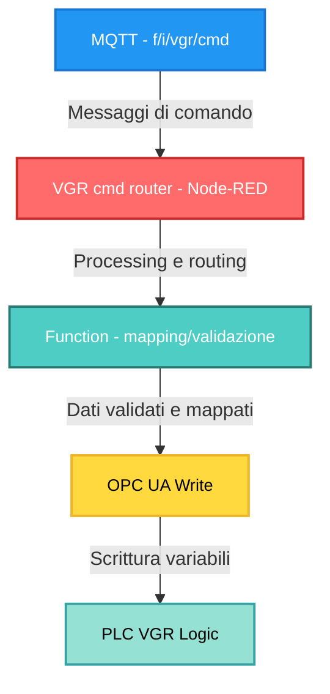
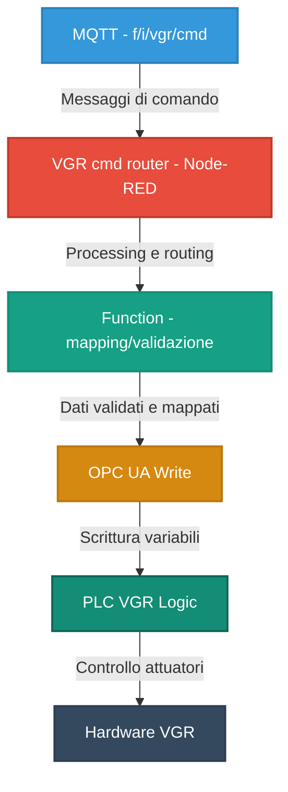

# CONTROLLO MANUALE VGR TRAMITE MQTT
## Relazione Tecnica di Progetto

---

## 1. INTRODUZIONE

Nel contesto della microfactory didattica Industry 4.0, il modulo VGR (Vacuum Gripper Robot - Robot a 3 assi con ventosa) rappresenta uno degli elementi più complessi del sistema di produzione automatizzato. Il VGR è normalmente controllato tramite una dashboard HMI basata su Node-RED, che comunica con il PLC Siemens S7-1500 mediante protocollo OPC UA.

L'obiettivo di questo lavoro è stato quello di estendere il sistema esistente introducendo la possibilità di controllare manualmente il modulo VGR tramite comandi MQTT, senza modificare la logica PLC originale e mantenendo piena compatibilità con il sistema esistente.

---

## 2. OBIETTIVO

L'obiettivo principale del progetto è stato:

- Abilitare il **controllo manuale del modulo VGR via MQTT**
- Replicare fedelmente le funzionalità disponibili nell'HMI ufficiale
- Mantenere il **PLC come unica autorità decisionale**
- Garantire l'integrazione del VGR in flussi esterni (orchestrazione, test, debug, automazione)
- Evitare interventi invasivi sul sistema esistente

In particolare, il sistema doveva consentire:

- Attivazione/disattivazione della modalità di posizionamento manuale
- Selezione di posizioni preconfigurate (preset PLC)
- Esecuzione delle fasi di movimento previste dal PLC (START, FINAL, HOME)
- Coordinamento con altri moduli (HBW, NFC, SLD)

---

## 3. IL MODULO VGR: CARATTERISTICHE TECNICHE

### 3.1 Descrizione del sistema

Il VGR è un **robot cartesiano a 3 assi** con ventosa pneumatica per la manipolazione di pezzi. Secondo la definizione VDI 2860, si tratta di un robot industriale per compiti di handling.

**Caratteristiche cinematiche:**

- **Asse X (orizzontale)**: range 270 mm
- **Asse Y (avanti/indietro)**: range 140 mm  
- **Asse Z (verticale)**: range 120 mm
- **Asse R (rotazione)**: movimento rotatorio completo

**Spazio di lavoro:**

Il volume raggiungibile corrisponde a un **cilindro cavo** il cui asse verticale coincide con l'asse di rotazione del robot.

### 3.2 Ciclo operativo tipico

Le operazioni tipiche del VGR si articolano in:

1. **Posizionamento** della ventosa sul pezzo
2. **Presa** del pezzo (attivazione vuoto)
3. **Trasporto** del pezzo nello spazio di lavoro
4. **Rilascio** del pezzo nella posizione target

---

## 4. PRINCIPIO CHIAVE

Il principio fondamentale su cui si basa l'intero progetto è il seguente:

- **MQTT non comanda direttamente i motori**
- **MQTT non scrive coordinate o setpoint direttamente**
- **MQTT seleziona preset già definiti nel PLC**
- **MQTT simula l'interazione dell'operatore con l'HMI**

### Flusso di controllo

Ogni comando MQTT viene tradotto nel seguente percorso:



Questo approccio garantisce:

- **Sicurezza** operativa (cinematica validata dal PLC)
- **Compatibilità** con la logica originale
- **Nessun rischio** di collisioni o movimenti non sicuri
- **Tracciabilità** delle operazioni

---

## 5. ARCHITETTURA DEL SISTEMA

### 5.1 Modello a responsabilità separata

L'architettura adottata si basa su una **separazione netta delle responsabilità**:

**PLC:**
- Contiene tutte le **posizioni preset**
- Gestisce la **cinematica del VGR** (calcolo traiettorie)
- **Valida** e realizza i movimenti
- Implementa la **logica di sicurezza**

**Node-RED:**
- Funge da **bridge** tra MQTT e PLC
- Traduce i comandi testuali in segnali compatibili con il flusso HMI esistente
- **Non introduce logica di movimento autonoma**
- Effettua validazione formale dei comandi

**MQTT:**
- Fornisce un'interfaccia **leggera e standardizzata**
- Permette il controllo **manuale e remoto** del modulo
- Facilita l'integrazione con sistemi esterni

### 5.2 Flusso logico completo
``


---

## 6. TOPIC MQTT UTILIZZATO

Per il controllo del modulo VGR è stato definito il seguente topic:

**Topic**: `f/i/vgr/cmd`

**Caratteristiche:**

- **Direzione**: INPUT (verso Node-RED)
- **Formato payload**: JSON
- **Modalità**: un comando per messaggio
- **QoS consigliato**: 0

---

## 7. MODALITÀ DI POSIZIONAMENTO MANUALE

### 7.1 Abilitazione

Prima di qualsiasi movimento, è **obbligatorio** abilitare la modalità di posizionamento manuale del VGR.

**Comando:**

```json
{
  "cmd": "enable_pos_move"
}
```

**Funzione:**

- Abilita il **controllo manuale** del VGR
- Replica il comportamento dello switch **"Activate pos. move"** dell'HMI
- Blocca temporaneamente la **logica automatica** della factory

⚠️ **Nota operativa critica:**

Se questo comando non viene inviato, **tutti gli altri comandi vengono ignorati dal PLC**. Il VGR rimane in modalità automatica e non risponde ai comandi MQTT successivi.

### 7.2 Disabilitazione

**Comando:**

```json
{
  "cmd": "disable_pos_move"
}
```

**Funzione:**

- Disattiva la modalità manuale
- Restituisce il controllo alla **logica automatica** della microfactory
- Fondamentale al termine dei test o dei movimenti manuali

---

## 8. SELEZIONE DELLA POSIZIONE (PRESET PLC)

### 8.1 Principio operativo

Il VGR **non riceve coordinate cartesiane dirette** via MQTT.

Le posizioni sono **predefinite nel PLC** (ConfigData) e identificate da **codici numerici** univoci.

Il comando `select` serve a **caricare nel PLC il preset desiderato**, senza avviare immediatamente il movimento.

### 8.2 Comando generale

```json
{
  "cmd": "select",
  "pos": <numero_preset>
}
```

### 8.3 Mappatura completa delle posizioni VGR

La seguente tabella riporta l'elenco completo dei preset disponibili:
	
| Ordine | Posizione logica | Codice PLC | Payload MQTT                                 | Funzione                                 | Note operative                  |
| ------ | ---------------- | ---------- | -------------------------------------------- | ---------------------------------------- | ------------------------------- |
| 2      | Color Reader     | 41         | `{ "cmd": "select", "pos": "COLOR_READER" }` | Porta il VGR in posizione lettura colore | Usata per identificazione pezzo |
| 3      | DSI collect      | 42         | `{ "cmd": "select", "pos": "DSI_COLLECT" }`  | Prelievo da DSI                          | Raccolta pezzo                  |
| 4      | DSI discard      | 43         | `{ "cmd": "select", "pos": "DSI_DISCARD" }`  | Scarto su DSI                            | Per pezzi non validi            |
| 5      | DSO collect      | 44         | `{ "cmd": "select", "pos": "DSO_COLLECT" }`  | Prelievo da DSO                          | Sequenza alternativa            |
| 6      | DSO discard      | 45         | `{ "cmd": "select", "pos": "DSO_DISCARD" }`  | Scarto su DSO                            |                                 |
| 7      | HBW collect      | 46         | `{ "cmd": "select", "pos": "HBW_COLLECT" }`  | Prelievo dal magazzino HBW               | Coordinato con HBW              |
| 8      | HBW discard      | 47         | `{ "cmd": "select", "pos": "HBW_DISCARD" }`  | Deposito verso HBW                       |                                 |
| 9      | MPO              | 48         | `{ "cmd": "select", "pos": "MPO" }`          | Posizione MPO                            | Trasferimento                   |
| 10     | NFC              | 49         | `{ "cmd": "select", "pos": "NFC" }`          | Posizione lettore NFC                    | Identificazione pezzo           |
| 11     | NiO              | 50         | `{ "cmd": "select", "pos": "NIO" }`          | Scarto NiO                               | Pezzo difettoso                 |
| 12     | SLD blue         | 51         | `{ "cmd": "select", "pos": "SLD_BLUE" }`     | Deposito SLD blu                         |                                 |
| 13     | SLD red          | 52         | `{ "cmd": "select", "pos": "SLD_RED" }`      | Deposito SLD rosso                       |                                 |
| 14     | SLD white        | 53         | `{ "cmd": "select", "pos": "SLD_WHITE" }`    | Deposito SLD bianco                      |                                 |

📌 **Nota fondamentale**  
I numeri **41–53 devono combaciare esattamente** con quelli definiti nel PLC / ConfigData.  
Node-RED **non può cambiarli**, ma solo **inoltrarli** al PLC tramite OPC UA.
La mappatura è **rigida** e definita in fase di configurazione del sistema.
 
---

## 1️⃣  Comandi ausiliari

| Comando          | Payload                         | Funzione                                                              | Note operative                                                                                                                                      |
| ---------------- | ------------------------------- | --------------------------------------------------------------------- | --------------------------------------------------------------------------------------------------------------------------------------------------- |
| enable_pos_move  | `{ "cmd": "enable_pos_move" }`  | Abilita il controllo manuale del VGR                                  | **Obbligatorio** prima di qualsiasi selezione o movimento. Se non attivo, il PLC ignora i comandi successivi. Blocca eventuali logiche automatiche. |
| disable_pos_move | `{ "cmd": "disable_pos_move" }` | Disabilita modalità manuale                                           | **Fondamentale** per restituire il controllo alla logica automatica                                                                                 |
| start            | `{ "cmd": "start" }`            | Avvia fisicamente il movimento del VGR verso la posizione selezionata | Deve arrivare **dopo** `select`. Senza `start`, il VGR non si muove.                                                                                |
| home             | `{ "cmd": "home" }`             | Riporta il VGR in posizione di riferimento                            | Usato per reset o recovery                                                                                                                          |
| final            | `{ "cmd": "final" }`            | Conferma fine posizionamento                                          | Segnala al PLC che la posizione è stata raggiunta e l’azione completata.                                                                            |

### 8.4 Esempi di utilizzo

**Selezione posizione NFC:**

```json
{
  "cmd": "select",
  "pos": "NFC"
}
```

**Selezione posizione HBW collect:**

```json
{
  "cmd": "select",
  "pos": "HBW_COLLECT"
}
```


---

## 9. AVVIO DEL MOVIMENTO

### 9.1 Comando START

Dopo la selezione della posizione, il movimento **non parte automaticamente**.

È necessario un **comando esplicito di avvio**.

**Comando:**

```json
{
  "cmd": "start"
}
```

**Funzione:**

- Avvia il **movimento fisico** del VGR verso il preset selezionato
- Corrisponde al pulsante **START** dell'HMI
- Attiva i motori encoder per il posizionamento 3D

📌 **Senza questo comando, il VGR rimane fermo** anche se la posizione è correttamente selezionata.

### 9.2 Sequenza logica minima

```
1. enable_pos_move
2. select pos=XX
3. start       ← movimento effettivo
```

---

## 10. CONFERMA DI FINE POSIZIONAMENTO

### 10.1 Comando FINAL

Una volta raggiunta la posizione, è necessario **notificare al PLC** la conclusione dell'operazione.

**Comando:**

```json
{
  "cmd": "final"
}
```

**Funzione:**

- Segnala la **fine del ciclo di posizionamento**
- Permette al PLC di **sbloccare la sequenza successiva**
- Conferma che il pezzo può essere preso/rilasciato

📌 **Nota operativa:**

Questo comando è fondamentale per il coordinamento con altri moduli. Senza `final`, il PLC potrebbe non autorizzare operazioni successive (es. apertura ventosa, movimento HBW, ecc.).

---

## 11. COMANDI AUSILIARI

### 11.1 Ritorno alla posizione di riferimento (HOME)

**Comando:**

```json
{
  "cmd": "home"
}
```

**Funzione:**

- Riporta il VGR in **posizione di riferimento** (HOME position)
- Utilizzato per:
  - **Reset** del sistema
  - **Recovery** dopo errori
  - **Riallineamento meccanico**

### 11.2 Importanza del comando HOME

Il comando HOME è fondamentale per:

- **Calibrazione**: stabilisce il punto di riferimento degli assi
- **Sicurezza**: posizione nota e sicura
- **Manutenzione**: accesso facilitato ai componenti

---

## 12. SEQUENZA TIPICA DI UTILIZZO

### 12.1 Esempio: Ciclo completo di movimentazione pezzo

**Scenario**: Prelievo da HBW → Lettura NFC → Deposito SLD blu

**Sequenza comandi:**

```json
// 1. Abilita controllo manuale
{ "cmd": "enable_pos_move" }

// 2. Vai a posizione HBW collect
{ "cmd": "select", "pos": "HBW_COLLECT" }
{ "cmd": "start" }
{ "cmd": "final" }

// 3. Vai a posizione NFC
{ "cmd": "select", "pos": "NFC" }
{ "cmd": "start" }
{ "cmd": "final" }

// 4. Vai a posizione SLD blu
{ "cmd": "select", "pos": "SLD_BLUE" }
{ "cmd": "start" }
{ "cmd": "final" }

// 5. Disabilita controllo manuale
{ "cmd": "disable_pos_move" }
```

### 12.2 Considerazioni sulla sequenza

Questa sequenza:

- **Rispecchia fedelmente** il comportamento dell'HMI ufficiale
- **Coordina** il VGR con altri moduli (HBW, NFC, SLD)
- **Garantisce** la tracciabilità del pezzo
- **Mantiene** la sicurezza operativa

---

## 13. CONSIDERAZIONI PROGETTUALI

### 13.1 Architettura non intrusiva

Il controllo MQTT **non sostituisce il PLC**.

**Principi fondamentali:**

- Il PLC rimane l'**unico responsabile** della sicurezza e della cinematica
- Node-RED agisce esclusivamente come **adattatore di protocollo**
- Nessuna logica di movimento è implementata fuori dal PLC

### 13.2 Vantaggi dell'approccio

L'approccio garantisce:

✅ **Modularità**: il sistema MQTT può essere aggiunto/rimosso senza impatto  
✅ **Sicurezza**: la logica certificata del PLC rimane intatta  
✅ **Compatibilità**: piena integrazione con la fabbrica didattica originale  
✅ **Flessibilità**: possibilità di orchestrazione esterna  
✅ **Tracciabilità**: log completo delle operazioni  

### 13.3 Limitazioni volontarie

Sono state **volutamente escluse**:

❌ Scrittura diretta di coordinate cartesiane  
❌ Bypass della logica PLC  
❌ Controllo diretto dei motori  
❌ Comandi concorrenti non sincronizzati  

**Motivazione:**

Garantire che ogni movimento passi attraverso la **validazione del PLC**, che implementa:

- Controllo cinematico inverso
- Verifica limiti di corsa
- Gestione collisioni
- Logica di sicurezza

---

## 14. COORDINAMENTO VGR CON ALTRI MODULI

### 14.1 Interazione VGR-HBW

Il VGR coordina le sue operazioni con l'HBW per:

- **Prelievo** contenitori dal magazzino (pos 46)
- **Deposito** contenitori nel magazzino (pos 47)

**Sequenza tipica:**

1. HBW posiziona contenitore in zona transfer
2. VGR si sposta in pos 46 (HBW collect)
3. VGR preleva pezzo
4. HBW riporta contenitore in magazzino

### 14.2 Interazione VGR-NFC

Il VGR posiziona i pezzi sul lettore NFC (pos 49) per:

- **Identificazione** univoca del pezzo
- **Tracciabilità** nel ciclo produttivo
- **Scrittura** dati di processo sul tag

### 14.3 Interazione VGR-SLD

Il VGR deposita i pezzi sulla linea di sorting (pos 51/52/53) per:

- **Smistamento** per colore
- **Confezionamento** finale
- **Spedizione**

---

## 15. GESTIONE SICUREZZA E LIMITI

### 15.1 Sicurezza operativa

Il sistema implementa i seguenti meccanismi di sicurezza:

1. **Enable esplicito**: il controllo manuale deve essere attivato intenzionalmente
2. **Validazione PLC**: ogni movimento è validato dal PLC prima dell'esecuzione
3. **Preset fissi**: impossibile comandare posizioni non certificate
4. **Sequenza obbligatoria**: select → start → final

### 15.2 Gestione errori

In caso di errori (es. timeout, posizione non raggiungibile), il PLC:

- **Arresta** il movimento
- **Segnala** l'errore tramite OPC UA
- **Attende** un comando di recovery (tipicamente `home`)

---

## 16. RISULTATI OTTENUTI

Il sistema sviluppato ha permesso di:

✅ **Controllare manualmente** il modulo VGR via MQTT  
✅ **Replicare fedelmente** le 13 posizioni preset dell'HMI  
✅ **Integrare** il controllo senza modificare il PLC  
✅ **Mantenere** piena compatibilità con l'HMI ufficiale  
✅ **Garantire** sicurezza e stabilità operativa  
✅ **Coordinare** il VGR con HBW, NFC e SLD  

Il comportamento osservato tramite MQTT è risultato **identico** a quello dell'HMI, confermando la correttezza dell'approccio progettuale.

---

## 17. CONSIDERAZIONI FINALI

### 17.1 Estensibilità del sistema

Il lavoro dimostra come sia possibile **estendere un sistema industriale complesso** introducendo nuove modalità di controllo, **senza compromettere l'architettura originale**.

L'uso di MQTT come **interfaccia di alto livello** consente:

- **Orchestrazione** di cicli produttivi complessi
- **Integrazione** con sistemi MES/ERP
- **Testing** automatizzato di sequenze
- **Sperimentazione** controllata in ambiente didattico

### 17.2 Valore didattico

In contesto universitario, questo progetto permette di:

- Comprendere l'**architettura a livelli** dei sistemi Industry 4.0
- Sperimentare l'integrazione **MQTT - OPC UA - PLC**
- Studiare la **cinematica** di robot cartesiani
- Apprendere tecniche di **orchestrazione** di sistemi distribuiti

---

## 19. CONCLUSIONI

Il progetto ha dimostrato la **fattibilità tecnica** e la **validità architetturale** del controllo remoto via MQTT di un robot industriale a 3 assi, mantenendo:

- **Sicurezza operativa** (logica PLC intatta)
- **Compatibilità** (integrazione non intrusiva)
- **Flessibilità** (orchestrazione esterna possibile)
- **Tracciabilità** (log completo delle operazioni)

L'approccio adottato rappresenta un **modello replicabile** per l'estensione di sistemi industriali legacy verso paradigmi Industry 4.0, senza necessità di re-engineering completo.

---

**Data**: Febbraio 2026  
**Sistema**: Learning Factory 4.0 24V - fischertechnik  
**Modulo**: VGR (Vacuum Gripper Robot - Robot cartesiano 3 assi)  
**Tecnologie**: MQTT, Node-RED, OPC UA, PLC Siemens S7-1500  
**Protocolli**: MQTT (pub/sub), OPC UA (client/server)  
**Linguaggi**: Structured Text (ST/SCL) per PLC, JavaScript per Node-RED  
