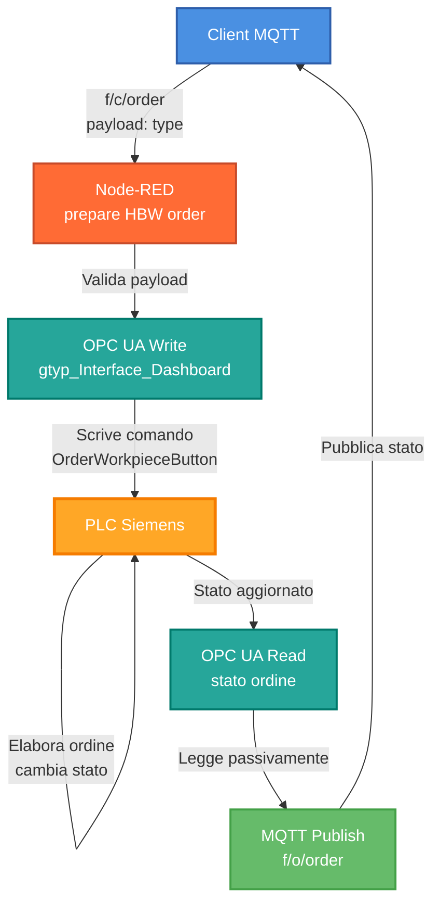
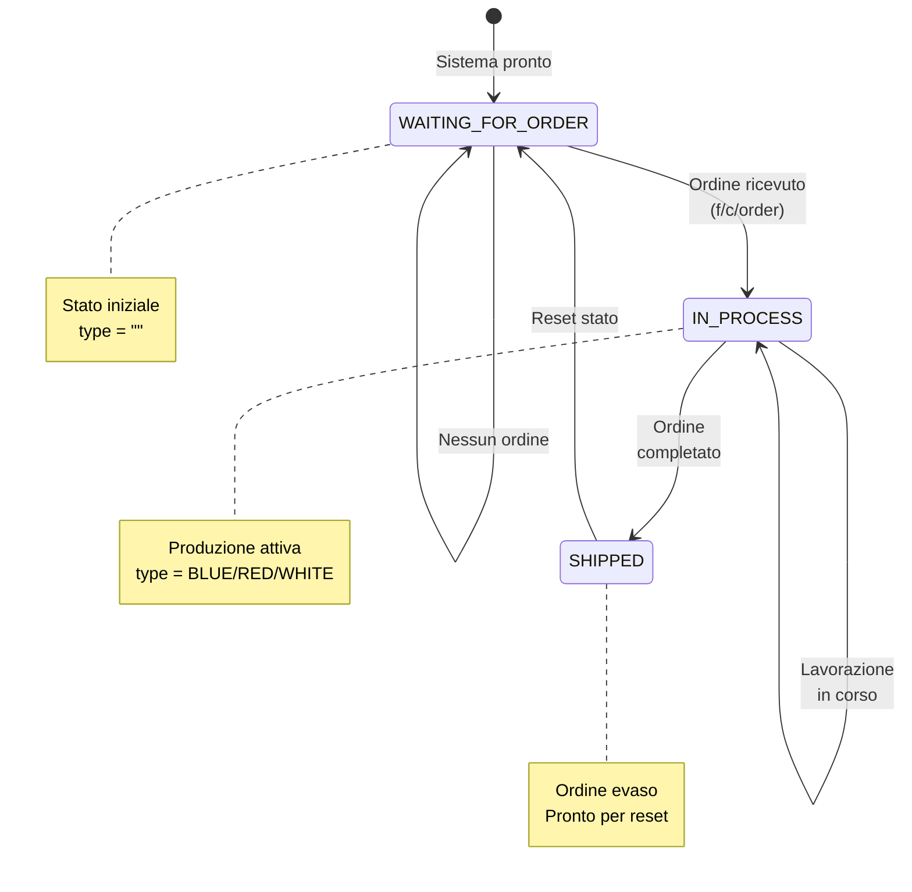

## 1. Obiettivo

L'obiettivo del lavoro è stato sostituire l'uso della dashboard ufficiale della microfactory per l'invio degli ordini, utilizzando esclusivamente MQTT, senza modificare la logica del PLC e senza causare instabilità o crash del sistema.

L'ordine viene:

- inviato via MQTT,
- intercettato da Node-RED,
- tradotto in una scrittura OPC UA verso il PLC,
- eseguito dal PLC,
- e infine lo stato viene restituito via MQTT.

## 2. Architettura generale

### 2.1 Flusso logico

mermaid

### 2.2 Principio fondamentale

⚠️ **Il PLC è l'unico responsabile dello stato dell'ordine**

Node-RED non forza mai lo stato, ma:

- scrive solo il comando di ordine,
- legge passivamente lo stato,
- lo ripubblica via MQTT.

Questo punto è stato essenziale per evitare crash della microfactory.

### 2.3 Ciclo di vita dell'ordine

mermaid

## 3. Topic MQTT utilizzati

