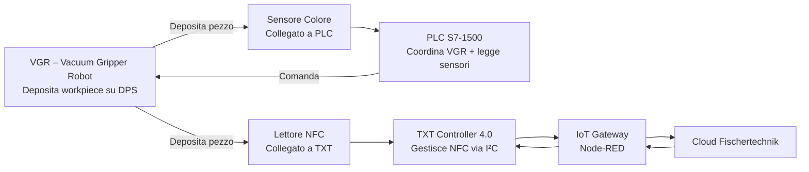
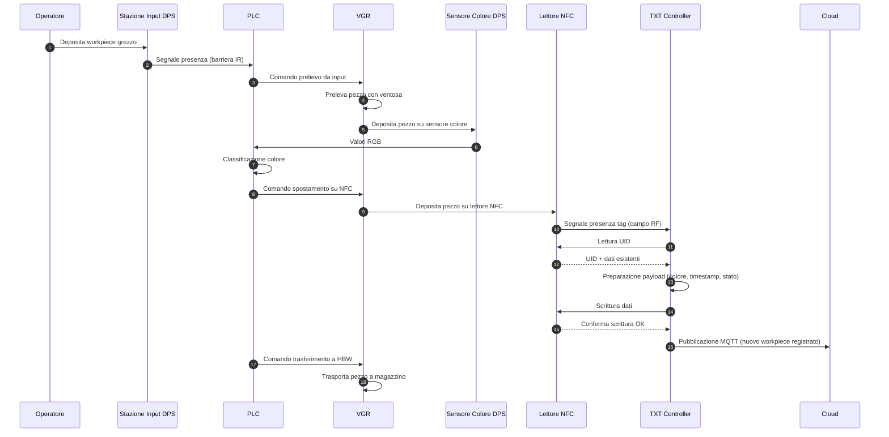

# 02.6 DPS – Input/Output Station + NFC

## 1. Descrizione Generale

La **DPS – Input/Output Station + NFC** è la stazione incaricata di **identificare e caratterizzare** i workpiece attraverso:

- **rilevamento della presenza fisica** del pezzo
- **riconoscimento del colore** tramite sensore ottico RGB
- **gestione dell'identificazione univoca** mediante tag NFC NTAG213

**Funzionalità principali:**

1. **Rilevamento presenza:** Rileva l'arrivo del workpiece tramite **barriera ottica** nell'unità di input
2. **Riconoscimento colore:** Determina il colore del pezzo tramite **sensore ottico RGB**
3. **Gestione dati NFC:** Legge e scrive dati sui **tag NFC NTAG213** incorporati nel workpiece
4. **Connettività IoT:** Invia le informazioni al **TXT Controller 4.0**, che le sincronizza con la **fischertechnik Cloud**

> **Nota critica:** La DPS **non ha movimentazione autonoma**. Il workpiece viene **depositato dal VGR** (Vacuum Gripper Robot) nelle posizioni di lettura colore e lettura/scrittura NFC. La DPS si limita a rilevare la presenza e acquisire i dati.

---

## 2. Funzione nel Processo Produttivo

La **DPS** interviene in **due fasi distinte** del ciclo produttivo:

### 2.1 Fase di Ingresso (Stoccaggio Iniziale)

**Sequenza operativa:**

1. L'operatore o un sistema automatico deposita manualmente un workpiece grezzo nella **stazione di input**
2. La **barriera ottica** dell'input rileva la presenza del pezzo e segnala al PLC
3. Il **VGR** (comandato dal PLC) preleva il pezzo dalla stazione di input
4. Il **VGR deposita il pezzo sulla posizione del sensore colore** nella DPS
5. Il **sensore di colore** (controllato dal PLC) acquisisce i valori RGB del workpiece
6. Il **VGR sposta il pezzo sulla posizione del lettore NFC**
7. Il **TXT Controller** (via Python):
   - Legge l'**UID** (identificativo univoco) del tag NFC
   - **Cancella** eventuali dati precedenti nella memoria del tag
   - **Scrive** i dati preliminari:
     - colore rilevato
     - timestamp di ingresso
     - stato "raw_material" (materia prima non lavorata)
8. Il **VGR** trasporta il pezzo verso l'**HBW** (magazzino) per lo stoccaggio

**Nota:** Durante questa fase, il PLC coordina i movimenti del VGR, mentre il TXT Controller gestisce esclusivamente le operazioni NFC.

---

### 2.2 Fase di Uscita (Fine Produzione)

**Sequenza operativa:**

1. Dopo le lavorazioni (MPO) e lo smistamento (SLD), il **VGR** preleva il workpiece finito
2. Il **VGR deposita il pezzo sulla posizione del lettore NFC** nella DPS
3. Il **TXT Controller** scrive i **dati finali** sul tag NFC:
   - ID ordine
   - timestamp di completamento produzione
   - dati di qualità (se applicabile)
   - stato "finished_product"
4. Il **TXT Controller** pubblica i dati aggiornati al **cloud Fischertechnik** via MQTT
5. Il **VGR** trasporta il pezzo verso la **stazione di output** per il ritiro

**Nota:** La fase di uscita non richiede nuovamente la lettura del colore, in quanto già memorizzato nel tag NFC durante la fase di ingresso.

---

## 3. Architettura del Sistema

### 3.1 Struttura Hardware della DPS

La DPS è organizzata in **tre sezioni funzionali**:

#### 3.1.1 Unità di Input/Output

**Componenti:**
- **Barriera fotoelettrica** (LED emettitore + fototransistor ricevitore)
- **Piattaforma di deposito** per il workpiece
- **Struttura meccanica FischerTechnik** per alloggiamento

**Funzione:**
- Rilevare la presenza fisica del workpiece nella zona di input
- Segnalare al PLC tramite ingresso digitale l'arrivo di un nuovo pezzo

**Interfacciamento PLC:**
- **Ingresso digitale DI** (normalmente aperto, chiude quando il fascio è interrotto)
- Variabile PLC: `DPS_INPUT_OCCUPIED`

---

#### 3.1.2 Modulo di Color Recognition

**Componenti:**
- **Sensore colore RGB** (tipo riflessivo, emette luce bianca e misura riflesso)
- **Piattaforma di lettura** (posizione fissa dove VGR deposita il pezzo)

**Funzione:**
- Determinare il colore del workpiece attraverso analisi dei valori RGB
- Fornire valori analogici al PLC per classificazione (rosso/blu/bianco)

**Interfacciamento PLC:**
- **Ingresso analogico AI** (0-10V, digitalizzato dal PLC in range 0-24883)
- Variabile PLC: `DPS_COLOR_SENSOR_VALUE`
- Algoritmo di classificazione implementato nel blocco funzionale **FB_DPS** del PLC

**Nota:** Il sensore è **passivo** (acquisisce solo quando il pezzo è presente), non ha movimentazione propria.

---

#### 3.1.3 Modulo NFC

**Componenti:**
- **Lettore NFC PN532** (controller NXP, interfaccia I²C)
- **Antenna integrata** (distanza operativa ~2 cm)
- **Piattaforma di lettura/scrittura** (posizione fissa dove VGR deposita il pezzo)
- **LED rosso indicatore** (segnala attività NFC in corso)

**Funzione:**
- Lettura **UID** (identificativo univoco a 7 byte, non modificabile)
- Lettura e scrittura **memoria dati** (180 byte disponibili su NTAG213)
- Comunicazione con **TXT Controller 4.0** per gestione tag

**Interfacciamento TXT:**
- **Connessione I²C** (SDA, SCL, VCC, GND)
- Indirizzo I²C: **0x24** (standard PN532)
- Protocollo: ISO/IEC 14443-A (compatibilità NFC Type 2)

**Nota:** Il lettore NFC è **gestito esclusivamente dal TXT Controller**, non dal PLC. Il PLC si limita a coordinare il posizionamento del workpiece da parte del VGR.

---

### 3.2 Componenti Elettrici – Tabella Riassuntiva

| Componente | Controllore | Interfaccia | Tipo Segnale | Variabile/API |
|------------|-------------|-------------|--------------|---------------|
| **Barriera fotoelettrica input** | PLC | Ingresso digitale | ON/OFF | `%I_DPS_INPUT_OCCUPIED` |
| **Sensore colore RGB** | PLC | Ingresso analogico | 0-10V | `%IW_DPS_COLOR_VALUE` |
| **Lettore NFC PN532** | TXT | I²C | Digitale seriale | `nfc.read()` / `nfc.write()` (Python) |
| **LED rosso indicatore** | TXT | Uscita digitale | ON/OFF | `led_nfc.set(True/False)` (Python) |

**Importante:** Non esiste alcun attuatore (motore, cilindro pneumatico, pusher) controllato dalla DPS. Tutti i movimenti di deposito/prelievo del workpiece sono eseguiti dal **VGR** sotto il controllo del **PLC**.

---

### 3.3 Interfacciamento con Altri Sistemi



**Nota architetturale:** La separazione di controllo (PLC per sensore colore, TXT per NFC) riflette la natura ibrida del sistema:
- **PLC** = controllo deterministico real-time (movimenti, sensori fisici)
- **TXT** = gestione IoT e dati (NFC, cloud, telemetria)

---

## 4. Tipologia di Tag Utilizzati

### 4.1 Specifiche dei Tag NFC NTAG213

I tag integrati direttamente nel workpiece sono del modello **NTAG213** (NXP Semiconductors), conformi allo standard **ISO/IEC 14443 Type A**.

**Caratteristiche tecniche:**

| Parametro | Valore |
|-----------|--------|
| **Chip** | NXP NTAG213 |
| **Standard** | ISO/IEC 14443-A, NFC Forum Type 2 |
| **Frequenza** | 13.56 MHz |
| **UID** | 7 byte (univoco, non modificabile, assegnato in fabbrica) |
| **Memoria totale** | 180 byte (user memory) |
| **Memoria pagine** | 45 pagine da 4 byte ciascuna |
| **Velocità lettura** | 106 kbit/s |
| **Distanza operativa** | 1-2 cm (dipende da antenna lettore) |
| **Anti-collisione** | Sì (supporta lettura singola anche con più tag in prossimità) |
| **Protezione scrittura** | Opzionale (lock bit configurabile) |
| **Durata dati** | 10 anni (ritenzione EEPROM) |
| **Cicli di scrittura** | 100.000 cicli (endurance tipica) |

**Nota sulla memory map:** La struttura esatta della memoria (quali byte sono usati per colore, timestamp, stato, ecc.) è definita nel software del TXT Controller (`GatewayPLC.py`) e può essere personalizzata.

---

### 4.2 Struttura Dati Memorizzati (Esempio Implementazione Standard)

**Layout memoria tipico (può variare in base a implementazione specifica):**

| Offset (byte) | Campo | Tipo | Descrizione |
|---------------|-------|------|-------------|
| 0-6 | UID | Hex (7 byte) | Identificativo univoco (sola lettura, impostato in fabbrica) |
| 16-17 | Colore | Int (1 byte) | 0=sconosciuto, 1=bianco, 2=rosso, 3=blu |
| 18-21 | Timestamp Ingresso | Unix Time (4 byte) | Secondi da epoch (01/01/1970) |
| 22-25 | Timestamp Uscita | Unix Time (4 byte) | Secondi da epoch |
| 26 | Stato Processo | Int (1 byte) | 0=raw, 1=processed, 2=sorted, 3=finished |
| 27-30 | ID Ordine | Int (4 byte) | Numero ordine di produzione |
| 31-34 | Dati Qualità | Int (4 byte) | Codice risultato controllo qualità |
| 35-179 | Riservato | – | Spazio per estensioni future |

**Nota:** Questa è una struttura **esemplificativa**. La struttura reale può essere consultata nel codice sorgente di `GatewayPLC.py`:
```
https://github.com/fischertechnik/plc_training_factory_24v
```

---

### 4.3 Vantaggi del Sistema NFC nella Learning Factory

**1. Tracciabilità completa:**
- Ogni workpiece ha un UID univoco → tracking end-to-end
- Storico completo memorizzato sul pezzo → audit trail incorporato

**2. Resilienza:**
- I dati restano sul pezzo anche in caso di blackout o reset del sistema
- Nessuna necessità di database centralizzato per dati critici

**3. Semplicità:**
- Lettura/scrittura senza contatto (no usura meccanica)
- Compatibilità con smartphone NFC (verifica dati con app standard)

**4. Scalabilità:**
- Aggiungere nuovi campi dati senza modificare hardware
- Ogni tag può contenere informazioni diverse (lotti, ricette, parametri)

**5. Didattica:**
- Dimostra tecnologie RFID/NFC usate in logistica industriale reale
- Introduce concetti di Industry 4.0 (Digital Twin, tracciabilità digitale)

---

## 5. Diagramma Funzionale



---

## 6. Ciclo Operativo Dettagliato

### 6.1 Fase di Lettura del Tag NFC (Ingresso)

**Condizioni iniziali:**
- Workpiece grezzo depositato manualmente nella stazione input
- Barriera IR rileva presenza → PLC attiva sequenza

**Sequenza passo-passo:**

1. **PLC comanda VGR:** Preleva pezzo da input
2. **VGR esegue:** Pick del pezzo con ventosa a vuoto
3. **PLC comanda VGR:** Deposita su sensore colore DPS
4. **Sensore colore acquisisce:** Valori RGB (gestito da PLC via ingresso analogico)
5. **PLC elabora:** Classificazione colore (FB_DPS) → risultato: BIANCO/ROSSO/BLU
6. **PLC comanda VGR:** Sposta pezzo su posizione lettore NFC
7. **VGR deposita pezzo** su piattaforma NFC
8. **TXT Controller rileva:** Campo RF del tag (presenza tag attivo)
9. **TXT esegue lettura NFC:**
   ```python
   uid = nfc.read_uid()  # Legge UID (7 byte)
   data = nfc.read_block(4, 40)  # Legge blocchi memoria
   ```
10. **TXT verifica:** Se tag già scritto in precedenza → cancella vecchi dati
11. **TXT prepara payload:**
    ```python
    payload = {
        'uid': uid,
        'color': color_from_plc,  # Ricevuto da PLC via MQTT
        'timestamp_in': current_time(),
        'status': 'raw_material'
    }
    ```
12. **TXT scrive su tag:**
    ```python
    nfc.write_block(4, payload_bytes)  # Scrive da blocco 4 in poi
    ```
13. **TXT verifica scrittura:** Rilegge blocco e confronta con payload inviato
14. **TXT pubblica MQTT:**
    ```json
    Topic: ftFactory/nfc/read
    Payload: {
      "uid": "04:5A:2F:3B:C1:4E:80",
      "color": "white",
      "timestamp": "2024-01-15T14:32:18Z",
      "status": "registered"
    }
    ```
15. **PLC riceve conferma** (via IoT Gateway) → procede con stoccaggio in HBW

**Tempo tipico:** 3-5 secondi (dipende da latenza I²C e MQTT)

---

### 6.2 Fase di Scrittura del Tag NFC (Uscita)

**Condizioni iniziali:**
- Workpiece ha completato lavorazione MPO e smistamento SLD
- VGR preleva pezzo da SLD e lo porta verso output

**Sequenza passo-passo:**

1. **PLC comanda VGR:** Preleva pezzo finito da SLD
2. **VGR esegue:** Pick del pezzo
3. **PLC comanda VGR:** Deposita su posizione lettore NFC DPS
4. **VGR deposita pezzo** su piattaforma NFC
5. **TXT Controller rileva:** Campo RF del tag
6. **TXT esegue lettura NFC:**
   ```python
   uid = nfc.read_uid()
   existing_data = nfc.read_block(4, 40)
   ```
7. **TXT recupera dati da cloud/IoT Gateway:**
   - ID ordine associato a questo UID
   - Timestamp completamento lavorazione MPO
   - Risultato smistamento SLD
8. **TXT aggiorna payload:**
   ```python
   updated_payload = {
       'uid': uid,
       'color': existing_data['color'],  # Mantiene colore originale
       'timestamp_in': existing_data['timestamp_in'],
       'timestamp_out': current_time(),  # NUOVO
       'order_id': order_id_from_cloud,  # NUOVO
       'status': 'finished_product'  # AGGIORNATO
   }
   ```
9. **TXT sovrascrive tag:**
   ```python
   nfc.write_block(4, updated_payload_bytes)
   ```
10. **TXT verifica scrittura:** Rilegge e confronta
11. **TXT pubblica MQTT:**
    ```json
    Topic: ftFactory/nfc/write
    Payload: {
      "uid": "04:5A:2F:3B:C1:4E:80",
      "status": "finished",
      "order_id": 12345,
      "production_time": 127  // secondi
    }
    ```
12. **Cloud aggiorna dashboard:** Ordine marcato come completato
13. **PLC riceve conferma** → comanda VGR per deposito in output

**Tempo tipico:** 2-4 secondi

---

### 6.3 Gestione Errori NFC

**Errore: Tag non rilevato**

**Causa:** Pezzo non posizionato correttamente, distanza > 2 cm, tag danneggiato

**Comportamento sistema:**
- TXT tenta rilettura (max 3 tentativi)
- Se fallisce → pubblica errore MQTT: `NFC_READ_FAIL`
- PLC entra in stato ERROR → richiede intervento operatore

**Errore: Scrittura fallita**

**Causa:** Interferenza RF, tag in sola lettura (lock bit attivo), memoria corrotta

**Comportamento sistema:**
- TXT tenta riscrittura (max 3 tentativi)
- Se fallisce → pubblica errore MQTT: `NFC_WRITE_FAIL`
- Workpiece marcato come "difettoso" nel cloud
- PLC può decidere di scartare il pezzo o riprocessarlo

**Errore: UID duplicato**

**Causa:** Due workpiece con stesso UID (teoricamente impossibile, ma gestibile)

**Comportamento sistema:**
- TXT rileva conflitto confrontando UID con database locale
- Pubblica warning MQTT: `NFC_UID_DUPLICATE`
- Cloud notifica operatore → necessaria verifica manuale

---

## 7. Diagnostica e Testing

### 7.1 Test Hardware Lettore NFC

**Requisiti:**
- Accesso al TXT Controller (SSH o console locale)
- Tag NFC NTAG213 di test

**Procedura:**

1. Posizionare tag su lettore NFC (distanza < 2 cm)
2. Eseguire script di test Python sul TXT:
   ```python
   from nfc_library import PN532
   
   nfc = PN532(i2c_address=0x24)
   nfc.begin()
   
   # Test 1: Rilevamento tag
   uid = nfc.read_passive_target()
   print(f"UID rilevato: {uid.hex()}")
   
   # Test 2: Lettura memoria
   data = nfc.ntag2xx_read_block(4)
   print(f"Blocco 4: {data}")
   
   # Test 3: Scrittura test
   test_data = b'FISCHERTECHNIK_TEST_'
   nfc.ntag2xx_write_block(4, test_data)
   
   # Test 4: Verifica scrittura
   verify = nfc.ntag2xx_read_block(4)
   assert verify == test_data, "Scrittura fallita!"
   print("Test OK")
   ```

**Risultato atteso:** Script esegue senza errori, UID corretto, scrittura verificata

---

### 7.2 Diagnostica via Dashboard

**Dashboard Cloud → Sezione NFC Reader:**

**Funzioni disponibili:**
- **Read NFC:** Lettura manuale del tag (richiede pezzo posizionato)
- **Write NFC:** Scrittura manuale di dati di test
- **Delete NFC:** Cancellazione completa memoria tag

**Uso per diagnostica:**

1. **Fabbrica in IDLE mode**
2. **Posizionare manualmente** workpiece su lettore NFC
3. **Click "Read NFC"** → visualizza UID + dati
4. **Modificare dati** (es. cambiare stato) → **Click "Write NFC"**
5. **Click "Read NFC"** nuovamente → verifica aggiornamento

**Indicatori di errore:**
- **LED rosso lampeggia rapidamente:** Errore I²C / lettore non risponde
- **LED rosso fisso:** Scrittura in corso (normale)
- **LED rosso spento:** Idle, nessuna operazione
- **Messaggio "NFC Error" su dashboard:** Tag non rilevato o corrotto

---

### 7.3 Diagnostica Node-RED

**Dashboard Node-RED → HMI → Factory Control:**

**Indicatori DPS:**
- **DPS_INPUT_OCCUPIED:** Verde se pezzo presente in input
- **DPS_COLOR_VALID:** Verde se sensore colore ha letto valore valido
- **DPS_NFC_READY:** Verde se lettore NFC operativo
- **DPS_ERROR:** Rosso se errore attivo

**Log MQTT in Node-RED:**
- Topic `ftFactory/nfc/#` → mostra tutti i messaggi NFC
- Utile per debugging sincronizzazione PLC ↔ TXT ↔ Cloud

---

## 8. Procedura di Test e Verifica NFC (Step-by-Step)

**Obiettivo:** Verificare funzionamento end-to-end del sistema NFC

**Prerequisiti:**
- Fabbrica in stato IDLE
- Almeno 1 workpiece con tag NFC funzionante
- Accesso a dashboard cloud e Node-RED

**Procedura:**

1. **Test Lettura UID:**
   - Portare fabbrica in IDLE
   - Posizionare manualmente workpiece su lettore NFC DPS
   - Dashboard cloud → **"Read NFC"**
   - **Verifica:** UID a 7 byte visualizzato correttamente (es. `04:5A:2F:3B:C1:4E:80`)

2. **Test Scrittura Manuale:**
   - Modificare campo "status" su dashboard (es. da "raw" a "test")
   - Click **"Write NFC"**
   - **Verifica:** LED rosso si accende durante scrittura
   - Attendere 2 secondi
   - Click **"Read NFC"** → confermare che status è cambiato

3. **Test Cancellazione:**
   - Click **"Delete NFC"**
   - **Verifica:** Dashboard mostra "Tag cleared"
   - Click **"Read NFC"** → tutti i campi devono essere vuoti/zero (tranne UID)

4. **Test Ciclo Completo Automatico:**
   - Riempire HBW con workpiece
   - Dashboard cloud → ordinare 1 pezzo bianco
   - **Monitorare dashboard:** Seguire workpiece attraverso tutte le stazioni
   - **Alla fine:** Click **"Read NFC"** sul pezzo in output
   - **Verifica:** Dati completi (colore, timestamp ingresso/uscita, order ID, status "finished")

5. **Test Resilienza (Opzionale):**
   - Durante la produzione, spegnere e riaccendere TXT Controller
   - Al riavvio, TXT deve riconnettersi automaticamente
   - Click **"Read NFC"** → dati devono essere persistiti (non persi)

**Risultato atteso:** Tutti i test completati senza errori

---

## 9. Ruolo nel Contesto Industry 4.0

La DPS costituisce il **layer di identificazione e tracciabilità digitale** della Learning Factory 4.0, implementando i seguenti principi Industry 4.0:

### 9.1 Digital Twin del Prodotto

- Ogni workpiece fisico ha un **gemello digitale** memorizzato sul tag NFC
- Il tag contiene lo **stato attuale** del prodotto (dove si trova nel processo, cosa è stato fatto)
- Sincronizzazione continua tra **oggetto fisico** (pezzo) e **rappresentazione digitale** (dati NFC + database cloud)

### 9.2 Tracciabilità End-to-End

- **UID univoco** permette tracking completo: ingresso → lavorazione → uscita
- **Timestamp** su ogni fase → calcolo tempi di ciclo, identificazione colli di bottiglia
- **Dati qualità** → tracciamento difetti, analisi cause root

### 9.3 Decentralizzazione dei Dati

- **Dati critici memorizzati sul pezzo** → resilienza (no single point of failure)
- Anche in caso di guasto server/cloud, i dati restano accessibili
- Approccio **edge-first**: dati generati e memorizzati localmente, sincronizzati al cloud quando possibile

### 9.4 Interoperabilità

- **Standard NFC** (ISO 14443) → compatibilità con smartphone, lettori industriali
- **Formato dati aperto** → lettura dati con app standard NFC (es. NFC Tools)
- **API REST/MQTT** → integrazione con sistemi MES/ERP esterni

### 9.5 Flessibilità Produttiva

- Ogni pezzo può avere **ricetta personalizzata** memorizzata su tag
- Possibilità di produzione **lotto 1** (mass customization)
- Riconfigurazione processo senza riprogrammare PLC (dati letti da tag)

---

## 10. Limitazioni e Considerazioni

### 10.1 Limitazioni Hardware

**Lettore NFC PN532:**
- **Distanza operativa limitata:** 1-2 cm (richiede posizionamento preciso)
- **Velocità di scrittura:** ~200 ms per blocco (non adatto per applicazioni ad altissima velocità)
- **Sensibilità a interferenze RF:** Vicinanza di metalli o altri dispositivi RF può degradare lettura

**Tag NTAG213:**
- **Memoria limitata:** 180 byte (sufficiente per Learning Factory, limitante per applicazioni reali complesse)
- **Endurance:** 100.000 cicli di scrittura (adeguato per didattica, potrebbe richiedere sostituzione in produzione intensiva)
- **Nessuna crittografia:** Dati leggibili da chiunque con lettore NFC (no sicurezza intrinseca)

---

### 10.2 Considerazioni di Integrazione

**Sincronizzazione PLC ↔ TXT:**
- La comunicazione è **asincrona** (MQTT via IoT Gateway)
- Possibile latenza 1-3 secondi → richiede handshake esplicito tra PLC e TXT
- In caso di perdita connessione, il PLC deve gestire timeout

**Gestione errori:**
- Se lettura NFC fallisce, il PLC deve decidere:
  - Ritentare (quante volte?)
  - Scartare il pezzo
  - Marcare come "sconosciuto" e processare comunque
- Strategia dipende da requisiti specifici dell'applicazione

---

### 10.3 Estensioni per Applicazioni Reali

**Per deployment industriale, considerare:**

1. **Lettori NFC industriali:**
   - Distanza operativa maggiore (es. 5-10 cm)
   - Certificazione IP67 (protezione polvere/acqua)
   - Interfaccia Profinet/Ethernet (integrazione diretta con PLC)

2. **Tag UHF RFID:**
   - Distanza lettura fino a 10 metri
   - Lettura multipla simultanea (anti-collisione avanzata)
   - Memoria maggiore (es. Alien Higgs-3: 512 bit user memory)

3. **Crittografia dati:**
   - Tag con autenticazione AES (es. MIFARE DESFire)
   - Prevenzione clonazione e manomissione dati
   - Conformità GDPR per dati sensibili

4. **Integrazione MES/ERP:**
   - UID tag mappato su database centrale
   - Sincronizzazione bidirezionale cloud ↔ tag
   - Analytics avanzata su dati storici di produzione

---

## 11. Collegamenti con Altri Moduli

- [[02.1_VGR_Vacuum_Gripper_Robot.md]] – Movimentazione workpiece verso/da DPS
- [[02.9_TXT_Controller_4.0.md]] – Gestione software lettore NFC e pubblicazione MQTT
- [[02.7_PLC_Siemens_S7-1500.md]] – Coordinamento sequenze e lettura sensore colore
- [[04_protocolli_e_rete.md]] – Flusso dati NFC via MQTT
- [[06_supervisione_e_diagnostica.md]] – Diagnostica errori NFC e dashboard