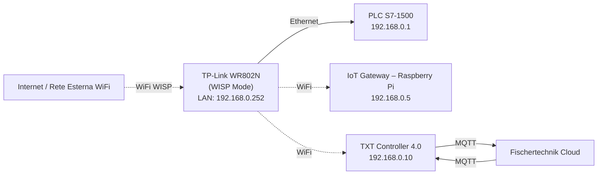

# 02.10 TP-Link Router WR802N

## 1. Descrizione Generale

Il **TP-Link TL-WR802N** costituisce l'infrastruttura di rete locale della Learning Factory 4.0.
Il router fornisce connettività IP ai dispositivi OT/IT dell'impianto e permette, quando
necessario, l'accesso al cloud Fischertechnik tramite la modalità **WISP (Wireless Internet Service Provider)**.

Le sue funzioni principali sono:

- fornire connettività LAN a PLC, IoT Gateway e TXT Controller;
- gestire l'assegnazione degli indirizzi IP tramite **DHCP**;
- collegarsi a una rete esterna tramite modalità **WISP**;
- offrire un punto di accesso Wi-Fi per PC di configurazione e diagnostica.

Il router rappresenta la base dell'infrastruttura IT della microfactory.

---

## 2. Funzione nel Processo Produttivo

Il router gestisce la rete interna **192.168.0.x**, necessaria per:

- comunicazione MQTT tra TXT e IoT Gateway (via IP locale);
- comunicazione OPC-UA tra PLC e IoT Gateway;
- accesso HTTP al Node-RED Dashboard;
- accesso del TXT al cloud tramite connessione Internet;
- coordinamento informativo tra livelli OT (PLC) e IT (Gateway + TXT).

In assenza del router, i componenti non potrebbero comunicare né con il cloud né tra loro.

---

## 3. Architettura e Interconnessione

### 3.1 Collegamenti Fisici

**Nota importante:** Il TP-Link TL-WR802N è un **nano router compatto** con:
- **1 porta Ethernet LAN/WAN** (commutabile)
- **Alimentazione tramite micro-USB** (fornita dal Raspberry Pi o alimentatore esterno)
- **Interfaccia WiFi** per modalità WISP e Access Point

**Schema di collegamento standard:**
- Porta Ethernet → collegata al **PLC Siemens S7-1500** (IP: 192.168.0.1)
- Alimentazione USB → fornita dal **IoT Gateway (Raspberry Pi 4)**
- Dispositivi TXT e IoT Gateway → connessi via **WiFi** alla rete del router

---

### 3.2 Dispositivi Connessi

| Dispositivo      | IP Assegnato     | Tipo  | Funzione                                 |
|------------------|------------------|-------|------------------------------------------|
| **PLC S7-1500**  | **192.168.0.1**  | LAN   | Controllo real-time                      |
| **IoT Gateway**  | **192.168.0.5**  | WiFi  | Node-RED, OPC-UA client, MQTT client     |
| **TXT Controller** | **192.168.0.10** | WiFi  | Supervisione IoT, camera, NFC, cloud     |
| **Router WR802N** | **192.168.0.252** | –     | Gestione rete e gateway Internet        |
| **PC Tecnico**   | 192.168.0.xx     | WiFi  | Debug, configurazione, TIA Portal        |

**Nota:** L'IoT Gateway e il TXT Controller ricevono IP tramite **DHCP** con **prenotazione statica** basata su indirizzo MAC.

---

### 3.3 Modalità WISP (Wireless Internet Service Provider)

In modalità WISP:

- il router si collega via WiFi a una **rete esterna** (es. rete aziendale, hotspot mobile);
- crea una **sottorete privata 192.168.0.x** isolata;
- fornisce accesso Internet a TXT e IoT Gateway tramite **NAT** (Network Address Translation);
- mantiene separazione tra rete esterna e rete interna della fabbrica.

**Vantaggi della modalità WISP:**
- Consente di integrare la Learning Factory in reti WiFi esistenti senza modifiche infrastrutturali.
- Permette l'accesso al cloud Fischertechnik senza necessità di cablaggio Ethernet aggiuntivo.

---

## 4. Configurazione del Router (Passo-Passo)

### 4.1 Accesso al Router

**Metodo 1: Tramite WiFi (configurazione iniziale)**
1. Collegare il PC alla rete WiFi del TP-Link (SSID: **TP-LINK_XXXX**)
2. Password WiFi predefinita: riportata sull'etichetta sotto il router
3. Aprire il browser e visitare: **http://tplinkwifi.net** oppure **http://192.168.0.252**
4. Credenziali di accesso:
   - **Username:** admin
   - **Password:** admin1 (o come indicato nel file `Password Fischertechnik.docx`)

**Metodo 2: Tramite cavo Ethernet**
1. Collegare il PC alla porta LAN del router
2. Configurare IP statico sul PC: 192.168.0.100 (subnet 255.255.255.0)
3. Aprire browser su **http://192.168.0.252**

---

### 4.2 Impostazione Modalità WISP

**Procedura secondo documentazione ufficiale Fischertechnik:**

1. Accedere al pannello di configurazione del router.
2. Selezionare **Quick Setup** (configurazione rapida).
3. Alla voce **Operation Mode**, selezionare **WISP (Hotspot Router Mode)**.
4. **Selezione rete WAN:**
   - Tipo di connessione WAN: **Dynamic IP** (DHCP)
   - Scansionare le reti WiFi disponibili
   - Selezionare la rete esterna desiderata
   - Inserire la password della rete WiFi esterna
5. **Confermare** le impostazioni e attendere il riavvio del router.

**Nota:** In modalità WISP, il router riceve un IP dalla rete esterna via DHCP, ma continua a fornire indirizzi 192.168.0.x ai dispositivi della fabbrica tramite il proprio server DHCP interno.

---

### 4.3 Impostazioni LAN e DHCP

**Configurazione indirizzo IP del router (interfaccia LAN):**
1. Menu → **Network** → **LAN**
2. Impostare:
   - **IP Address:** 192.168.0.252
   - **Subnet Mask:** 255.255.255.0
3. **Salvare** (il router si riavvierà)

**Configurazione DHCP Server:**
1. Menu → **DHCP** → **DHCP Settings**
2. **Abilitare DHCP Server** (Enable)
3. Configurare il pool di indirizzi:
   - **Start IP Address:** 192.168.0.2
   - **End IP Address:** 192.168.0.254
4. **Salvare**

**Prenotazione indirizzi IP (Address Reservation):**

Per garantire che TXT e IoT Gateway ricevano sempre gli stessi IP:

1. Menu → **DHCP** → **Address Reservation**
2. Identificare i dispositivi nella **DHCP Client List**
3. Per il **TXT Controller 4.0** (verificare il MAC address):
   - Prenotare IP: **192.168.0.10**
4. Per il **IoT Gateway (Raspberry Pi)**:
   - Prenotare IP: **192.168.0.5**

**Nota critica:** Come indicato nella documentazione ufficiale (p.67 del manuale di commissioning):

> "DHCP is activated on the router and ensures that the TXT 4.0 controller is always provided with the same IP address 192.168.0.10 via DHCP."

---

### 4.4 Sicurezza

**Configurazione WiFi sicura:**
1. Menu → **Wireless** → **Wireless Security**
2. Selezionare **WPA2-PSK** (o WPA2/WPA3 se disponibile)
3. Impostare una **password complessa** per la rete WiFi del router
4. **Disabilitare WPS** per motivi di sicurezza

**Modifica password di amministrazione:**
1. Menu → **System Tools** → **Password**
2. Cambiare la password impostandone una più sicura
3. **Annotare** la nuova password nel file delle credenziali del progetto

---

## 5. Diagramma Funzionale di Rete



**Legenda:**
- **Linea continua** (—): connessione Ethernet cablata
- **Linea tratteggiata** (-.-): connessione WiFi

---

## 6. Errori Comuni e Diagnostica

### 6.1 Errori di Connessione

**Problema:** Il router non raggiunge Internet in modalità WISP

**Cause possibili:**
- Credenziali WiFi della rete esterna errate
- Rete esterna non disponibile o fuori portata
- MAC filtering attivo sulla rete esterna (il MAC del router è bloccato)

**Soluzione:**
- Verificare la password della rete WiFi esterna
- Avvicinare il router al punto di accesso WiFi
- Contattare l'amministratore della rete esterna per autorizzare il MAC del router

---

**Problema:** I dispositivi (TXT, IoT Gateway) non ricevono indirizzi IP

**Cause possibili:**
- DHCP Server disattivato sul router
- Indirizzo IP del router non corretto (non è 192.168.0.252)
- Conflitto di indirizzi IP nella rete

**Soluzione:**
- Verificare che DHCP sia **abilitato** nelle impostazioni del router
- Reset del router alle impostazioni di fabbrica e riconfigurazione
- Controllare la **DHCP Client List** per vedere quali dispositivi sono connessi

---

**Problema:** Il TXT Controller non si collega al cloud

**Cause possibili:**
- Router non connesso a Internet (modalità WISP non configurata)
- Firewall sulla rete esterna blocca le porte MQTT (1883, 8883)
- Proxy attivo sulla rete esterna (il TXT **non supporta** configurazioni proxy)

**Soluzione:**
- Verificare connettività Internet del router (ping google.com dal router)
- Contattare l'amministratore di rete per aprire le porte MQTT
- Utilizzare una connessione Internet senza proxy (es. hotspot mobile)

---

### 6.2 Errori di Configurazione

**Problema:** Impossibile accedere al pannello di amministrazione del router

**Cause possibili:**
- PC non nella subnet 192.168.0.x
- Indirizzo IP del router cambiato accidentalmente
- Password di amministrazione dimenticata

**Soluzione:**
- Configurare IP statico sul PC: 192.168.0.100
- Reset hardware del router (premere il pulsante reset per 10 secondi)
- Dopo il reset, IP predefinito è **192.168.0.254** o **192.168.1.1** (consultare manuale TP-Link)

---

### 6.3 Diagnostica di Rete

**Strumenti utili:**

1. **Pagina Status del router:**
   - Menu → **Status**
   - Verificare:
     - Stato connessione WAN (se in WISP, deve mostrare IP assegnato dalla rete esterna)
     - DHCP Client List (deve mostrare PLC, TXT, IoT Gateway)
     - Statistiche traffico

2. **Ping da PC:**
   - Aprire terminale/prompt dei comandi
   - Testare connettività verso:
     ```
     ping 192.168.0.252   (router)
     ping 192.168.0.1     (PLC)
     ping 192.168.0.5     (IoT Gateway)
     ping 192.168.0.10    (TXT Controller)
     ```

3. **Verifica dashboard cloud:**
   - Accedere a [www.fischertechnik-cloud.com](https://www.fischertechnik-cloud.com)
   - Verificare se il TXT Controller risulta **online**
   - Se offline, problema di connettività Internet o configurazione MQTT

---

## 7. Specifiche Tecniche TP-Link TL-WR802N

| Caratteristica | Valore |
|----------------|--------|
| **Standard WiFi** | IEEE 802.11b/g/n (2.4 GHz) |
| **Velocità massima** | 300 Mbps |
| **Porte Ethernet** | 1 porta 10/100 Mbps (LAN/WAN commutabile) |
| **Alimentazione** | 5V DC tramite micro-USB |
| **Modalità operative** | Router, Access Point, Range Extender, Client, **WISP** |
| **Sicurezza WiFi** | WEP, WPA, WPA2-PSK |
| **Dimensioni** | 57.4 × 57.4 × 18 mm |

**Nota:** Il modello WR802N è un nano router estremamente compatto, ideale per applicazioni embedded come la Learning Factory 4.0.

---

## 8. Ruolo nel Contesto Industry 4.0

Il TP-Link WR802N costituisce l'**infrastruttura di rete locale** della Learning Factory 4.0 e garantisce la connettività tra:

- **Livello OT** (Operational Technology): PLC, moduli fisici
- **Livello Edge**: IoT Gateway (Node-RED)
- **Livello IoT/Cloud**: TXT Controller e cloud Fischertechnik

**Funzioni critiche:**

1. **Rete IP locale 192.168.0.x** → necessaria per OPC-UA (PLC ↔ Gateway)
2. **Comunicazione MQTT** → TXT ↔ Gateway ↔ Cloud
3. **Accesso Internet in modalità WISP** → permette integrazione in reti WiFi esistenti
4. **Isolamento rete interna** → sicurezza tramite NAT

In un sistema cyber-fisico, il router rappresenta il componente di **rete e connettività** che abilita l'intero ecosistema IT/OT.

**Senza il router:**
- Impossibile comunicazione OPC-UA tra PLC e Gateway
- Impossibile sincronizzazione MQTT tra Gateway e TXT
- Impossibile accesso al cloud Fischertechnik
- Sistema completamente isolato

---

## 9. Procedure di Manutenzione

### 9.1 Backup Configurazione

**È consigliabile salvare periodicamente la configurazione del router:**

1. Menu → **System Tools** → **Backup & Restore**
2. Click su **Backup**
3. Salvare il file `.bin` in una posizione sicura
4. Annotare data e versione del backup

### 9.2 Ripristino Configurazione

**In caso di malfunzionamento:**

1. Menu → **System Tools** → **Backup & Restore**
2. Selezionare il file di backup `.bin`
3. Click su **Restore**
4. Attendere il riavvio del router

### 9.3 Reset Completo

**Reset software:**
- Menu → **System Tools** → **Factory Defaults** → **Restore**

**Reset hardware:**
- Tenere premuto il pulsante **Reset** sul router per **10 secondi**
- Il router tornerà alle impostazioni di fabbrica (IP predefinito, password admin)

---

## 10. Limitazioni e Considerazioni

### 10.1 Limitazioni Hardware

- **Singola porta Ethernet**: il PLC deve essere l'unico dispositivo cablato (TXT e Gateway su WiFi)
- **Solo 2.4 GHz**: non supporta banda 5 GHz (possibile interferenza in ambienti industriali)
- **Throughput limitato**: 300 Mbps teorici, adeguati per la Learning Factory ma non per applicazioni con traffico intenso

### 10.2 Considerazioni di Sicurezza

- **NAT fornisce isolamento base**, ma non è un firewall industriale
- **WiFi 2.4 GHz può essere soggetto a interferenze** in ambienti con molti dispositivi wireless
- **Password WPA2 deve essere robusta** per evitare accessi non autorizzati

### 10.3 Alternative per Deployment Industriale

Per applicazioni reali in ambito industriale, considerare:
- Switch Ethernet industriali (Phoenix Contact, CISCO Industrial)
- Router 4G/5G per connettività cellulare
- Firewall dedicati per segmentazione rete OT/IT
- Access Point enterprise (Ubiquiti, Aruba)

Il WR802N è **ideale per didattica**, ma in contesti produttivi reali richiede integrazione con infrastruttura più robusta.

---

## 11. Collegamenti con Altri Moduli

- [[02.7_PLC_Siemens_S7-1500.md]] – Connessione Ethernet PLC ↔ Router
- [[02.8_IoT_Gateway_RaspberryPi.md]] – Connessione WiFi Gateway ↔ Router
- [[02.9_TXT_Controller_4.0.md]] – Connessione WiFi TXT ↔ Router
- [[04_protocolli_e_rete.md]] – Architettura complessiva di rete della fabbrica