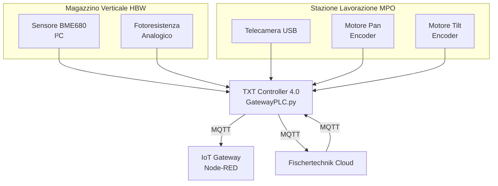

# 02.5 – Sensor Station + Camera (SSC)

## 1. Descrizione Generale

La **SSC (Sensor Station + Camera)** è una stazione integrata dedicata al **monitoraggio ambientale** e alla **supervisione visiva** nella Learning Factory 4.0.

**Nota importante sulla collocazione fisica:**

La SSC è un **modulo logico** composto da due sottosistemi **fisicamente separati** ma **funzionalmente integrati**:

1. **Telecamera orientabile pan/tilt**
   - **Montata sulla Multi-Processing Station (MPO)**
   - Posizione elevata per visione panoramica dell'intera fabbrica
   - Controllata tramite TXT Controller 4.0

2. **Sensore ambientale BME680 + fotoresistenza**
   - **Montati sulla piastra di base del High-Bay Warehouse (HBW)** per motivi di spazio
   - Collegati elettricamente al TXT Controller 4.0 tramite cavi

**Entrambi i sottosistemi sono gestiti dal TXT Controller 4.0**, che acquisisce i dati e li pubblica verso il cloud Fischertechnik tramite MQTT.

---

### 1.1 Componenti della Stazione

La SSC è composta da:

- **Sensore ambientale BME680** (Bosch Sensortec), che rileva:
  - temperatura (°C)
  - umidità relativa (%)
  - pressione atmosferica (hPa)
  - qualità dell'aria – VOC (Volatile Organic Compounds) / AQI (Air Quality Index)
  
- **Fotoresistenza (LDR)** per misura della luminosità ambientale

- **Telecamera USB orientabile** con cinematica pan/tilt a 2 assi:
  - asse pan (rotazione orizzontale)
  - asse tilt (inclinazione verticale)
  
- **LED rosso indicatore** che segnala il trasferimento immagini al cloud

- **Modulo di acquisizione** integrato nel **TXT Controller 4.0**:
  - camera collegata via **USB**
  - sensori collegati via **I²C** (BME680) e **ingresso analogico** (fotoresistenza)

---

## 2. Funzione nel Processo Produttivo

La SSC **non interviene direttamente nel controllo operativo del processo** (non gestisce logica OT), ma fornisce **informazioni contestuali** essenziali per:

- **supervisione ambientale continua** dell'impianto
- **diagnostica visiva remota** del processo produttivo
- **monitoraggio della qualità dell'aria** (importante in contesti industriali reali)
- **verifica visiva degli stati delle stazioni** tramite dashboard cloud

Le sue funzioni principali sono:

1. **Acquisizione continua dei parametri ambientali** mediante sensore BME680
2. **Misura della luminosità** tramite fotoresistenza (utile per diagnostica dei sensori colore)
3. **Generazione di snapshot** tramite la telecamera orientabile
4. **Controllo remoto del movimento pan/tilt** tramite dashboard cloud o Node-RED
5. **Supporto alla diagnostica visiva** della produzione
6. **Invio dei dati al TXT Controller**, che li inoltra al cloud Fischertechnik via MQTT

Questi dati sono visualizzabili sia nel **Node-RED Dashboard locale** sia nella **dashboard del cloud Fischertechnik**, in forma numerica o grafica.

---

## 3. Architettura del Sistema

### 3.1 Sensori Ambientali

#### 3.1.1 Sensore BME680 (Bosch Sensortec)

**Specifiche tecniche:**
- **Protocollo:** I²C (indirizzo 0x76 o 0x77)
- **Temperatura:** Range -40°C ~ +85°C, accuratezza ±1°C
- **Umidità:** Range 0-100% RH, accuratezza ±3%
- **Pressione:** Range 300-1100 hPa, accuratezza ±1 hPa
- **Gas (VOC):** Sensore MOX (Metal Oxide) per rilevamento VOC, output resistivo
- **Tempo di risposta:** 1 secondo (temperatura/umidità/pressione), 10-30 secondi (gas)

**Nota importante:** Il sensore BME680 richiede un **warm-up iniziale** di circa 5 minuti per stabilizzare le letture di gas/VOC. Durante questo periodo i valori possono essere instabili.

#### 3.1.2 Fotoresistenza (LDR)

- **Tipo:** Resistenza variabile in funzione della luminosità
- **Range resistivo:** ~1 kΩ (luce intensa) ~ 1 MΩ (buio completo)
- **Interfacciamento:** Partitore resistivo collegato a ingresso analogico del TXT
- **Output:** Valore digitalizzato 0-15000 (scala arbitraria del TXT)

**Nota:** La fotoresistenza è sensibile alla temperatura e può subire deriva. I valori assoluti hanno significato relativo, utili per monitorare variazioni di luminosità nel tempo.

---

### 3.2 Telecamera Pan-Tilt

La stazione integra una **telecamera USB standard** montata su una cinematica a 2 gradi di libertà (pan/tilt) controllata tramite **motori encoder**.

**Specifiche cinematica:**

| Asse | Movimento | Range | Controllo |
|------|-----------|-------|-----------|
| **Pan** | Rotazione orizzontale | ±90° (circa) | Motore encoder + API TXT |
| **Tilt** | Inclinazione verticale | ±45° (circa) | Motore encoder + API TXT |

**Risoluzione camera:** Dipende dal modello USB utilizzato (tipicamente 640×480 o superiore)

**Frame rate:** ~15-30 fps (dipende dalla connessione USB e banda WiFi disponibile)

**Funzionalità:**
- **Acquisizione snapshot** su richiesta da dashboard
- **Streaming live** (se implementato nell'applicazione TXT)
- **Controllo remoto pan/tilt** tramite joystick virtuale nella dashboard cloud

---

### 3.3 Componenti Elettrici

**Collegamento al TXT Controller 4.0:**

| Componente | Interfaccia TXT | Protocollo/Tipo | Note |
|------------|-----------------|-----------------|------|
| Sensore BME680 | I²C (SDA/SCL) | I²C (0x76/0x77) | Montato su HBW, cavi verso TXT |
| Fotoresistenza | Ingresso analogico | Partitore resistivo | Montato su HBW, cavi verso TXT |
| Telecamera USB | Porta USB | USB 2.0 | Montata su MPO, cavo USB verso TXT |
| Motore pan | Uscita motore M1 | Encoder + PWM | Montato su MPO |
| Motore tilt | Uscita motore M2 | Encoder + PWM | Montato su MPO |
| LED rosso | Uscita digitale | ON/OFF | Indicatore acquisizione immagini |

**Nota sulla gestione:** Tutti i segnali convergono sul **TXT Controller 4.0**, che esegue lo script Python `GatewayPLC.py` per gestire acquisizione dati, movimento camera e pubblicazione MQTT.

---

### 3.4 Interfacciamento con TXT Controller

**Il TXT Controller 4.0 gestisce la SSC tramite:**

1. **Librerie Python per I²C** (sensore BME680)
2. **API analogica TXT** (fotoresistenza)
3. **Librerie Python per USB Video** (camera)
4. **API motori encoder TXT** (pan/tilt)
5. **Client MQTT** per pubblicazione dati al cloud

**Flusso dati:**
```
Sensori → TXT Controller → MQTT → IoT Gateway / Cloud
```

**Nota:** La SSC comunica **esclusivamente con il TXT Controller**, senza alcun legame diretto con il PLC. Il PLC può ricevere informazioni sulla SSC indirettamente tramite l'IoT Gateway (via OPC-UA), ma **non controlla** la stazione.

---

## 4. Diagramma Funzionale



**Nota architetturale:** La separazione fisica dei componenti (sensori su HBW, camera su MPO) è dovuta a:
- **vincoli di spazio** (HBW ha piastra di base accessibile per sensori)
- **requisiti di visibilità** (camera su MPO per visione panoramica dall'alto)
- **modularità** (TXT può acquisire dati da più punti fisici tramite cavi)

---

## 5. Ciclo Operativo Dettagliato

### 5.1 Acquisizione Dati Ambientali

**Sequenza operativa:**

1. Il **TXT Controller** esegue ciclicamente (es. ogni 10 secondi) la lettura del sensore BME680 via I²C
2. Acquisizione valori:
   - Temperatura (°C)
   - Umidità (%RH)
   - Pressione (hPa)
   - Resistenza sensore gas (Ω) → conversione in AQI/VOC
3. Lettura fotoresistenza tramite ADC (valore 0-15000)
4. **Elaborazione dati:**
   - Conversione resistenza gas in indice di qualità aria (algoritmo proprietario Bosch)
   - Calcolo media mobile per ridurre rumore
5. **Pubblicazione MQTT** verso topic `ftFactory/env`:
   ```json
   {
     "temperature": 23.5,
     "humidity": 45.2,
     "pressure": 1013.2,
     "aqi": 75,
     "brightness": 8500,
     "timestamp": "2024-01-15T10:30:00Z"
   }
   ```
6. **Aggiornamento dashboard:**
   - Cloud Fischertechnik → sezione "Environmental Station"
   - Node-RED Dashboard → HMI SSC

**Nota sul warm-up:** I primi 5-10 minuti dopo l'accensione del TXT, i valori di AQI possono essere instabili. La dashboard dovrebbe mostrare un indicatore di "warm-up in corso".

---

### 5.2 Ispezione Visiva (Controllo Camera)

**Sequenza operativa:**

1. **Utente** invia comando di movimento tramite dashboard cloud (es. pan +15°, tilt -10°)
2. **Dashboard cloud** pubblica messaggio MQTT su topic `ftFactory/camera/cmd`:
   ```json
   {
     "action": "move",
     "pan": 15,
     "tilt": -10
   }
   ```
3. **TXT Controller** riceve il messaggio e:
   - Verifica limiti di sicurezza (range pan/tilt)
   - Attiva i motori encoder
   - Monitora encoder per posizionamento preciso
4. **Conferma posizionamento** via MQTT:
   ```json
   {
     "status": "ready",
     "pan_position": 15,
     "tilt_position": -10
   }
   ```
5. **Utente** richiede snapshot tramite pulsante "Cattura Immagine"
6. **TXT Controller**:
   - Attiva LED rosso (segnalazione acquisizione in corso)
   - Cattura frame dalla camera USB
   - Comprime immagine (JPEG, qualità 80%)
   - Carica su cloud Fischertechnik (HTTP POST o MQTT con payload Base64)
   - Disattiva LED rosso
7. **Dashboard cloud** mostra l'immagine nella galleria

**Nota sulla latenza:** Il movimento pan/tilt e l'acquisizione immagine hanno latenza tipica di 2-5 secondi (dipende dalla connessione Internet).

---

### 5.3 Segnali e Stati

**Stati principali gestiti dal TXT:**

| Stato | Significato | Pubblicato su |
|-------|-------------|---------------|
| `SSC_ENV_DATA_READY` | Nuovi dati ambientali disponibili | `ftFactory/env/status` |
| `SSC_CAMERA_MOVING` | Camera in movimento | `ftFactory/camera/status` |
| `SSC_CAMERA_IDLE` | Camera ferma, pronta per comandi | `ftFactory/camera/status` |
| `SSC_SNAPSHOT_DONE` | Immagine acquisita e caricata | `ftFactory/camera/status` |
| `SSC_ERROR` | Errore sensore o camera | `ftFactory/ssc/error` |

**Codici errore tipici:**

| Codice | Descrizione | Causa Probabile |
|--------|-------------|-----------------|
| `BME680_I2C_FAIL` | Sensore BME680 non risponde | Cavo I²C disconnesso, indirizzo errato |
| `CAMERA_USB_FAIL` | Camera non rilevata | Cavo USB disconnesso, driver mancante |
| `PAN_TIMEOUT` | Movimento pan non completato | Blocco meccanico, encoder guasto |
| `TILT_TIMEOUT` | Movimento tilt non completato | Blocco meccanico, encoder guasto |

---

## 6. Errori Comuni e Diagnostica

### 6.1 Errori Sensori Ambientali

#### Problema: Valori BME680 incoerenti o instabili

**Cause possibili:**
- Warm-up incompleto (primi 5-10 minuti dopo accensione)
- Sensore esposto a fonte di calore (es. vicinanza a componenti elettronici caldi)
- Cavo I²C troppo lungo o con interferenze
- Indirizzo I²C errato nel codice Python

**Soluzione:**
- Attendere stabilizzazione sensore (10 minuti)
- Verificare collegamento fisico del cavo I²C (SDA, SCL, GND, VCC)
- Eseguire scan I²C da Python per verificare indirizzo (tipicamente 0x76 o 0x77)
- Consultare datasheet BME680 per verifica configurazione

#### Problema: Fotoresistenza sempre a valore massimo/minimo

**Cause possibili:**
- Fotoresistenza danneggiata o corto circuito
- Partitore resistivo mal dimensionato
- Ingresso analogico TXT guasto

**Soluzione:**
- Verificare resistenza della fotoresistenza con multimetro (deve variare con la luce)
- Controllare valore di riferimento del partitore
- Testare ingresso analogico con segnale noto

---

### 6.2 Errori Telecamera

#### Problema: Camera non rilevata dal TXT

**Cause possibili:**
- Cavo USB disconnesso o danneggiato
- Camera non supportata dal driver Linux del TXT
- Conflitto USB (altra periferica USB occupa la porta)

**Soluzione:**
- Verificare collegamento fisico USB
- Riavviare TXT Controller
- Consultare log Python su TXT: `journalctl -u txt-gateway` (se disponibile)
- Testare camera su un PC per verificarne il funzionamento

#### Problema: Movimenti pan/tilt incompleti o errati

**Cause possibili:**
- Offset di calibrazione non corretti
- Encoder sporco o con gioco meccanico
- Alimentazione insufficiente (motori non raggiungono posizione)
- Collisione meccanica con struttura del modello

**Soluzione:**
- Ricalibrare posizioni pan/tilt tramite Node-RED Dashboard (vedi sezione 7)
- Verificare corretto montaggio meccanico (nessun attrito eccessivo)
- Controllare alimentazione 24V stabile
- Pulire encoder (sensore ottico) con aria compressa

---

### 6.3 Errori di Comunicazione

#### Problema: Dati ambientali non arrivano al cloud

**Cause possibili:**
- TXT non connesso a Internet (problema router WR802N)
- Broker MQTT non raggiungibile
- Credenziali MQTT errate

**Soluzione:**
- Verificare connessione WiFi del TXT (LED sul controller)
- Testare connettività: `ping 8.8.8.8` dal TXT
- Verificare log MQTT nel TXT Controller
- Controllare dashboard cloud: stato TXT deve essere "online"

---

### 6.4 Diagnostica con Node-RED

**Dashboard Node-RED → HMI – SSC Positions:**

Permette di:
- Visualizzare posizione corrente pan/tilt in tempo reale
- Testare movimenti manuali
- Verificare feedback encoder
- Monitorare errori di posizionamento

**Dashboard Cloud → Environmental Station:**

Permette di:
- Visualizzare grafici storici di temperatura, umidità, pressione, AQI
- Scaricare dati in formato CSV per analisi offline
- Verificare timestamp delle letture (per diagnosticare interruzioni)

---

## 7. Procedura di Calibrazione della SSC

### 7.1 Calibrazione Posizioni Camera (Pan/Tilt)

**Requisiti:**
- Accesso al Node-RED Dashboard: `http://192.168.0.5:1880/ui`
- TXT Controller acceso e connesso
- Fabbrica in stato IDLE (nessun processo in corso)

**Procedura:**

1. Aprire **Node-RED Dashboard → HMI – Posizioni SSC**

2. **Abilitare modalità calibrazione:**
   - Attivare checkbox **"Attivare muovere alla pos."**

3. **Calibrazione posizione di riferimento (0/0):**
   - Cliccare su **"Posizione 0/0"**
   - Verificare che camera torni alla posizione centrale neutra
   - Se non corretta, annotare lo scostamento

4. **Calibrazione posizione "Centro":**
   - Cliccare su **"Centro"**
   - La camera dovrebbe inquadrare la zona centrale della fabbrica (sopra VGR)
   - Se non corretta:
     - Modificare valori in **"Posizione centro"** (pan/tilt in gradi)
     - Riprovare il movimento
     - Iterare fino a posizione corretta

5. **Calibrazione posizione "HBW":**
   - Cliccare su **"HBW"**
   - La camera dovrebbe inquadrare il magazzino verticale
   - Se non corretta:
     - Modificare valori in **"Posizione HBW"**
     - Riprovare il movimento
     - Iterare fino a posizione corretta

6. **Salvataggio configurazione:**
   - Una volta completata la calibrazione, cliccare su **"Save Data"** in **HMI – Config Data**
   - I valori vengono salvati in `/home/pi/.node-red/pub/CSV/ConfigData.csv`

7. **Disabilitare modalità calibrazione:**
   - Disattivare checkbox **"Attivare muovere alla pos."**

**Nota importante:** Le posizioni calibrate sono in gradi encoder, non gradi assoluti. I valori dipendono dal montaggio meccanico e possono variare tra diversi esemplari della fabbrica.

---

### 7.2 Verifica Calibrazione Sensori Ambientali

**Il sensore BME680 è pre-calibrato in fabbrica** e non richiede calibrazione utente per temperatura, umidità e pressione.

**Per la qualità dell'aria (AQI):**
- Il sensore richiede un **burn-in iniziale** di 48 ore per stabilizzarsi completamente
- Durante le prime 48 ore, i valori AQI possono mostrare deriva
- Dopo il burn-in, la precisione migliora significativamente

**Verifica valori nominali:**

| Parametro | Range tipico in laboratorio | Azione se fuori range |
|-----------|------------------------------|------------------------|
| Temperatura | 20-25°C | Verificare vicinanza a fonti di calore |
| Umidità | 30-60% RH | Normale in ambienti climatizzati |
| Pressione | 950-1050 hPa | Dipende da altitudine e meteo |
| AQI | 50-150 (buono-moderato) | >200 → ventilare ambiente |
| Luminosità | 5000-12000 | Dipende da illuminazione artificiale |

**Nota:** Se i valori sono costantemente fuori range, verificare integrità del sensore con un multimetro (misura resistenza su pin I²C).

---

## 8. Ruolo nel Contesto Industry 4.0

La SSC rappresenta un tipico **sistema di sensing IoT edge** all'interno della Learning Factory 4.0, embodying i seguenti principi Industry 4.0:

### 8.1 Monitoraggio Ambientale Continuo

**Nella produzione reale:**
- Qualità dell'aria → importante in lavorazioni chimiche, verniciatura, stampa 3D
- Temperatura/umidità → critiche per processi di assemblaggio elettronico, lavorazione legno
- Pressione → rilevante in camere bianche, processi sotto vuoto

**Nella Learning Factory:**
- Dimostra acquisizione dati contestuali
- Permette correlazione tra condizioni ambientali e performance processo
- Abilita analisi predittiva (es. deriva sensori colore con variazione luminosità)

---

### 8.2 Supervisione Visiva Remota

**Nella produzione reale:**
- Telecamere industriali per controllo qualità visivo
- Sistemi di Computer Vision per rilevamento difetti
- Monitoraggio remoto per operatori in control room

**Nella Learning Factory:**
- Dimostra possibilità di supervisione remota da dashboard web
- Simula telemetria visiva tipica di impianti distribuiti geograficamente
- Abilita troubleshooting remoto (vedere cosa succede senza essere fisicamente presenti)

---

### 8.3 Edge Computing

**Il TXT Controller funge da nodo edge:**
- Acquisisce dati grezzi dai sensori
- Pre-elabora i dati (conversione AQI, compressione immagini)
- Pubblica solo dati aggregati al cloud (riduzione banda)
- Può prendere decisioni locali (es. alert se AQI > soglia critica)

Questo approccio riflette architetture edge-cloud moderne in cui:
- **Edge** → elaborazione locale, bassa latenza, riduzione traffico
- **Cloud** → storage storico, analisi avanzata, dashboard globale

---

### 8.4 Digital Twin

**I dati della SSC contribuiscono al Digital Twin della fabbrica:**
- Condizioni ambientali replicate nel modello digitale
- Immagini usate per validazione stato fisico vs. simulazione
- Storico sensori per analisi di correlazione con performance produttive

---

## 9. Limitazioni e Considerazioni

### 9.1 Limitazioni Hardware

**Sensore BME680:**
- **Drift a lungo termine:** La resistenza del sensore MOX può degradare nel tempo (lifetime tipico 5 anni)
- **Sensibilità alla temperatura:** Valori AQI influenzati da temperatura del PCB (autoscaldamento)
- **Non è un sensore calibrato per gas specifici:** Misura VOC generici, non CO₂, CO, NOₓ specifici

**Fotoresistenza:**
- **Risposta non lineare:** La resistenza non è proporzionale alla luminosità (curva logaritmica)
- **Tempo di risposta lento:** ~100ms, inadatta per applicazioni ad alta frequenza
- **Deriva termica:** La resistenza varia anche con la temperatura

**Telecamera USB:**
- **Risoluzione limitata:** Tipicamente 640×480 (VGA), non adatta per Computer Vision avanzata
- **Latenza:** Streaming live limitato da banda WiFi (2-5 secondi di delay)
- **Nessuna ottimizzazione industriale:** Camera consumer, non certificata per ambienti industriali

---

### 9.2 Considerazioni di Sistema

**Cablaggio fisico distribuito:**
- I cavi tra HBW (sensori) e TXT (su/vicino MPO) possono essere esposti
- In deployment reale, richiederebbero canaline protettive

**Sincronizzazione dati:**
- I timestamp dei dati ambientali e delle immagini devono essere sincronizzati via NTP
- Il TXT deve avere accesso a un server NTP (es. via router WR802N connesso a Internet)

**Scalabilità:**
- Per monitorare più punti, servirebbero più sensori BME680 su I²C (max ~8 sensori su stesso bus)
- Per più telecamere, servirebbero più TXT Controller o un sistema di video switching

---

## 10. Collegamenti con Altri Moduli

- [[02.3_MPO_MultiProcessing_Station.md]] – Collocazione fisica della telecamera
- [[02.2_HBW_HighBay_Warehouse.md]] – Collocazione fisica dei sensori ambientali
- [[02.9_TXT_Controller_4.0.md]] – Gestione software e pubblicazione MQTT
- [[04_protocolli_e_rete.md]] – Flusso dati MQTT verso cloud
- [[06_supervisione_e_diagnostica.md]] – Utilizzo dati SSC per diagnostica