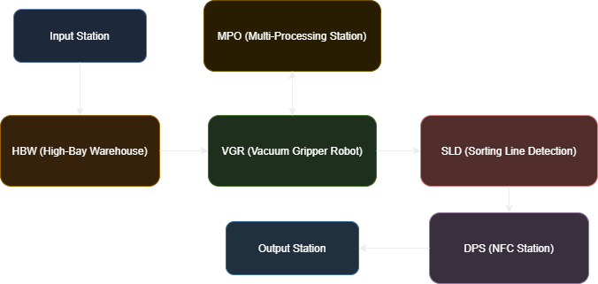
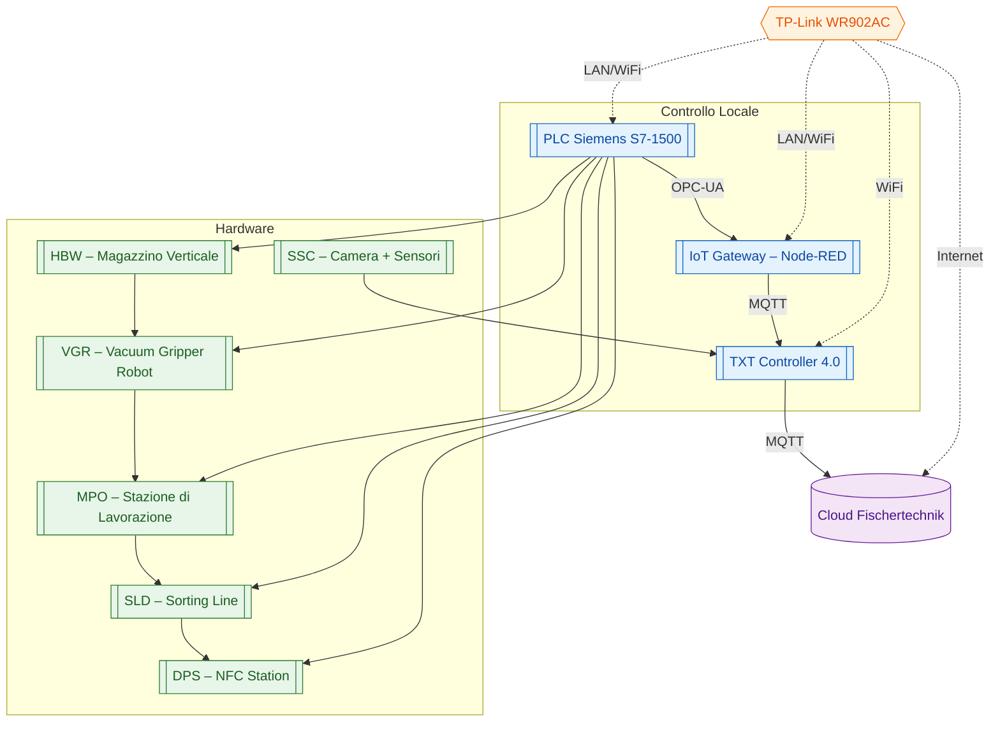
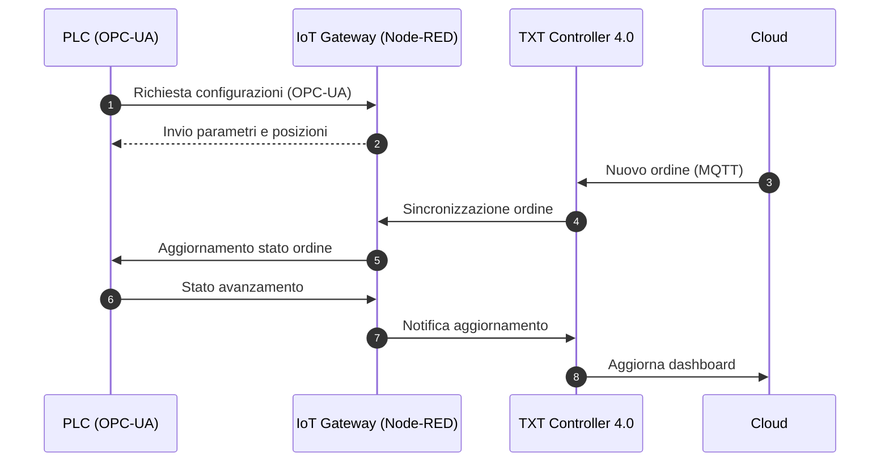
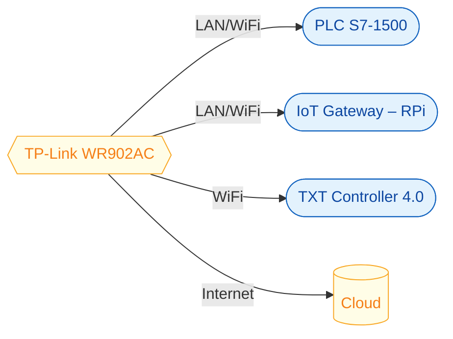

# 01 – Architettura Generale della Microfactory 4.0

Questa sezione presenta la **visione complessiva** della Learning Factory 4.0: l'organizzazione del sistema, l'interazione tra le componenti e il flusso di controllo e informazione.

---

# 1. Vista Generale della Fabbrica

---

# 2. Architettura Logica Completa
Questa sezione descrive i collegamenti tra i moduli: connessioni fisiche, logiche e informatiche del sistema.

---

# 3. Chi Controlla Cosa (Tabella OT/IT)
Questa sezione definisce il ruolo dei diversi livelli del sistema.

| Livello | Componente | Responsabilità |
|---------|------------|----------------|
| **OT (Operativo)** | PLC Siemens S7-1500 | Controllo reale della produzione, gestione sensori/attuatori, sicurezza |
| **Edge** | IoT Gateway (Node-RED) | Calibrazioni, dashboard, comunicazione OPC-UA→MQTT, gestione file |
| **IoT Device** | TXT Controller 4.0 | Lettura NFC, telecamera, sensori, sincronizzazione con cloud |
| **Cloud** | Fischer Cloud | Gestione ordini, dashboard remota |
| **Networking** | TP-Link WR902AC | Gestione rete interna, DHCP, connessione Internet |
| **Moduli fisici** | HBW, VGR, MPO, SLD, DPS, SSC | Parte meccatronica che movimenta e processa il pezzo |

---

# 4. Flusso di Comunicazione OT → IT → Cloud
Qui mostro in che modo i dati e i comandi si spostano tra PLC, Gateway, TXT e Cloud. È utile per capire come avviene la sincronizzazione.

---

# 5. Schema della Rete OT/IT
Rappresentazione semplice di come sono collegati tra loro router, PLC, Gateway, TXT e Cloud.

---

# 6. Architettura Cyber-Fisica (CPS)
La fabbrica si basa sul concetto di **sistema cyber-fisico**: una parte fisica fatta di moduli reali e una parte digitale fatta di PLC, Gateway, TXT e Cloud. È proprio la comunicazione continua tra queste due parti che rende la microfactory un esempio realistico di Industry 4.0.

---

# 7. Scopo della Sezione
Questa sezione fornisce una panoramica dell'intero ecosistema, facilitando la comprensione dei singoli moduli.

