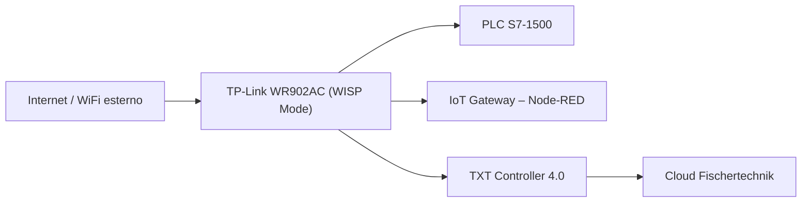

# 02.10 TP-Link Router WR902AC

## 1. Descrizione Generale
Il **TP-Link WR902AC** è il router utilizzato come infrastruttura di rete locale per la Learning Factory 4.0. La sua funzione principale è:
- fornire connettività Wi-Fi e LAN a **TXT Controller**, **IoT Gateway**, **PLC**,
- collegarsi a una rete esterna tramite modalità **WISP (Wireless Internet Service Provider)**,
- assegnare gli indirizzi IP ai dispositivi della microfactory tramite DHCP,
- garantire un punto di accesso stabile per cloud e supervisione.

Il router costituisce la base dell'infrastruttura IT dell’intera microfactory.

---

## 2. Funzione nel Processo Produttivo
Il router è responsabile della rete interna **192.168.0.x**, indispensabile per:
- comunicazione MQTT TXT ↔ Gateway,
- interfaccia OPC-UA PLC ↔ Gateway,
- accesso HTTP al Node-RED Dashboard,
- accesso TXT e Cloud,
- sincronizzazione dei dati tra livelli OT e IT.

Senza il router, la fabbrica non può comunicare né verso l’esterno (cloud) né internamente.

---

## 3. Architettura e Interconnessione
### 3.1 Collegamenti Fisici
- **Porta LAN → PLC Siemens S7-1500**
- **Porta LAN → IoT Gateway (alimentazione via USB + rete via LAN se necessario)**
- **Wi-Fi → TXT Controller**

### 3.2 Dispositivi Connessi
| Dispositivo | IP Assegnato | Tipo | Funzione |
|-------------|--------------|------|----------|
| PLC S7-1500 | 192.168.0.x | LAN | Controllo real-time |
| IoT Gateway | 192.168.0.5 | LAN | Node-RED, OPC-UA, MQTT bridge |
| TXT Controller | 192.168.0.10 | Wi-Fi | Supervisione, NFC, camera |
| PC Configurazione | 192.168.0.xx | Wi-Fi | Debug, calibrazione |
| Router | 192.168.0.252 | LAN IP | Gestione rete |

### 3.3 Modalità WISP
In modalità WISP il router:
- si collega via Wi-Fi a una rete esterna (Wi-Fi principale),
- crea una **sottorete privata 192.168.0.x**,
- fornisce accesso Internet a TXT e Gateway.

---

## 4. Configurazione del Router (Passo-Passo)
### 4.1 Accesso al Router
1. Collegarsi al Wi-Fi del router TP-Link.
2. Aprire browser: `http://192.168.0.252`.
3. Login con credenziali:
   - **Username:** admin
   - **Password:** admin1 (o riportata nel tuo file password)

### 4.2 Impostazione WISP
1. Menu → *Working Mode* → selezionare **WISP**.
2. Cercare la rete Wi-Fi a cui collegarsi.
3. Inserire password rete esterna.
4. Abilitare DHCP interno.

### 4.3 Impostazioni LAN
- IP del router: `192.168.0.252`
- Subnet: `255.255.255.0`
- DHCP attivo: range `192.168.0.2 – 192.168.0.254`

### 4.4 Sicurezza
- WPA2/WPA3
- Password Wi-Fi impostata nel file allegato
- Bloccare WPS

---

## 5. Diagramma Funzionale di Rete

---

## 6. Errori Comuni e Diagnostica
### Errori di Connessione
- Router non raggiunge Internet → rete esterna errata o password sbagliata.
- DHCP disattivato → TXT non ottiene IP.
- Configurazione WISP incompleta → isolamento rete.

### Errori Interni
- Interferenze Wi-Fi
- Modalità router non corretta
- Firewall bloccante (raro)

### Diagnostica
- Pagina **Status** del router
- Ping da PC verso:
  - `192.168.0.252` (router)
  - `192.168.0.5` (gateway)
  - `192.168.0.10` (TXT)

---

## 7. Ruolo nel Contesto Industry 4.0
Il TP-Link WR902AC costituisce l’infrastruttura IT primaria della microfactory:
- collega OT (PLC) con IT (TXT/Cloud),
- permette gestione remota sicura,
- realizza la topologia di rete necessaria allo scambio OPC-UA ↔ MQTT,
- fornisce stabilità di comunicazione.

In un sistema cyber-fisico, il router rappresenta la componente di **rete e connettività** che abilita l’intero ecosistema.

---

## 8. Collegamenti con Altri Moduli
- [[02.8_IoT_Gateway_RaspberryPi.md]]
- [[02.9_TXT_Controller_4.0.md]]

