# 02.10 TP-Link Router WR902AC

## 1. Descrizione Generale

Il TP-Link WR902AC costituisce l’infrastruttura di rete locale della Learning Factory 4.0.
Il router fornisce connettività IP ai dispositivi OT/IT dell’impianto e permette, quando
necessario, l’accesso al cloud Fischertechnik tramite la modalità WISP.

Le sue funzioni principali sono:

- fornire connettività LAN a PLC, IoT Gateway e TXT Controller;
- gestire l’assegnazione degli indirizzi IP tramite DHCP;
- collegarsi a una rete esterna tramite modalità **WISP**;
- offrire un punto di accesso Wi-Fi per PC di configurazione e diagnostica.

Il router rappresenta la base dell’infrastruttura IT della microfactory.

---

## 2. Funzione nel Processo Produttivo

Il router gestisce la rete interna **192.168.0.x**, necessaria per:

- comunicazione MQTT tra TXT e IoT Gateway (via IP locale);
- comunicazione OPC-UA tra PLC e IoT Gateway;
- accesso HTTP al Node-RED Dashboard;
- accesso del TXT al cloud tramite connessione Internet;
- coordinamento informativo tra livelli OT (PLC) e IT (Gateway + TXT).

In assenza del router, i componenti non potrebbero comunicare né con il cloud né tra loro.

---

## 3. Architettura e Interconessione

### 3.1 Collegamenti Fisici
- Porta LAN → PLC Siemens S7-1500
- Porta LAN → IoT Gateway (alimentazione via USB + rete via LAN)
- Porta LAN → TXT Controller (connessione raccomandata)

Il Wi-Fi è utilizzato esclusivamente per PC di configurazione.

---

### 3.2 Dispositivi Connessi

| Dispositivo   | IP Assegnato     | Tipo | Funzione                                 |
|---------------|------------------|------|-------------------------------------------|
| PLC S7-1500   | 192.168.0.x      | LAN  | Controllo real-time                       |
| IoT Gateway   | 192.168.0.5      | LAN  | Node-RED, OPC-UA, MQTT client             |
| TXT Controller| 192.168.0.10     | LAN  | Supervisione IoT, camera, NFC, cloud      |
| PC Tecnico    | 192.168.0.xx     | Wi-Fi| Debug, configurazione                      |
| Router        | 192.168.0.252    | LAN  | Gestione rete                             |

---

### 3.3 Modalità WISP

In modalità WISP:

- il router si collega via Wi-Fi a una rete esterna;
- crea una sottorete privata **192.168.0.x**;
- fornisce accesso Internet a TXT e IoT Gateway tramite NAT;
- mantiene isolamento tra rete esterna e rete interna.

---

## 4. Configurazione del Router (Passo-Passo)

### 4.1 Accesso al Router
1. Collegarsi alla rete Wi-Fi del TP-Link (solo per configurazione).
2. Aprire il browser e visitare: **http://192.168.0.252**
3. Credenziali predefinite:
   - **Username:** admin
   - **Password:** admin1 (o come riportato nel file password interno)

---

### 4.2 Impostazione WISP
1. Menu **Working Mode** → selezionare **WISP (Client Router)**.
2. Selezionare la rete Wi-Fi esterna a cui collegarsi.
3. Inserire la password della rete esterna.
4. Salvare.  
*Nota:* la modalità WISP fornisce accesso Internet tramite NAT, mantenendo privata la rete 192.168.0.x.

---

### 4.3 Impostazioni LAN
- **IP Router:** 192.168.0.252  
- **Subnet Mask:** 255.255.255.0  
- **DHCP attivo:** range consigliato  
  **192.168.0.2 – 192.168.0.254**

Gli indirizzi tipici della Learning Factory:
- IoT Gateway → **192.168.0.5**
- TXT Controller → **192.168.0.10**
- PLC S7-1500 → **192.168.0.20** (o altro IP libero)

---

### 4.4 Sicurezza
- WPA2/WPA3 per l’accesso Wi-Fi
- Password Wi-Fi conforme a quanto indicato nel file interno
- Disabilitare **WPS** per sicurezza

---

## 5. Diagramma Funzionale di Rete

```mermaid
flowchart LR
  INTERNET["Internet / Rete Esterna"]
  ROUTER["TP-Link WR902AC<br>(WISP Mode + LAN 192.168.0.x)"]
  PLC["PLC S7-1500<br>(OPC-UA Server)"]
  GATEWAY["IoT Gateway – Node-RED<br>(OPC-UA Client / MQTT Client)"]
  TXT["TXT Controller 4.0<br>(MQTT Broker + Client)"]
  CLOUD["Fischertechnik Cloud<br>(MQTT Client)"]

  INTERNET --> ROUTER

  ROUTER --> PLC
  ROUTER --> GATEWAY
  ROUTER --> TXT

  TXT --> CLOUD
  CLOUD --> TXT

```

---

## 6. Errori Comuni e Diagnostica

### 6.1 Errori di Connessione
- Router non raggiunge Internet → credenziali Wi-Fi esterne errate o AP non disponibile.
- DHCP disattivato → TXT, PLC e Gateway non ricevono IP.
- Gateway non raggiungibile (192.168.0.5) → impossibile comunicare OPC-UA con il PLC.
- TXT senza accesso Internet → il cloud non riceve aggiornamenti.

---

### 6.2 Errori Interni
- Modalità router errata (non WISP o non Client Router).
- Configurazione IP duplicata nella rete locale.
- NAT o subnet configurati in modo non conforme.

---

### 6.3 Diagnostica
- Pagina **Status** del router per verificare IP, DHCP e WISP.
- Ping verso:
  - **192.168.0.252** (router)
  - **192.168.0.5**   (IoT Gateway)
  - **192.168.0.10**  (TXT Controller)
- Verifica stato cloud tramite dashboard Fischertechnik.

---

## 7. Ruolo nel Contesto Industry 4.0

Il TP-Link WR902AC costituisce l’infrastruttura di rete locale della 
Learning Factory 4.0 e garantisce la connettività tra:

- livello OT (PLC, moduli fisici),
- livello Edge (IoT Gateway),
- livello IoT/Cloud (TXT Controller e cloud Fischertechnik).

Il router:

- fornisce la rete IP necessaria a OPC-UA (PLC ↔ Gateway),
- abilita la comunicazione MQTT (TXT ↔ Gateway ↔ Cloud),
- permette l’accesso Internet in modalità WISP,
- assicura stabilità di comunicazione tra tutti i livelli dell’architettura cyber-fisica.

In un sistema cyber-fisico, costituisce il componente di **rete e connettività**
che abilita l’intero ecosistema IT/OT.

---

## 8. Collegamenti con Altri Moduli
- [[02.8_IoT_Gateway_RaspberryPi.md]]
- [[02.9_TXT_Controller_4.0.md]]

