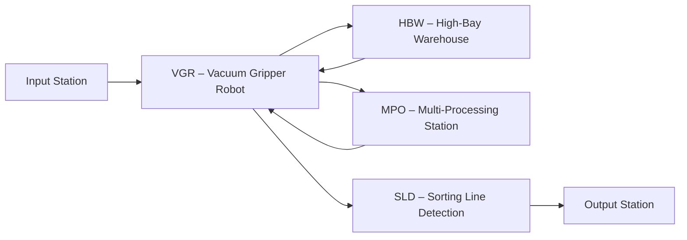

# 02.1 Vacuum Gripper Robot (VGR)

## 1. Descrizione Generale
Il **VGR – Vacuum Gripper Robot** è un manipolatore cartesiano a tre assi (X, Y, Z) dotato di presa tramite **ventosa a vuoto**. È il principale attuatore responsabile della movimentazione interna dei workpiece nella Fischertechnik Learning Factory 4.0 24V.

Questa componente rappresenta fedelmente la logica delle stazioni robotiche industriali, riproducendo dinamiche di:
- movimentazione cartesiana,
- gestione del vuoto per il pick&place,
- sincronizzazione con PLC e altre stazioni,
- controllo e diagnostica tramite Node-RED.

---

## 2. Funzione nel Processo Produttivo
Il VGR si occupa di trasferire i workpiece tra le principali stazioni della microfactory:
- **Input → HBW (Magazzino Verticale)**
- **HBW → MPO (Stazione di Lavorazione)**
- **MPO → SLD (Sorting Line)**
- **SLD → Output / ritorno HBW**

Ogni movimento avviene solo dopo conferme di stato (finecorsa, presenza pezzo, posizione raggiunta) per garantire una sequenza sicura e priva di collisioni.

---

## 3. Architettura del Sistema
### 3.1 Struttura Meccanica
- Asse **X**: movimento orizzontale
- Asse **Y**: traslazione trasversale
- Asse **Z**: sollevamento/abbassamento
- Ventosa pneumatica con sensore di pressione
- Guide lineari Fischertechnik con struttura modulare

### 3.2 Componenti Elettrici
- Motori DC comandati tramite driver PWM
- Relè di inversione (avanti/indietro)
- Elettrovalvola on/off per la ventosa
- Sensori:
  - finecorsa X/Y/Z,
  - sensore presenza pezzo,
  - sensore pressione vacuum.

### 3.3 Interfacciamento con PLC
| Componente    | Segnale PLC       | Tipo     |
| ------------- | ----------------- | -------- |
| Motore Asse X | PWM + direzione   | Uscita   |
| Motore Asse Y | PWM + direzione   | Uscita   |
| Motore Asse Z | PWM + direzione   | Uscita   |
| Ventosa       | Uscita digitale   | Uscita   |
| Finecorsa     | Ingressi digitali | Ingresso |
| Sensore vuoto | Ingresso digitale | Ingresso |

Il PLC utilizza funzioni dedicate come **FB_VGR** per la gestione dei movimenti, sicurezza, timeout e conferme sequenziali.

---

## 4. Diagramma del Flusso Funzionale

---

## 5. Ciclo Operativo Dettagliato
### 5.1 Prelievo
1. Verifica posizione iniziale sicura.
2. Movimento X/Y verso coordinate target.
3. Abbassamento asse Z.
4. Attivazione ventosa → conferma tramite sensore.

### 5.2 Trasporto
1. Risalita asse Z.
2. Navigazione verso nuova stazione.
3. Posizionamento fine tramite encoder e finecorsa.

### 5.3 Rilascio
1. Disattivazione ventosa.
2. Conferma rilascio.
3. Risalita in posizione neutra.

### 5.4 Segnali Scambiati con PLC
- `VGR_READY`
- `VGR_BUSY`
- `PICK_DONE`
- `DROP_DONE`
- `ERROR_STATE`

Questi segnali sono indispensabili per mantenere coerenza sequenziale.

---

## 6. Errori Comuni e Diagnostica
### Errori Meccanici
- Blocco assi (collisioni o attriti eccessivi)
- Ventosa non in presa
- Allineamento imperfetto con stazioni MPO/HBW

### Errori Sensori
- Finecorsa non rilevato
- Sensore vuoto non attivo

### Diagnostica con Node-RED
- Dashboard: **HMI → VGR Positions**
- Topic MQTT: `/factory/vgr/state`
- Errori nel PLC: `FB_VGR::ErrorCode`

---

## 7. Procedura di Calibrazione (Node-RED)
1. Accedere a Node-RED → Dashboard → VGR Positions.
2. Impostare manualmente posizioni min/max di X/Y/Z.
3. Verificare movimenti in modalità test.
4. Salvare configurazioni in `ConfigData.csv`.
5. Riavviare PLC e IoT Gateway.

---

## 8. Ruolo nel Contesto Industry 4.0
Il VGR incarna il livello di **attuazione fisica** nel modello cyber-fisico della fabbrica:
- esecuzione comandi del PLC,
- feedback verso Edge (Gateway),
- supporto alla tracciabilità del ciclo produzione,
- integrazione con dashboard cloud.

La sua architettura è affine ai sistemi industriali reali a tre assi per logistica interna.

---

## 9. Collegamenti ad Altri Moduli
- [[02.2_HBW_HighBay_Warehouse.md]]
- [[02.3_MPO_MultiProcessing_Station.md]]
- [[02.4_SLD_Sorting_Line_Detection.md]]

