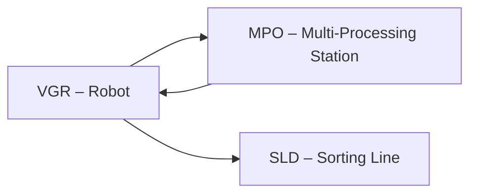

# 02.3 Multi-Processing Station (MPO)

## 1. Descrizione Generale
La **MPO – Multi-Processing Station** è la stazione di lavorazione centrale della Learning Factory 4.0. Simula un processo industriale composto da:
- **Fase termica** (forno / kiln),
- **Fase meccanica** (piattaforma di lavorazione),
- **Movimentazione verticale/orizzontale** del workpiece.

Il suo ruolo è trasformare il workpiece grezzo prelevato dall’HBW in un oggetto “processato”, pronto per la fase successiva (SLD). Riproduce dinamiche industriali quali:
- trattamenti termici,
- processi di machining,
- sincronizzazione tra stazioni robotiche.

---

## 2. Funzione nel Processo Produttivo
La MPO riceve il workpiece dal VGR e ne esegue la lavorazione secondo uno schema sequenziale definito nel programma PLC:
1. Il VGR deposita il pezzo nell’area MPO.
2. La MPO attiva la fase di riscaldamento / processo.
3. Vengono eseguiti movimenti di lavorazione interna.
4. A ciclo terminato, la stazione comunica al PLC la disponibilità del pezzo.
5. Il VGR preleva il workpiece e lo trasferisce alla SLD.

Durante tutta la lavorazione, lo stato della stazione viene mostrato in tempo reale su Node-RED e sulla dashboard cloud.

---

## 3. Architettura del Sistema
### 3.1 Struttura Meccanica
- Piano di lavoro motorizzato (movimento lineare)
- Camera termica / forno simulato
- Struttura modulare Fischertechnik
- Sensori di posizione e presenza pezzo

### 3.2 Componenti Elettrici
- Motore DC per piattaforma
- Elemento riscaldante (simulazione via LED/resistenza)
- Ventola di raffreddamento
- Finecorsa movimento piano
- Sensore presenza workpiece

### 3.3 Interfacciamento con PLC
| Componente | Segnale PLC | Tipo |
|-----------|--------------|------|
| Motore piano lavoro | PWM + direzione | Uscita |
| Forno (riscaldamento) | Uscita digitale | Uscita |
| Ventola | Uscita digitale | Uscita |
| Finecorsa piano | Ingresso digitale | Ingresso |
| Presence sensor | Ingresso digitale | Ingresso |

Il PLC utilizza il blocco funzionale **FB_MPO**, che coordina:
- accensione forno,
- durata del trattamento,
- movimento del piano,
- condizioni di sicurezza,
- sincronizzazione con VGR.

---

## 4. Diagramma di Flusso Funzionale

---

## 5. Ciclo Operativo Dettagliato
### 5.1 Ingresso
1. Conferma presenza VGR.
2. Conferma posizione piano lavoro.
3. Sensore presenza rileva workpiece.

### 5.2 Lavorazione
1. Attivazione fase termica (timer forno).
2. Eventuale movimento piano lavoro.
3. Attesa completamento processo.
4. Attivazione ventola di raffreddamento.

### 5.3 Uscita
1. Piano si riposiziona in modalità prelievo.
2. Segnale al PLC: `MPO_READY_FOR_PICK`.
3. Il VGR esegue il pick.

### 5.4 Segnali PLC
- `MPO_BUSY`
- `MPO_DONE`
- `MPO_ERROR`
- `MPO_READY_FOR_PICK`

---

## 6. Errori Comuni e Diagnostica
### Errori Meccanici
- Piano non raggiunge la posizione corretta.
- Presenza workpiece non rilevata.

### Errori Sensori
- Finecorsa guasto o sporco.
- Sensore presenza non allineato.

### Diagnostica Node-RED
- Dashboard: **HMI → MPO Status**
- Log interno del processo termico
- Errori dedicati in `FB_MPO::ErrorCode`

---

## 7. Procedura di Calibrazione (Node-RED)
1. Accedere a Node-RED → *Calibration*.
2. Posizionare manualmente il piano di lavoro.
3. Registrare coordinate min/max.
4. Salvare `ConfigData.csv`.
5. Riavviare PLC + IoT Gateway.

---

## 8. Ruolo nel Contesto Industry 4.0
La MPO rappresenta la fase di **trasformazione industriale** del ciclo produttivo. Simula:
- lavorazioni termiche,
- machining controllato,
- controllo di processo,
- integrazione con cloud per monitoraggio dei tempi.

È la componente che consente alla microfactory di replicare in modo realistico una pipeline produttiva completa.

---

## 9. Collegamenti con Altri Moduli
- [[02.1_VGR_Vacuum_Gripper_Robot.md]]
- [[02.2_HBW_HighBay_Warehouse.md]]
- [[02.4_SLD_Sorting_Line_Detection.md]]

