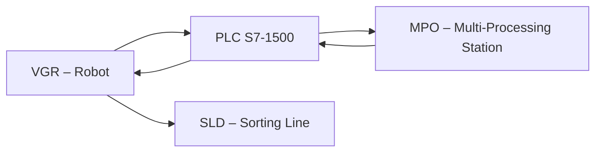

# 02.3 Multi-Processing Station (MPO)

## 1. Descrizione Generale

La MPO – Multi-Processing Station è la stazione centrale di lavorazione della Learning Factory 4.0. Riproduce un processo industriale multistadio composto da:

- **fase termica simulata** mediante riscaldamento controllato (PWM),
- **fase meccanica** su piattaforma di processo,
- **movimentazione verticale/orizzontale** per posizionamento e rilascio del workpiece.

La stazione è strutturata in due unità principali:

1. **Processing Platform** – piano di lavorazione con simulazione di riscaldamento.
2. **Handling Unit** – cinematica verticale/orizzontale per la movimentazione interna.

Il suo scopo è trasformare il workpiece grezzo proveniente dall'HBW in un pezzo “processato”, pronto per la fase successiva (SLD).  
La MPO riproduce dinamiche tipiche della manifattura, quali:

- trattamenti termici simulati,
- micro-operazioni di machining,
- sequenziamento e sincronizzazione con sistemi robotici e PLC.

---

## 2. Funzione nel Processo Produttivo

La MPO riceve il workpiece dal VGR e ne esegue la lavorazione secondo una sequenza programmata all’interno del PLC (FB_MPO):

1. Il VGR posiziona il pezzo nell’area di processo.
2. Il PLC attiva la fase termica simulata tramite controllo PWM.
3. L’unità di movimentazione verticale/orizzontale posiziona il pezzo per la lavorazione.
4. Il PLC gestisce la temporizzazione del ciclo e monitora sensori e finecorsa.
5. Al termine del processo, il PLC espone lo stato **MPO_DONE**.
6. Il VGR preleva il pezzo e lo trasferisce alla stazione SLD.

La MPO opera in stretta sincronizzazione con il VGR e con il PLC, che ne gestisce stati, temporizzazioni e condizioni di sicurezza.

---

## 3. Architettura del Sistema
### 3.1 Struttura Meccanica
La MPO è costituita da due unità principali:

1. **Processing Platform**
   - Piano di lavoro con alloggiamento del workpiece.
   - Sistema di riscaldamento simulato tramite LED/elemento resistivo.
   - Possibile ventola per la fase di raffreddamento.
   - Sensori di presenza del pezzo e di posizione del piano.

2. **Handling Unit (Movimentazione)**
   - Cinematica lineare per lo spostamento del piano in posizione di processo.
   - Finecorsa per rilevare le posizioni limite (avanti/indietro, alto/basso).
   - Struttura modulare FischerTechnik.

### 3.2 Componenti Elettrici
- Motore DC per il movimento lineare del piano (controllo PWM + direzione)
- Elemento di riscaldamento simulato (LED / resistenza controllata)
- Ventola per simulazione fase di raffreddamento
- Finecorsa per:
  - posizione del piano (home / fine corsa)
  - posizione della piattaforma
- Sensore presenza workpiece (ingresso digitale)

## 3.3 Interfacciamento con PLC

| Componente                | Segnale PLC            | Tipo     |
|---------------------------|-------------------------|----------|
| Motore piano lavoro       | PWM + direzione         | Uscita   |
| Riscaldamento (simulato)  | Uscita digitale         | Uscita   |
| Ventola                   | Uscita digitale         | Uscita   |
| Finecorsa piano           | Ingresso digitale       | Ingresso |
| Sensore presenza workpiece| Ingresso digitale       | Ingresso |

Il PLC utilizza il blocco funzionale **FB_MPO**, che coordina:

- gestione del riscaldamento,
- controllo temporizzazione del trattamento,
- movimento lineare del piano,
- verifica dei finecorsa,
- condizioni di sicurezza,
- sincronizzazione con il robot VGR.

---

## 4. Diagramma di Flusso Funzionale

---

## 5. Ciclo Operativo Dettagliato

### 5.1 Ingresso
1. Il PLC posiziona il piano in modalità *Load Position*.
2. Il VGR deposita il workpiece.
3. Il sensore presenza conferma la disponibilità del pezzo.
4. Finecorsa e logiche di sicurezza devono essere validi prima dell’avvio.

### 5.2 Lavorazione
1. Il PLC attiva il riscaldamento simulato (PWM).
2. Il piano può essere movimentato nella *Processing Position*.
3. Il timer interno del FB_MPO determina la durata del trattamento.
4. Al termine, si attiva la ventola per la fase di raffreddamento.
5. Il PLC espone lo stato **MPO_DONE**.

### 5.3 Uscita
1. Il piano torna nella *Pick Position*.
2. Il PLC attiva il segnale **MPO_READY_FOR_PICK**.
3. Il VGR effettua il prelievo del pezzo.

### 5.4 Segnali PLC principali
- **MPO_BUSY**
- **MPO_DONE**
- **MPO_ERROR**
- **MPO_READY_FOR_PICK**
- **MPO_READY**

---

## 6. Errori Comuni e Diagnostica

### 6.1 Errori Meccanici
- Il piano non raggiunge la posizione corretta (fuori limite / offset errato).
- Finecorsa piano non attivo o guasto.
- Movimento oltre i limiti meccanici consentiti.
- Sensore presenza non rileva il workpiece.
- Ventola guasta o non attiva durante la fase di raffreddamento.

### 6.2 Errori Sensori
- Sensore presenza sporco o disallineato.
- Doppia rilevazione del workpiece.
- Feedback del forno non coerente (LED non si accende).

### 6.3 Diagnostica Node-RED
- Dashboard → **HMI → MPO Status**.
- Visualizzazione stato forno, timer, posizione piano.
- Log interno del ciclo termico.
- Errori provenienti da `FB_MPO::ErrorCode`.

---

## 7. Procedura di Calibrazione (Node-RED)

1. Accedere a Node-RED → **Calibration**.
2. Posizionare manualmente il piano di lavoro nella posizione *Home*.
3. Registrare le coordinate di:
   - **Home offset**
   - **Work offset** (posizione di processo)
4. Verificare funzionamento forno (accensione LED simulato).
5. Salvare i dati in `ConfigData.csv`.
6. Riavviare il PLC per applicare i nuovi valori.

---

## 8. Ruolo nel Contesto Industry 4.0

La MPO rappresenta la fase di **trasformazione industriale** del processo produttivo.  
Riproduce:
- trattamenti termici simulati,
- machining controllato,
- controllo di processo,
- registrazione dei tempi di lavorazione,
- sincronizzazione robot–stazione (VGR),
- integrazione con cloud per analisi e monitoraggio.

È la stazione che trasforma il workpiece da “grezzo” a “processato”, abilitando il controllo qualità nella fase successiva (SLD) e completando il ciclo produttivo digitale della microfactory.

---

## 9. Collegamenti con Altri Moduli
- [[02.1_VGR_Vacuum_Gripper_Robot.md]]
- [[02.2_HBW_HighBay_Warehouse.md]]
- [[02.4_SLD_Sorting_Line_Detection.md]]

