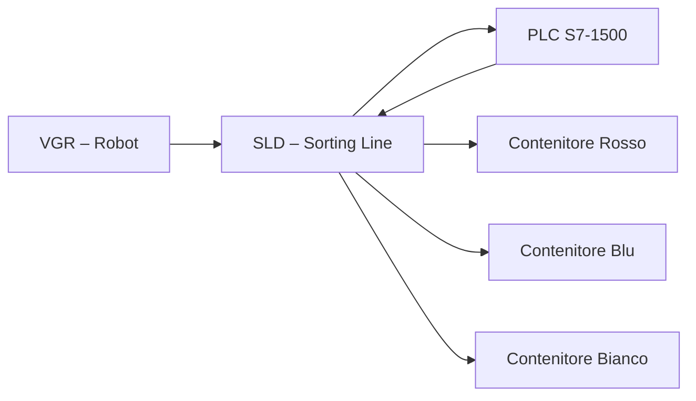

# 02.4 Sorting Line Detection (SLD)
## 1. Descrizione Generale

La SLD – Sorting Line Detection è la stazione dedicata allo smistamento automatico dei workpiece in base al loro **colore rilevato da un sensore RGB**.
È costituita da:

- nastro trasportatore lineare,
- sensore colore (RGB + luminosità),
- deviatore a solenoide,
- contenitori di raccolta.

La stazione riproduce un tipico processo di **color-based sorting**, comune neisistemi industriali di classificazione e controllo qualità.

---

## 2. Funzione nel Processo Produttivo

Il funzionamento della SLD è autonomo e si articola come segue:

1. Il VGR deposita il workpiece sul nastro di ingresso.
2. Il sensore colore acquisisce i valori RGB e di luminosità.
3. Il PLC elabora i valori confrontandoli con le soglie calibrate.
4. Il deviatore indirizza il pezzo verso uno dei contenitori (rosso, blu, bianco),
   oppure genera un errore se il colore non è classificabile.

La SLD opera come modulo indipendente di sorting e non influenza il flusso principale della produzione della microfactory.

---

## 3. Architettura del Sistema

### 3.1 Struttura Meccanica
- Nastro trasportatore lineare
- Sensore di presenza (fotointerruttore)
- Sensore colore RGB
- Deviatore a solenoide
- Contenitori di raccolta

### 3.2 Componenti Elettrici
- Motore DC per il nastro (PWM)
- Solenoide per il deviatore
- Sensori:
  - presenza workpiece (digitale)
  - colore RGB (analogico)

## 3.3 Interfacciamento con PLC

| Componente       | Segnale PLC                | Tipo     |
|------------------|-----------------------------|----------|
| Motore nastro    | PWM + direzione             | Uscita   |
| Deviatore        | DO (solenoide)              | Uscita   |
| Sensore presenza | DI                           | Ingresso |
| Sensore colore   | 3 ingressi analogici (R,G,B) | Ingresso |

Il blocco **FB_SLD** gestisce:
- acquisizione valori RGB,
- confronto con soglie definite,
- comando del deviatore,
- gestione del nastro,
- generazione di stati e errori.

---

## 4. Diagramma Funzionale

---

## 5. Ciclo Operativo Dettagliato

### 5.1 Lettura Colore
1. Il nastro trasporta il pezzo sotto al sensore.
2. Il sensore produce tre valori analogici (R, G, B).
3. Il PLC confronta tali valori con soglie calibrate.
4. Determinazione del colore secondo le classi definite in configurazione.

### 5.2 Smistamento
1. Il PLC attiva il solenoide del deviatore.
2. Il pezzo viene instradato nel contenitore appropriato.
3. Il PLC segnala il completamento tramite **SLD_DONE**.

### 5.3 Segnali Scambiati
- SLD_BUSY  
- SLD_COLOR_DETECTED  
- SLD_DONE  
- SLD_ERROR

---

## 6. Calibrazione del Sensore Colore
La calibrazione avviene tramite Node-RED:

1. Dashboard → *Calibration*.
2. Posizionare un pezzo davanti al sensore.
3. Registrare i valori medi di R, G e B.
4. Definire le soglie per ogni classe (Rosso, Blu, Bianco) in base ai valori misurati.
5. Salvare le soglie nel file **ConfigData.csv**.

Le soglie dipendono dall'illuminazione e non sono universali.

---

## 7. Errori Comuni e Diagnostica
### Errori Sensori
- Valori RGB incoerenti.
- Illuminazione errata.
- Sensore sporco o ostruito.
- Errore colore instabile → necessità di ricalibrazione

### Errori Meccanici
- Deviatore bloccato.
- Nastro non in movimento → PWM nullo o guasto motore

### Diagnostica Node-RED
- Stato SLD in **HMI → SLD Monitoring**.
- Lettura valori RGB in tempo reale.
- Alert automatizzati in caso di mismatch colore.

---

## 8. Ruolo nel Contesto Industry 4.0
La SLD introduce un livello di **controllo qualità** basato su caratteristiche fisiche del pezzo. Ciò replica:
- sistemi di visione industriale,
- classificazione automatica,
- gestione dinamica della produzione.

Contribuisce alla tracciabilità e alla flessibilità della microfactory.

---

## 9. Collegamenti con Altri Moduli
- [[02.3_MPO_MultiProcessing_Station.md]]
- [[02.5_SSC_Sensor_Station_Camera.md]]

