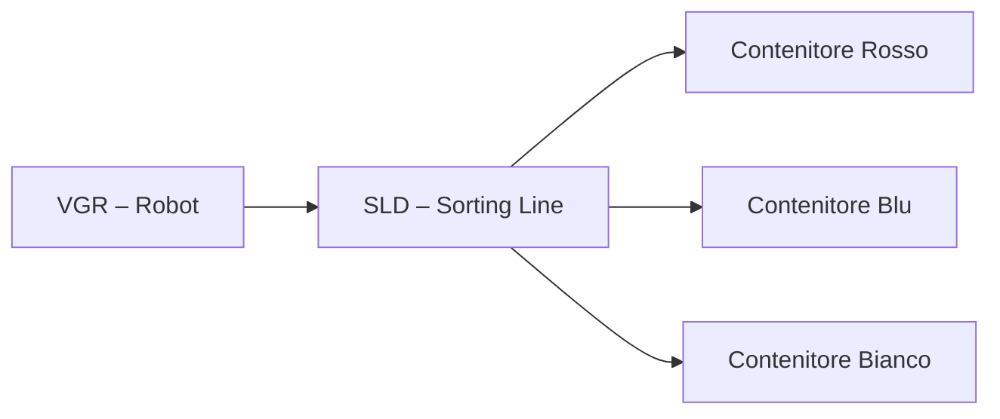

# 02.4 Sorting Line Detection (SLD)
## 1. Descrizione Generale
La **SLD – Sorting Line Detection** è la stazione responsabile dello smistamento automatizzato dei workpiece basandosi sul loro **colore**. È una linea dotata di sensore ottico RGB, nastro trasportatore e deviatore elettromeccanico, che consente di instradare ciascun pezzo verso il contenitore corretto.

Questa stazione svolge un ruolo analogo ai sistemi industriali di **quality sorting** e **classificazione automatica**, ed è cruciale nella pipeline della Learning Factory 4.0 poiché determina il percorso successivo del workpiece.

---

## 2. Funzione nel Processo Produttivo
Il flusso di lavoro della SLD è il seguente:
1. Il VGR deposita il workpiece sulla linea.
2. Il sensore colore acquisisce i valori RGB.
3. Il PLC confronta i valori con le soglie calibrate.
4. In base al colore:
   - il deviatore indirizza il pezzo al contenitore specifico (Rosso/Blu/Bianco),
   - oppure segnala errore se il colore non è riconosciuto.
5. Il VGR recupera il contenitore corrispondente.

La SLD costituisce una fase chiave nella logica Industry 4.0 per la gestione intelligente dei flussi produttivi.

---

## 3. Architettura del Sistema
### 3.1 Struttura Meccanica
- Nastro trasportatore lineare.
- Sensore di presenza in ingresso.
- Sensore colore RGB.
- Pistone / deviatore per instradamento.
- Contenitori di raccolta.

### 3.2 Componenti Elettrici
- Motore DC per nastro (PWM).
- Elettrovalvola per deviatore.
- Sensori:
  - presenza workpiece,
  - rilevamento colore (RGB),
  - posizione deviatore.

### 3.3 Interfacciamento con PLC
| Componente | Segnale PLC | Tipo |
|-----------|--------------|------|
| Motore nastro | PWM + direzione | Uscita |
| Deviatore | Uscita digitale | Uscita |
| Sensore presenza | Ingresso digitale | Ingresso |
| Sensore colore | Ingresso analogico (RGB) | Ingresso |

Il blocco **FB_SLD** gestisce:
- lettura sensore colore,
- comparazione soglie,
- comando deviatore,
- gestione timer del nastro,
- segnalazione errori.

---

## 4. Diagramma Funzionale

---

## 5. Ciclo Operativo Dettagliato
### 5.1 Lettura Colore
1. Il nastro avanza il pezzo fino al sensore.
2. Il sensore emette i valori RGB.
3. Il PLC calibra i valori su intervalli predefiniti.
4. Determinazione colore:
   - `RED` se R > soglia_R & R > B & R > G
   - `BLUE` se B > soglia_B & B > R & B > G
   - `WHITE` se R, G, B elevati e simili

### 5.2 Smistamento
1. Il PLC attiva il deviatore.
2. Il pezzo viene inviato al contenitore corretto.
3. Viene inviato segnale `SLD_DONE`.

### 5.3 Segnali scambiati
- `SLD_BUSY`
- `SLD_COLOR_DETECTED`
- `SLD_DONE`
- `SLD_ERROR`

---

## 6. Calibrazione del Sensore Colore
La calibrazione avviene tramite Node-RED:
1. Dashboard → *Calibration*.
2. Posizionare manualmente un pezzo davanti al sensore.
3. Registrare i valori RGB medi.
4. Impostare soglie di colore:
   - **Rosso:** R ≥ 200, G ≤ 60, B ≤ 60
   - **Blu:** B ≥ 200, R ≤ 60, G ≤ 60
   - **Bianco:** R,G,B ≥ 180
5. Salvare → `ConfigData.csv`.

---

## 7. Errori Comuni e Diagnostica
### Errori Sensori
- Valori RGB incoerenti.
- Illuminazione errata.
- Sensore sporco o ostruito.

### Errori Meccanici
- Deviatore bloccato.
- Nastro non avanza.

### Diagnostica Node-RED
- Stato SLD in **HMI → SLD Monitoring**.
- Lettura valori RGB in tempo reale.
- Alert automatizzati in caso di mismatch colore.

---

## 8. Ruolo nel Contesto Industry 4.0
La SLD introduce un livello di **controllo qualità** basato su caratteristiche fisiche del pezzo. Ciò replica:
- sistemi di visione industriale,
- classificazione automatica,
- gestione dinamica della produzione.

Contribuisce alla tracciabilità e alla flessibilità della microfactory.

---

## 9. Collegamenti con Altri Moduli
- [[02.3_MPO_MultiProcessing_Station.md]]
- [[02.5_SSC_Sensor_Station_Camera.md]]

