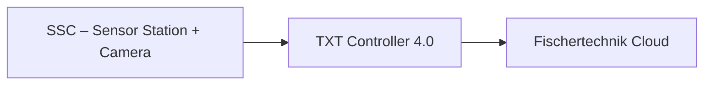

# 02.5 Sensor Station + Camera (SSC)

## 1. Descrizione Generale
La **SSC – Sensor Station + Camera** è una stazione multifunzionale che integra:
- un **sensore ambientale** (temperatura, umidità, luminosità, pressione, qualità dell’aria),
- una **telecamera orientabile**, controllata da remoto,
- un modulo di acquisizione e monitoraggio collegato al **TXT Controller 4.0**.

Questa stazione svolge un duplice ruolo:
1. **Monitoraggio ambientale** della microfactory in tempo reale.
2. **Ispezione visiva** del processo produttivo, tramite camera regolabile.

Si tratta di un componente chiave nei sistemi cyber-fisici, poiché fornisce dati contestuali e supporta la supervisione remota.

---

## 2. Funzione nel Processo Produttivo
La SSC viene utilizzata per:
- raccolta continua dei parametri ambientali,
- streaming video dalla microfactory,
- acquisizione di immagini per documentazione del processo,
- supporto alle attività di debugging e controllo qualità.

Il TXT Controller invia i dati al cloud, rendendoli disponibili nella dashboard ufficiale.

---

## 3. Architettura del Sistema
### 3.1 Sensori Ambientali
La SSC misura:
- **Temperatura (°C)**
- **Umidità (%)**
- **Luce (%)**
- **Pressione (hPa)**
- **Qualità dell’aria (AQI / VOC)**

### 3.2 Telecamera Pan-Tilt
- **Movimento orizzontale** (asse pan)
- **Movimento verticale** (asse tilt)
- Controllo tramite segnali digitali inviati al TXT Controller
- Possibilità di scattare foto e salvarle in galleria

### 3.3 Componenti Elettrici
- Motori DC miniaturizzati per pan/tilt
- Sensore luce integrato
- Modulo sensore ambiente (I2C)
- LED stato

### 3.4 Interfacciamento con TXT Controller
| Funzione | Segnale / Protocollo | Direzione |
|----------|------------------------|-----------|
| Lettura sensori ambientali | API TXT (I2C) | Ingresso |
| Controllo camera pan/tilt | PWM + direzione | Uscita |
| Acquisizione immagini | TXT API | Uscita verso cloud |

La SSC **non è gestita dal PLC**, ma direttamente dal TXT Controller.

---

## 4. Diagramma Funzionale

---

## 5. Ciclo Operativo Dettagliato
### 5.1 Acquisizione Dati Ambientali
1. Il sensore misura parametri ogni ciclo di campionamento.
2. Il TXT riceve i valori via bus interno.
3. I dati vengono inviati al cloud.
4. La dashboard aggiorna la sezione “Environmental Station”.

### 5.2 Ispezione Visiva
1. L’utente controlla il pan/tilt via dashboard.
2. La camera si muove tramite attuatori dedicati.
3. È possibile scattare foto e salvarle.
4. Le immagini finiscono nella galleria cloud.

### 5.3 Segnali e Stati
- `SSC_ENV_DATA_READY`
- `SSC_CAMERA_MOVING`
- `SSC_SNAPSHOT_DONE`
- `SSC_ERROR`

---

## 6. Errori Comuni e Diagnostica
### Errori Sensori
- Valori incoerenti (sensore difettoso o sporco)
- Illuminazione errata

### Errori Telecamera
- Movimenti incompleti (problema PWM)
- Motore pan/tilt bloccato

### Diagnostica
- Dashboard Cloud → Environmental Station
- Node-RED → Monitoraggio TXT

---

## 7. Procedura di Calibrazione
1. Accedere a dashboard cloud.
2. Muovere pan/tilt e verificare finecorsa.
3. Verificare valori sensore con condizioni ambientali reali.
4. Correggere soglie via TXT se necessario.

---

## 8. Ruolo nel Contesto Industry 4.0
La SSC è l’elemento di **supervisione visiva** e **ambientale** del sistema:
- abilita manutenzione predittiva,
- migliora la qualità del monitoraggio remoto,
- fornisce dati contestuali utili per decision making.

Il suo accoppiamento con il TXT Controller rappresenta un tipico esempio di **sensore-edge device**.

---

## 9. Collegamenti con Altri Moduli
- [[02.4_SLD_Sorting_Line_Detection.md]]
- [[02.9_TXT_Controller_4.0.md]]

