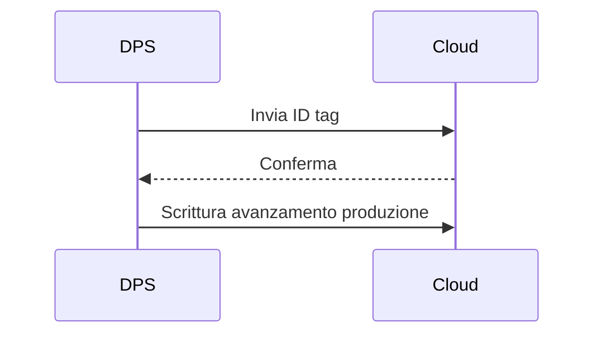

# 02.6 DPS – Input/Output Station + NFC

## 1. Descrizione Generale
La **DPS – Input/Output Station + NFC** è la stazione incaricata di:
- gestire l’**ingresso** e **uscita** dei workpiece,
- **leggere** e **scrivere** informazioni sui tag **NFC NTAG213**,
- comunicare lo stato di produzione al **TXT Controller 4.0** e alla dashboard cloud.

È una delle componenti più critiche della pipeline Industry 4.0 poiché abilita la **tracciabilità completa** del pezzo, rendendolo un vero e proprio *digital twin fisico*.

---

## 2. Funzione nel Processo Produttivo
La stazione DPS opera come punto di identificazione del pezzo:
1. Il workpiece viene posizionato sulla DPS.
2. Il lettore NFC rileva il tag NTAG213 integrato.
3. Viene recuperato l’**ID univoco** del pezzo.
4. Il TXT aggiorna il cloud con:
   - ID,
   - stato ordine,
   - timestamp,
   - avanzamento produzione.
5. In fase finale, la DPS **scrive** sul tag lo stato completato.

Questo consente alla fabbrica di ricostruire l’intero ciclo vita del pezzo.

---

## 3. Architettura del Sistema
### 3.1 Struttura Fisica
- Piattaforma con sede per il workpiece
- Lettore NFC integrato sotto il piano
- LED di stato (lettura/scrittura/errore)
- Sensore presenza workpiece

### 3.2 Componenti Elettrici
- Modulo NFC 13.56 MHz
- LED RGB
- Sensore presenza

### 3.3 Interfacciamento
A differenza di VGR/HBW/MPO/SLD, **la DPS non è controllata dal PLC**, ma direttamente dal **TXT Controller 4.0**, che:
- gestisce la lettura,
- prepara i dati da inviare al cloud,
- scrive i nuovi valori sul tag.

---

## 4. Tipologia di Tag Utilizzati
### **NTAG213 (ISO/IEC 14443-A)**
- Memoria disponibile: **180 byte**
- UID a 7 byte
- Velocità lettura: 106 kbit/s
- Anti-collisione
- Distanza operativa ottimale: **1–2 cm**

### Struttura tipica dei dati scritti
| Offset | Contenuto     | Descrizione                      |
| ------ | ------------- | -------------------------------- |
| 00–06  | UID           | Identificativo univoco           |
| 07–20  | Stato ordine  | Ordered / Processing / Completed |
| 21–40  | Codice colore | R / B / W                        |
| 41–70  | Timestamp     | ISO8601                          |

---

## 5. Diagramma Funzionale

---

## 6. Ciclo Operativo Dettagliato
### 6.1 Lettura NFC
1. Il workpiece viene rilevato dal sensore presenza.
2. Il TXT attiva la lettura.
3. Il lettore NFC acquisisce UID + dati.
4. I dati vengono inviati alla dashboard cloud.

### 6.2 Scrittura NFC
1. A fine lavorazione, il TXT riceve nuovo stato dal PLC via MQTT.
2. Il TXT prepara il payload:
   - ID
   - Stato (e.g. `Completed`)
   - Timestamp
3. Il TXT scrive sul tag.
4. Il sistema verifica l’avvenuta scrittura.

### 6.3 Segnali chiave
- `DPS_NFC_READ`
- `DPS_NFC_WRITE`
- `DPS_NFC_ERROR`
- `DPS_ITEM_PRESENT`

---

## 7. Errori Comuni e Diagnostica
### Errori Lettura
- Distanza troppo elevata dal lettore
- Tag danneggiato
- UID non riconosciuto

### Errori Scrittura
- Operazione incompleta
- Memoria insufficiente
- Collisione tag

### Diagnostica
- Dashboard: sezione **NFC Reader**
- Node-RED: monitoraggio TXT → MQTT

---

## 8. Procedura di Test
1. Posizionare un workpiece con tag.
2. Verificare lettura UID.
3. Modificare lo stato ordine dal cloud.
4. Controllare che venga scritto sul tag.
5. Verificare consistenza tra tag e dashboard.

---

## 9. Ruolo nel Contesto Industry 4.0
La DPS è il cuore della **tracciabilità digitale** della fabbrica:
- abilita integrazione tra mondo fisico e cloud,
- realizza il concetto di *Digital Twin del prodotto*,
- supporta processi di qualità e audit.

Senza la DPS, la fabbrica non potrebbe sincronizzare i dati reali con quelli digitali.

---

## 10. Collegamenti con Altri Moduli
- [[02.5_SSC_Sensor_Station_Camera.md]]
- [[02.9_TXT_Controller_4.0.md]]