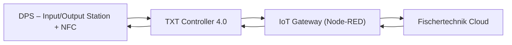
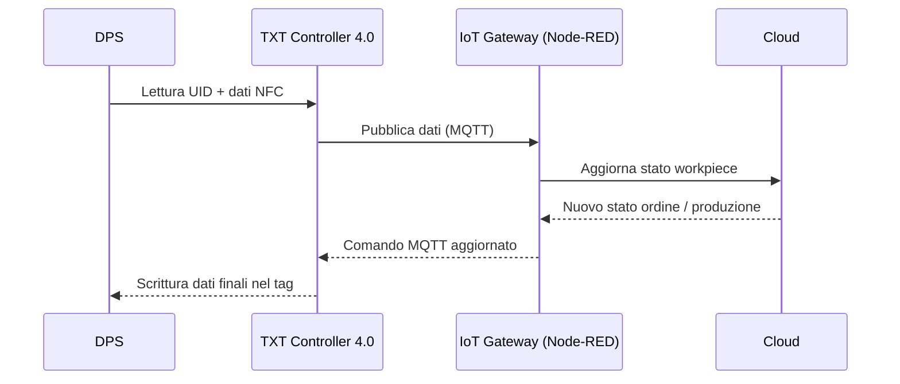

# 02.6 DPS – Input/Output Station + NFC

## 1. Descrizione Generale
La **DPS – Input/Output Station + NFC** è la stazione incaricata di identificare e caratterizzare i *workpiece*.

**Funzionalità principali:**

* **Rilevamento presenza:** Rileva il *workpiece* tramite la **barriera ottica** dell’unità di input.
* **Riconoscimento colore:** Determina il colore tramite il **sensore ottico integrato**.
* **Gestione Dati:** Legge e scrive dati sui tag **NFC NTAG213** incorporati nel pezzo.
* **Connettività:** Invia tali informazioni al **TXT Controller 4.0**, che provvede alla sincronizzazione con la **fischertechnik Cloud**.

> La stazione costituisce il punto centrale per la **tracciabilità del workpiece** nel processo produttivo.

---

## 2. Funzione nel Processo Produttivo
La **DPS** interviene in due fasi del ciclo produttivo:
### 2.1 Fase di ingresso (stoccaggio iniziale)
* La **barriera ottica** dell’input segnala l’arrivo del *workpiece*.
* Il **VGR** deposita il pezzo sulla DPS.
* Il **sensore di colore** determina il colore.
* Il **lettore NFC** cancella il contenuto del tag e scrive i dati preliminari (colore, *timestamp*, stato “unfinished”).

### 2.2 Fase di uscita (fine produzione)
* Dopo le lavorazioni e il *sorting*, il **VGR** riporta il *workpiece* sulla DPS.
* Il **lettore NFC** scrive i dati finali del ciclo (ordine, produzione, consegna).
* Il **TXT 4.0** invia i dati aggiornati alla **fischertechnik Cloud** tramite l’IoT Gateway.

> Queste operazioni permettono la tracciabilità completa del *workpiece* all’interno dell’intero ciclo produttivo.

---

## 3. Architettura del Sistema
### 3.1 Struttura Hardware della DPS

La DPS è composta da **tre sezioni funzionali** principali:

1. **Unità di Input/Output**
   Dotata di una **barriera ottica** fondamentale per rilevare la presenza fisica del *workpiece*.

2. **Modulo di Color Recognition**
   Responsabile della determinazione del colore del pezzo.

3. **Modulo NFC**
   Integra il lettore **PN532**, posizionato strategicamente sotto la piattaforma di appoggio per la lettura/scrittura dei tag.

> **Nota:** La stazione integra inoltre un’**indicator lamp rossa** che segnala visivamente attività in corso o eventuali errori operativi.

### 3.2 Componenti Elettrici
- Lettore NFC PN532 (13.56 MHz, interfaccia I²C)
- Indicator lamp rossa
- Light barrier dell'unità di input  per rilevamento pezzo
- Sensore colore integrato (color sensor)

### 3.3 Interfacciamento
A differenza di VGR/HBW/MPO/SLD, **la DPS non è controllata dal PLC**, ma direttamente dal **TXT Controller 4.0**, che:
- gestisce la lettura,
- prepara i dati da inviare al cloud,
- scrive i nuovi valori sul tag.

---

## 4. Tipologia di Tag Utilizzati
### Specifiche dei Tag NFC **NTAG213
I tag integrati direttamente nel *workpiece* sono del modello **NTAG213** (conformi allo standard **ISO/IEC 14443-A**).

**Caratteristiche Tecniche:**
* **UID Univoco:** Ogni tag possiede un identificativo seriale non modificabile, a 7 byte.
* **Memoria Dati:** Capacità di archiviazione di circa **180 byte**.
- Velocità lettura: 106 kbit/s
- Anti-collisione
- Distanza operativa ottimale: **1–2 cm**

**Dati Memorizzati dalla DPS:**
La stazione utilizza la memoria scrivibile del tag per registrare le informazioni di tracciabilità:

* **Colore** del *workpiece*.
* **Timestamp** di ingresso e di uscita.
* **Stato del processo** (es. *ricevuto*, *lavorato*, *pronto alla consegna*).
* Eventuali **dati di qualità**.

> **Nota Tecnica:** La struttura esatta dei dati (memory map) non è standardizzata nel manuale hardware, ma dipende specificamente dalla logica del software installato sul **TXT Controller 4.0**.

---

## 5. Diagramma Funzionale

---

## 6. Ciclo Operativo Dettagliato
### 6.1 Fase di Lettura del Tag NFC

Il processo di identificazione segue questi passaggi sequenziali:

1. **Rilevamento:** L’arrivo del *workpiece* viene rilevato dalla **barriera ottica** dell’unità di input.
2. **Posizionamento:** Il **VGR** deposita il pezzo sopra il lettore NFC della DPS.
3. **Attivazione:** Il **TXT 4.0** attiva la procedura di lettura tramite il lettore **NFC PN532**.
4. **Acquisizione Dati:** Il lettore acquisisce il contenuto del tag, leggendo sia l’**UID** che i **dati memorizzati**.
5. **Trasmissione IoT:** I dati vengono inviati al TXT, che li inoltra tramite l’**IoT Gateway** direttamente alla **fischertechnik Cloud**.

### 6.2 Fase di Scrittura del Tag NFC
Questa procedura avviene al termine delle lavorazioni e garantisce che il pezzo porti con sé le informazioni aggiornate.

1. **Ricezione Dati:** A fine lavorazione, il **PLC** invia lo stato aggiornato all’**IoT Gateway**, che lo converte in un messaggio **MQTT** destinato al TXT.
2. **Preparazione Payload:** Il **TXT** prepara il *payload* contenente i dati da memorizzare sul tag NFC:
    * Stato del processo
    * Colore
    * Timestamp
    * Eventuali dati di qualità
3. **Comando di Scrittura:** Il TXT invia il comando di scrittura al lettore **NFC PN532**.
4. **Sovrascrittura:** Il lettore sovrascrive fisicamente i dati presenti nella memoria del tag.
5. **Verifica (Check):** Il TXT verifica la corretta esecuzione dell'operazione confrontando il contenuto appena letto con il *payload* inviato.

---

## 7. Errori Comuni e Diagnostica
### Errori Lettura
- Distanza eccessiva dal lettore
- Tag danneggiato
- Nessun tag rilevato
- UID non riconosciuto

### Errori Scrittura
- Scrittura incompleta
- Memoria tag insufficiente
- Collisione tag, più tag presenti nell’area di lettura

### Diagnostica
- Dashboard cloud: sezione **NFC Reader**
- Node-RED: monitoraggio dei messaggi NFC e dei comandi PLC → TXT via MQTT

---

## 8. Procedura di Test e Verifica NFC

1. **Setup Iniziale:** Portare la fabbrica in **idle mode**.
2. **Posizionamento:** Posizionare un *workpiece* sul **lettore NFC** della DPS.
3. **Lettura:** Premere il pulsante **Read NFC** nella dashboard cloud e verificare l'avvenuta lettura dell’**UID**.
4. **Modifica:** Modificare lo stato del *workpiece* direttamente dal cloud (impostando parametri di ordine o completamento).
5. **Scrittura:** Inviare il comando **Write NFC** e verificare che i dati vengano aggiornati.
6. **Verifica Consistenza:** Utilizzare nuovamente **Read NFC** per confermare che i dati sul tag fisico coincidano con quelli visualizzati nella dashboard.
7. **Reset (Opzionale):** Usare il comando **Delete NFC** per cancellare manualmente i dati dal tag.

---

## 9. Ruolo nel Contesto Industry 4.0
La DPS è il cuore della **tracciabilità digitale** della fabbrica:
- abilita integrazione tra mondo fisico e cloud,
- realizza il concetto di *Digital Twin del prodotto*,
- supporta processi di qualità e audit.

Senza la DPS, la fabbrica non potrebbe sincronizzare i dati reali con quelli digitali.

---

## 10. Collegamenti con Altri Moduli
- [[02.5_SSC_Sensor_Station_Camera.md]]
- [[02.9_TXT_Controller_4.0.md]]