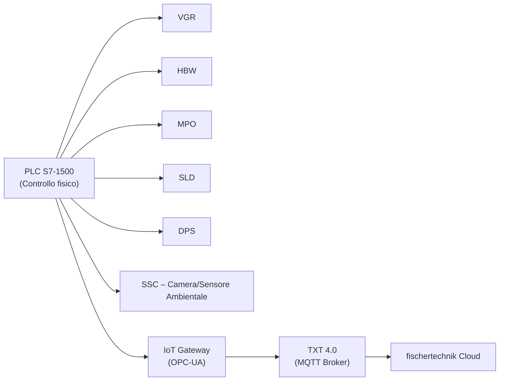

# 02.7 PLC Siemens S7-1500

# 1. Descrizione Generale

Il controllore principale della Learning Factory 4.0 24V è un PLC **Siemens SIMATIC S7-1500**, responsabile del
coordinamento deterministico di tutti i moduli meccatronici:

- **VGR** – Robot cartesiano a ventosa (3 assi, encoder);
- **HBW** – Magazzino verticale automatizzato;
- **MPO** – Stazione di lavorazione multipla con forno, fresa e tavolo rotante;
- **SLD** – Sorting Line con riconoscimento colore;
- **DPS** – Stazione di ingresso/uscita con lettore NFC e sensore colore;
- **SSC** – Stazione sensori con telecamera PTZ e sensore ambientale.

Il PLC è programmato tramite **Siemens TIA Portal V18** (linguaggio **SCL/Structured Text**) e realizza il controllo
sequenziale locale dell’intero impianto, garantendo:
- l’assenza di collisioni tra gli assi,
- il rispetto delle posizioni calibrate,
- la gestione centralizzata degli errori,
- il determinismo del processo produttivo.

La Learning Factory integra inoltre i seguenti componenti informatici:

- **IoT Gateway (Raspberry Pi + Node-RED)**: funge da adattatore **OPC UA → MQTT**.  
- **Controller TXT 4.0**: MQTT broker, gestione sensore ambientale, telecamera PTZ, lettore NFC e collegamento
  al cloud fischertechnik.
- **Router TP-Link WR802N**: fornisce la connettività WAN/WLAN.

Ogni pezzo in lavorazione è dotato di un tag NFC **NTAG213** con ID univoco, che permette il tracciamento
completo del flusso produttivo.

---

# 2. Funzione nel Processo Produttivo

Il PLC SIMATIC S7-1500 controlla l’intera sequenza fisica di produzione e coordina i moduli della Learning
Factory secondo una logica completamente deterministica.

Le principali funzioni operative includono:

1. **Ricezione degli ordini**  
   tramite IoT Gateway via **OPC UA**; gli ordini provenienti dal cloud vengono convertiti dal Gateway per il PLC.

2. **Verifica disponibilità dei moduli**  
   interrogazione degli ingressi digitali/analogici dei moduli (encoder, barriere fotoelettriche, pulsanti, sensori).

3. **Comando degli attuatori**  
   gestione delle uscite del PLC:
   - relè R1–R8,
   - valvole 3/2 vie (V1–V3),
   - motori encoder e minimotori,
   - posizionamento assi VGR, HBW, MPO, SSC.

4. **Controllo degli stati dei moduli**  
   gestione degli stati *Ready*, *Busy*, *Error*, *No Item* per ogni stazione.

5. **Tracking del pezzo tramite NFC**  
   il PLC comanda la ventosa per depositare il pezzo sul lettore NFC; la scrittura/lettura viene eseguita dal TXT.

6. **Segnalazione dello stato operativo**  
   il PLC pubblica al Gateway i dati di processo tramite **OPC UA**, che vengono inoltrati via MQTT al cloud.

7. **Gestione errori e sicurezza operativa**  
   rilevazione delle condizioni di fault, arresto dei moduli, conferma errori tramite dashboard.

Il PLC costituisce il livello “Control” nell’architettura a tre livelli
**(PLC → Gateway → Cloud)** e rappresenta il nucleo esecutivo del processo fisico.

---

## 3. Architettura del Sistema

### 3.1 Modello CPU

La Learning Factory 4.0 24V utilizza una CPU **Siemens SIMATIC S7-1500 – CPU 1512SP-1 PN**,
dotata di:

- Interfaccia PROFINET (porti P1, P2, P3)
- LED diagnostici (RUN/STOP, ERROR, MAINT)
- Modalità operative: RUN, STOP, MRES
- Necessità di **SIMATIC Memory Card** per il caricamento del programma
- Ciclo di scan deterministico conforme allo standard PLC Siemens

La CPU rappresenta il livello di controllo operativo dell’intera microfactory.

---

### 3.2 Interfacce

La comunicazione industriale segue una architettura a tre livelli:

**PLC → IoT Gateway (OPC-UA) → TXT 4.0 (MQTT) → Cloud**

Il PLC gestisce esclusivamente il controllo fisico dei moduli, mentre non utilizza direttamente
protocollo MQTT.

Le interfacce elettriche includono:

- **Ingressi digitali (DI)**: finecorsa, barriere IR, sensori presenza
- **Uscite digitali (DO)**: relè per ventose, valvole pneumatiche, attuatori
- **Comandi motori**: i motori DC sono regolati tramite la scheda adattatrice fischertechnik
  (non esistono uscite PWM native del PLC)

---

### 3.3 Collegamento ST1 – Piastra Adattatore 24V

La piastra adattatore fornisce l’interfaccia elettrica tra PLC e moduli meccatronici a 24V,
mappando ingressi/uscite digitali e relè.

| Modulo | Tipo Segnali | Funzioni Gestite |
|--------|--------------|------------------|
| **VGR** | DI, DO, motori DC | assi X/Y/Z, ventosa, finecorsa |
| **HBW** | DI, DO, motori DC | shuttle verticale/orizzontale, livelli magazzino |
| **MPO** | DI, DO, motori DC | forno, fresa, tavola rotante |
| **SLD** | DI, DO, motori DC | nastro, deviazione, sensore colore |
| **DPS** | DI, DO | sensore presenza, movimentazione pusher verso lettore NFC |

Il lettore NFC è collegato al **TXT 4.0**, ma la movimentazione del pezzo è gestita dal PLC.

---

## 4. Blocchi Funzionali (SCL)

Il programma PLC è strutturato in **blocchi funzionali (FB)**, uno per ogni stazione,
seguendo la logica a stati utilizzata nella soluzione fischertechnik.

### FB_VGR
- gestione assi X/Y/Z con posizioni calibrate
- controllo ventosa e valvole
- supervisione finecorsa e diagnostica
- gestione stati Ready/Busy/Error
- timeout di posizionamento

### FB_HBW
- movimentazione shuttle verticale/orizzontale
- controllo livelli e scaffali
- gestione slot magazzino
- trasferimento container a VGR

### FB_MPO
- controllo forno (timer termico)
- controllo fresa e tavola rotante
- sincronizzazione con VGR tramite handshake
- gestione stati macchina

### FB_SLD
- lettura colore tramite sensore RGB
- smistamento pneumatico
- controllo nastro trasportatore
- gestione timer di avanzamento

### FB_SYSTEM
- coordinamento globale del ciclo di produzione
- gestione stati della fabbrica (Idle, Processing, Error)
- esposizione variabili a IoT Gateway tramite OPC-UA
- gestione comandi remoti (order, reset, ack)

---

## 5. Diagramma Funzionale del PLC

---

## 6. Ciclo Operativo

### 6.1 Pipeline del ciclo PLC

Il ciclo produttivo è coordinato da **FB_SYSTEM**, che gestisce la macchina a stati globale.
La sequenza reale, in accordo con l’architettura ufficiale, è la seguente:

1. **WaitForOrder**  
   Il PLC attende un ordine esposto dal **IoT Gateway via OPC-UA**, il quale riceve
   il comando dal **TXT 4.0** (che a sua volta è connesso al cloud via MQTT).

2. **RetrieveMaterial (HBW)**  
   Prelievo del container dal magazzino automatico (HBW) tramite shuttle
   e suo trasferimento alla stazione MPO.

3. **ProcessMaterial (MPO)**  
   Esecuzione del ciclo termico, fresatura e rotazione secondo ricetta.

4. **SortMaterial (SLD)**  
   Identificazione colore e smistamento tramite deviazione pneumatica.

5. **LabelMaterial (DPS + TXT)**  
   Il PLC posiziona il pezzo sul lettore NFC.  
   La scrittura del tag viene eseguita dal **TXT 4.0** (programma Python).

6. **Finalize / Output**  
   Il pezzo è depositato nella vaschetta di uscita.

7. **PublishStatus**  
   Gli stati macchina sono pubblicati dal PLC verso l’IoT Gateway (OPC-UA),
   quindi trasferiti al cloud tramite MQTT.

---

### 6.2 Logica di Scan

Ogni ciclo di scan del PLC segue la struttura Siemens:

1. **Acquisizione ingressi** (DI, sensori)
2. **Esecuzione FB/FC**  
   - state machine moduli  
   - gestione errori  
   - handshake tra stazioni
3. **Aggiornamento variabili globali e OPC-UA**
4. **Scrittura uscite** (relè, motori, valvole)

Il ciclo è deterministico e garantisce la coerenza temporale delle azioni.

---

## 7. Diagnostica e LED CPU

### LED di Stato

| LED   | Significato                                           |
| ----- | ----------------------------------------------------- |
| RUN   | CPU in esecuzione programma                           |
| STOP  | CPU in stato fermo                                    |
| ERROR | Fault hardware/software, condizione di errore critico |
| MAINT | Warning / evento diagnostico non critico              |

La CPU è inoltre dotata di LED di collegamento:
- **POWER**  
- **LINK RX/TX** per i porti PROFINET P1, P2, P3

---

### Diagnostica Software

- **Node-RED Dashboard (IoT Gateway)**  
  - Visualizzazione errori PLC via OPC-UA  
  - Acknowledge errori (Reset Fault)

- **Dashboard Cloud**  
  - Mostra lo stato dei moduli (Ready/Busy/Error)

- **Blocchi Funzionali (FB)**  
  Ogni FB espone:  
  - `ErrorCode`  
  - `ErrorState`  
  - `TimeoutFlag`  
  - `PositionInvalid`  
  - `SensorFault`

---

## 8. Reset e Messa in Funzione
### Reset (MRES)
Utilizzato per:
- cancellare memoria,
- ripristinare configurazione,
- ricaricare programma TIA Portal.

### Messa in Funzione
1. Mettere PLC in STOP.
2. Caricare programma TIA Portal.
3. Passare in RUN.
4. Monitorare tramite diagnostica online.

---

## 9. Ruolo nel Contesto Industry 4.0

Il PLC S7-1500 costituisce il livello di **controllo fisico** della Learning Factory 4.0:

- garantisce la sincronizzazione deterministica tra i moduli meccatronici,
- esegue il controllo real-time di motori, valvole e sensori,
- espone dati al livello edge tramite **OPC-UA verso IoT Gateway**,
- abilita l’integrazione con il sistema cyber-fisico tramite TXT 4.0 e MQTT.

L’architettura multilivello:

**PLC → IoT Gateway → TXT 4.0 → Cloud**

permette monitoraggio remoto, tracciabilità NFC, diagnosi avanzata
e orchestrazione digitale del ciclo produttivo.

---

## 10. Collegamenti con Altri Moduli
- [[02.8_IoT_Gateway_RaspberryPi.md]]
- [[02.1_VGR_Vacuum_Gripper_Robot.md]]
- [[02.2_HBW_HighBay_Warehouse.md]]
- [[02.3_MPO_MultiProcessing_Station.md]]
- [[02.4_SLD_Sorting_Line_Detection.md]]
- [[02.6_DPS_Input_Output_NFC.md]]

