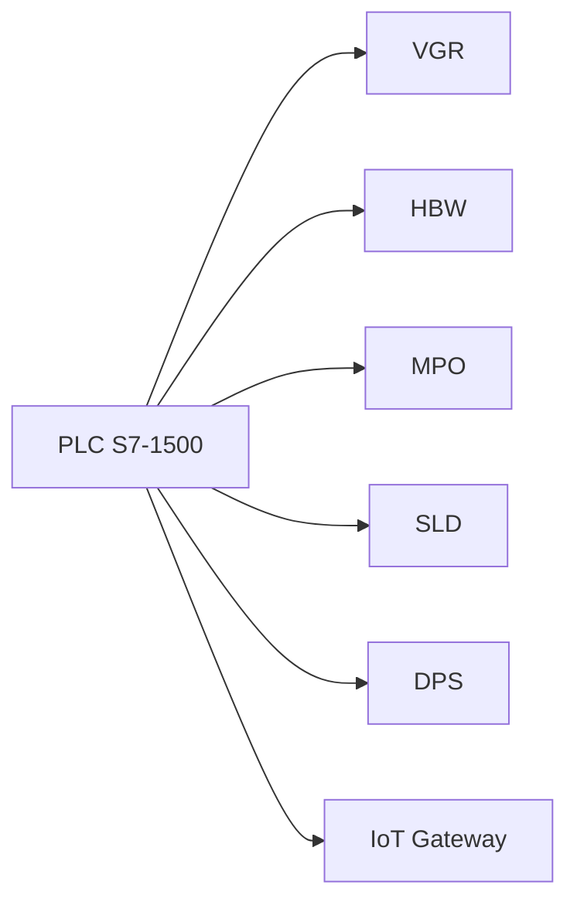

# 02.7 PLC Siemens S7-1500

## 1. Descrizione Generale
Il **PLC Siemens S7-1500** è il controllore logico principale della Learning Factory 4.0 24V. Coordina tutti i moduli meccatronici:
- VGR (robot cartesiano),
- HBW (magazzino verticale),
- MPO (stazione di lavorazione),
- SLD (sorting line),
- DPS (NFC station, lettura/scrittura),
- Segnalazioni verso IoT Gateway,
- Sincronizzazione con TXT Controller e Cloud.

È installato in configurazione compatta ed è programmato tramite **TIA Portal V18** con logica **SCL (Structured Control Language)**.

Il PLC rappresenta il livello *Control* nella piramide ISA-95, assicurando determinismo, sicurezza operativa e corretto flusso sequenziale dell’intera microfactory.

---

## 2. Funzione nel Processo Produttivo
Il PLC governa la sequenza completa di produzione:
1. attende ordini dal Cloud (tramite IoT Gateway → MQTT → TXT → PLC),
2. interroga VGR, HBW, MPO, SLD per verificarne disponibilità,
3. comanda i movimenti (PWM, relè, digital out),
4. verifica sensori e conferme (digital input),
5. gestisce gli errori,
6. comunica avanzamento produzione verso TXT,
7. coordina stati *Ready*, *Busy*, *Done* di ogni modulo.

Il PLC garantisce la **coerenza temporale** tra gli attuatori e impedisce condizioni di collisione.

---

## 3. Architettura del Sistema
### 3.1 Modello CPU
- **Siemens S7-1500 – CPU 1512SP-1 PN** (tipica delle microfactory)
- PROFINET integrato
- Ciclo di scan deterministico
- Modalità operative: RUN, STOP, MRES

### 3.2 Interfacce
- **PROFINET**: comunicazione con IoT Gateway (OPC-UA → MQTT)
- **Ingressi digitali (DI)**: finecorsa, sensori, presenza pezzo
- **Uscite digitali (DO)**: ventose, deviatore, attuatori
- **Uscite PWM**: motori DC (VGR, HBW, MPO, SLD)

### 3.3 Collegamento ST1 – Piastra Adattatore 24V
La piastra fornisce l’interfaccia tra PLC e componenti a 24V.

| Modulo | Tipo Segnale | Descrizione |
|--------|--------------|-------------|
| VGR | PWM, DO, DI | Motori X/Y/Z, ventosa, finecorsa |
| HBW | PWM, DO, DI | Shuttle verticale/orizzontale, sensori livelli |
| MPO | DO, PWM, DI | Forno, piano lavoro, finecorsa |
| SLD | PWM, DO, DI | Nastro, deviatore, sensore colore |
| DPS | DI | Presence sensor (TXT gestisce NFC) |

---

## 4. Blocchi Funzionali (SCL)
Il programma PLC è organizzato in blocchi funzionali (FB), ciascuno dedicato a una stazione.

### FB_VGR
- gestione movimenti X/Y/Z
- sicurezza su finecorsa
- controllo ventosa
- gestione timeout e allarmi

### FB_HBW
- posizionamento verticale/orizzontale
- controllo finecorsa livelli
- gestione slot magazzino

### FB_MPO
- processo termico (timer)
- piano lavoro (PWM)
- sincronizzazione con VGR

### FB_SLD
- lettura colore (RGB)
- smistamento
- timer nastro

### FB_SYSTEM
- coordinamento globale
- gestione stati macchina
- comunicazione con Gateway IoT

---

## 5. Diagramma Funzionale del PLC

---

## 6. Ciclo Operativo
### 6.1 Fasi del ciclo PLC
1. **OrderReceived** – arrivo ordine da cloud → Gateway → TXT → PLC
2. **LoadMaterial** – prelievo HBW
3. **ProcessMaterial** – MPO
4. **SortMaterial** – SLD
5. **FinalizeProduction** – DPS scrive stato NFC
6. **ReportStatus** – invio verso cloud

### 6.2 Logica di Scan
Ogni ciclo di scan del PLC esegue:
- Lettura ingressi (sensori)
- Esecuzione logica FB/FC
- Aggiornamento stati globali
- Scrittura uscite (attuatori)

---

## 7. Diagnostica e LED CPU
### LED di Stato
| LED | Significato |
|------|--------------|
| RUN | PLC operativo |
| STOP | PLC fermo |
| ERROR | errore hardware/software |
| MAINT | manutenzione richiesta |

### Diagnostica Software
- Node-RED → errori PLC in tempo reale
- Dashboard → stato macchina
- Log errori FB: `ErrorCode`, `TimeoutFlag`, `SensorFault`

---

## 8. Reset e Messa in Funzione
### Reset (MRES)
Utilizzato per:
- cancellare memoria,
- ripristinare configurazione,
- ricaricare programma TIA Portal.

### Messa in Funzione
1. Mettere PLC in STOP.
2. Caricare programma TIA Portal.
3. Passare in RUN.
4. Monitorare tramite diagnostica online.

---

## 9. Ruolo nel Contesto Industry 4.0
Il PLC costituisce il cuore della fabbrica:
- garantisce sincronizzazione deterministica tra unità meccatroniche,
- esegue controllo real-time,
- collabora con Edge (IoT Gateway) e Device (TXT Controller),
- abilita processi cyber-fisici tramite OPC-UA e MQTT.

L’integrazione tra PLC, Gateway e Cloud permette una visibilità completa del ciclo produttivo.

---

## 10. Collegamenti con Altri Moduli
- [[02.8_IoT_Gateway_RaspberryPi.md]]
- [[02.1_VGR_Vacuum_Gripper_Robot.md]]
- [[02.2_HBW_HighBay_Warehouse.md]]
- [[02.3_MPO_MultiProcessing_Station.md]]
- [[02.4_SLD_Sorting_Line_Detection.md]]
- [[02.6_DPS_Input_Output_NFC.md]]

