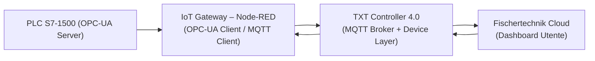

# 02.8 IoT Gateway – Raspberry Pi + Node-RED

## 1. Descrizione Generale

L’IoT Gateway della Learning Factory 4.0 è basato su **Raspberry Pi 4** e svolge il ruolo di nodo
**Edge** dell’architettura cyber-fisica. Su di esso è installata un’istanza preconfigurata di
**Node-RED**, che fornisce le seguenti funzioni:

- **Interfaccia HMI locale (Node-RED Dashboard)** per visualizzare stati, errori e valori
  ambientali.
- **Adattatore protocollare** tra i dati del PLC (esposti tramite **OPC-UA**) e il sistema
  informativo del TXT 4.0 (basato su **MQTT**).
- **Gestione e archiviazione dei dati di calibrazione** delle stazioni VGR, HBW, MPO, SLD,
  tramite i file `ConfigData.csv` memorizzati nel Raspberry Pi.
- **Punto di diagnosi operativa**, con possibilità di:
  - riavviare l’IoT Gateway,
  - azzerare gli errori della fabbrica,
  - monitorare la comunicazione PLC–Gateway.

In un’architettura Industry 4.0, il Gateway funge da livello Edge, interposto tra il controllo
real-time del PLC e la supervisione cloud attraverso il TXT Controller.

---

## 2. Funzione nel Processo Produttivo

L’IoT Gateway svolge un ruolo centrale nella catena informativa della Learning Factory 4.0.
Le sue funzioni principali, in accordo con la documentazione ufficiale, sono:

1. **Interfaccia protocollare**  
   Node-RED opera come client **OPC-UA** verso il PLC e come client **MQTT** verso il
   TXT 4.0, consentendo la propagazione dei dati operativi e di stato.

2. **Sincronizzazione dei parametri**  
   Il Gateway fornisce al PLC i parametri di configurazione e calibrazione tramite OPC-UA.
   Il caricamento avviene tramite la funzione *Load Data* del dashboard Node-RED.

3. **HMI locale (Human Machine Interface)**  
   La dashboard Node-RED visualizza:
   - posizioni assi,
   - errori di modulo,
   - stato del ciclo,
   - valori dei sensori ambientali.

4. **Calibrazione delle stazioni**  
   Le posizioni di riferimento per VGR, HBW, MPO e SLD sono salvate nel file:
   `/home/pi/.node-red/pub/CSV/ConfigData.csv`
   e possono essere ricaricate nel PLC in caso di reset (MRES).

5. **Persistenza delle configurazioni**  
   Il Gateway conserva in locale i valori critici per la fabbrica, garantendo la continuità
   operativa anche dopo un riavvio del PLC o del TXT.

Senza l’IoT Gateway, la Learning Factory perderebbe l’integrazione edge-cloud e la
possibilità di calibrazione, diagnostica e supervisione tramite dashboard.

---

## 3. Architettura del Sistema

### 3.1 Componenti Hardware
L’IoT Gateway è basato su:

- **Raspberry Pi 4** con sistema Linux preconfigurato
- Alimentazione tramite porta USB del router TP-Link WR902AC
- MicroSD contenente:
  - Node.js
  - Node-RED
  - flussi preinstallati per Factory 4.0

Il dispositivo rappresenta il nodo Edge della fabbrica, posizionato tra PLC e TXT.

---

### 3.2 Software Principale

Il Gateway esegue:

- **Node.js** – runtime JavaScript
- **Node-RED Runtime** – orchestratore dei flussi Edge
- **Node-RED Dashboard** – HMI locale per supervisione e calibrazione
- **Client MQTT** – comunicazione con TXT 4.0 (broker MQTT integrato)
- **Client OPC-UA** – lettura/scrittura verso PLC S7-1500

---

### 3.3 Struttura Node-RED

Node-RED è suddiviso in flussi funzionali:

- **HMI – Main**: stato fabbrica, errori, reset, riavvio gateway
- **HMI – HBW / VGR / MPO / SLD / SSC**: pannelli di calibrazione
- **HMI – Config Data**: salvataggio e caricamento dei dati di calibrazione
- **Bridge OPC-UA / MQTT**: sincronizzazione Edge tra PLC e TXT

---

## 4. Flussi Node-RED Principali

### 4.1 HMI – Main Dashboard
Mostra:

- Stato PLC (RUN/STOP, errori)
- Stato moduli VGR, HBW, MPO, SLD
- Errori della fabbrica e pulsante di acknowledge
- Controlli di servizio:
  - reset errori
  - reset assegnazione HBW
  - riavvio IoT Gateway

---

### 4.2 Calibration

Sotto-dashboard dedicate alle singole stazioni:

- **VGR Positions** – posizioni X/Y/Z
- **HBW Positions** – livelli verticali e posizioni shuttle
- **MPO Positions** – posizioni tavola rotante e piano lavoro
- **SLD Calibration** – calibrazione sensore colore e nastri
- **SSC Camera Calibration** – calibrazione assi camera

---

### 4.3 File Handling

Node-RED gestisce:

- **Save Data** → scrittura del file `ConfigData.csv`
- **Load Data** → invio dei valori al PLC via OPC-UA
- Gestione persistente dei parametri della fabbrica

Non sono previsti backup automatici: il salvataggio avviene manualmente.

---

## 5. File di Configurazione – ConfigData.csv

Percorso:

`/home/pi/.node-red/pub/CSV/ConfigData.csv`

Contiene:

- coordinate VGR X/Y/Z
- livelli verticali HBW
- posizioni MPO
- parametri SLD
- calibrazioni SSC

Il file non viene caricato automaticamente dal PLC:  
l’utente deve eseguire *Load Data* dal dashboard Node-RED dopo un MRES.

---

## 6. Diagramma Funzionale

---

## 7. Ciclo Operativo Dettagliato

### 7.1 Avvio

1. Il Raspberry Pi si avvia e carica automaticamente Node-RED.
2. Node-RED inizializza i flussi OPC-UA e MQTT.
3. Vengono stabilite le connessioni:
   - **OPC-UA Client → PLC S7-1500**
   - **MQTT Client → TXT 4.0**
4. Il file `ConfigData.csv` è reso disponibile nel sistema, ma il caricamento nel PLC
   deve essere effettuato manualmente tramite il comando **Load Data** nel dashboard.

---

### 7.2 Durante la Produzione

- Node-RED legge periodicamente le variabili del PLC tramite OPC-UA.
- Pubblica gli stati verso il TXT 4.0 tramite MQTT.
- Aggiorna l’HMI con:
  - stati moduli,
  - errori,
  - telemetria.
- Se l’utente modifica valori di calibrazione, questi possono essere salvati tramite **Save Data**.

---

### 7.3 Fine Produzione

- L’HMI rimane attiva in modalità di standby.
- L’utente può salvare manualmente lo stato aggiornato nel file `ConfigData.csv`.

---

## 8. Errori Comuni e Diagnostica

### 8.1 Errori di Comunicazione

- **Connessione OPC-UA persa**  
  Tipico in caso di riavvio del PLC. Node-RED può richiedere un riavvio.
- **MQTT non disponibile**  
  Il TXT 4.0 non risponde o il broker è offline.
- **Timeout TXT**  
  Il TXT non pubblica le conferme sui topic previsti.

---

### 8.2 Errori HMI

- Dashboard non raggiungibile (Node-RED offline).
- Flussi non funzionanti a causa di errori nei nodi OPC-UA o MQTT.

---

### 8.3 Strumenti di Diagnostica

- **Node-RED System Log**
- **Console SSH del Raspberry Pi**
- **HMI – pagina diagnostica** (visualizzazione errori PLC via OPC-UA)

---

## 9. Sicurezza e Networking

### 9.1 Indirizzi Standard

- Gateway (Raspberry Pi): **192.168.0.5**
- Router TP-Link: **192.168.0.252**
- TXT 4.0: **192.168.0.10**

Questi indirizzi sono preconfigurati nella Learning Factory 4.0.

---

### 9.2 Porte Principali

| Protocollo | Porta | Funzione |
|-----------|-------|----------|
| HTTP      | 1880  | Accesso alla dashboard Node-RED |
| MQTT      | *dipende dalla configurazione del TXT* | Comunicazione Edge |
| OPC-UA    | 4840  | Interfaccia PLC ↔ Gateway |

Tutte le comunicazioni avvengono su LAN privata.

---

## 10. Ruolo nel Contesto Industry 4.0

L’IoT Gateway rappresenta il nucleo del livello **Edge Computing** della Learning Factory 4.0.
Le sue principali funzioni sono:

- integrazione tra **OT (PLC S7-1500)** e **IT (Cloud via TXT 4.0)**,
- trasformazione dati tra protocolli OPC-UA e MQTT,
- supervisione locale tramite HMI Node-RED,
- gestione della configurazione e calibrazione delle stazioni,
- supporto alla diagnostica e al mantenimento operativo del sistema.

Il Gateway consente la continuità informativa tra campo, edge e cloud,
costituendo un elemento fondamentale dell’architettura cyber-fisica.

---

## 11. Collegamenti con Altri Moduli
- [[02.7_PLC_Siemens_S7-1500.md]]
- [[02.9_TXT_Controller_4.0.md]]

