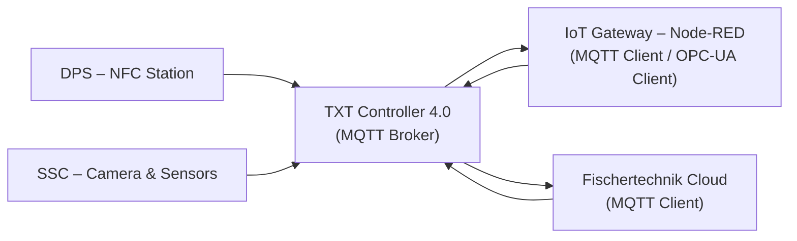

# 02.9 TXT Controller 4.0

## 1. Descrizione Generale

Il **TXT Controller 4.0** è l’unità IoT embedded della Learning Factory 4.0. 
Funziona come dispositivo edge-intelligente dedicato alla gestione dei 
sottosistemi non direttamente controllati dal PLC e come nodo di comunicazione 
verso il cloud Fischertechnik.

Il TXT è responsabile di:

- **gestione della telecamera SSC** (pan, tilt, zoom, acquisizione immagini);
- **acquisizione dei dati del sensore ambientale** (BME680);
- **lettura e scrittura dei tag NFC** nella stazione DPS;
- **pubblicazione e sottoscrizione di messaggi MQTT**;
- **operare come MQTT broker locale** per l’intera microfactory;
- **traduzione dei dati locali verso il cloud Fischertechnik**;
- **esecuzione automatica del programma `GatewayPLC.py`**, che gestisce 
  interfacce hardware e protocolli applicativi.

Il TXT non gestisce il controllo real-time della fabbrica (compito del PLC), 
ma fornisce la componente IoT e di supervisione necessaria alla 
trasformazione cyber-fisica dell’impianto.

---
## 2. Funzione nel Processo Produttivo

Il TXT Controller si occupa di tutte le funzioni IoT, informative e di 
tracciabilità, integrandosi con il PLC e l’IoT Gateway senza interferire 
con il controllo sequenziale.

Le principali attività sono:

1. **Tracciabilità NFC**  
   Legge e scrive i dati dei tag NFC sul pezzo tramite la stazione DPS 
   e pubblica l’identificativo via MQTT.

2. **Gestione ordini e messaggi cloud**  
   Riceve dal cloud gli ordini di produzione, li elabora tramite MQTT 
   e li rende disponibili all’IoT Gateway per la sincronizzazione con il PLC.

3. **Controllo telecamera SSC**  
   Esegue i comandi di movimento (pan/tilt), cattura immagini e fornisce 
   il flusso visivo alla dashboard cloud.

4. **Raccolta dei dati ambientali**  
   Legge temperatura, umidità e qualità dell’aria tramite BME680 
   e invia i valori al cloud.

5. **Supporto informativo al PLC**  
   Pubblica stati, identificativi NFC e dati diagnostici necessari 
   alla supervisione della microfactory.

In sintesi: **PLC = controllo fisico**, **TXT = IoT + dati + cloud**.

---

## 3. Architettura del Sistema

### 3.1 Hardware
Il TXT Controller 4.0 integra:

- CPU embedded ARM a basso consumo;
- modulo Wi-Fi e interfaccia Ethernet;
- storage su microSD;
- porte I/O digitali dedicate ai moduli DPS e SSC;
- interfaccia con telecamera PTZ e sensore ambientale BME680;
- lettore NFC per la stazione DPS.

---

### 3.2 Software Interno
Il TXT esegue un sistema operativo embedded fischertechnik, che comprende:

- interprete Python per l’esecuzione dello script **GatewayPLC.py**;
- stack **MQTT broker + MQTT client**;
- servizi interni per camera, sensori, NFC;
- API Python per accesso a periferiche locali.

---

### 3.3 Programmi Principali

All’avvio, il TXT esegue automaticamente:
`GatewayPLC.py`

Le funzioni del programma includono:

- gestione locale di **camera**, **sensori ambientali** e **NFC**;
- pubblicazione e ricezione di messaggi MQTT;
- sincronizzazione IoT con l’IoT Gateway;
- inoltro dati al cloud Fischertechnik.

---

## 4. Comunicazione MQTT

Il TXT funge da **MQTT broker centrale** della Learning Factory 4.0 e
contemporaneamente da MQTT client per la connessione al cloud.

### 4.1 Topic Principali (schema generale)

| Topic                       | Direzione       | Descrizione                    |
|-----------------------------|-----------------|--------------------------------|
| ftFactory/env              | TXT → Cloud     | Sensori ambientali             |
| ftFactory/nfc/read         | TXT → Cloud     | Lettura NFC                    |
| ftFactory/nfc/write       | TXT → Gateway   | Richieste di scrittura tag     |
| ftFactory/order           | Cloud → TXT     | Ordini di produzione           |
| ftFactory/status/plc      | Gateway → TXT   | Stato PLC sincronizzato        |

---

### 4.2 Messaggi Tipici

- **NFC_READ** → UID + contenuto tag  
- **NFC_WRITE_OK / NFC_WRITE_FAIL** → esito scrittura  
- **CAMERA_SNAPSHOT** → immagine catturata  
- **ENV_UPDATE** → valori BME680

---

## 5. Interfacciamento con Altre Stazioni

### 5.1 DPS (NFC)
- lettura UID del tag;
- scrittura parametri ordine;
- invio dati via MQTT al cloud.

### 5.2 SSC (Camera + Sensori)
- controllo movimento (pan/tilt);
- acquisizione immagini;
- lettura dati ambientali;
- pubblicazione MQTT verso cloud.

### 5.3 IoT Gateway
- sincronizzazione tramite MQTT;
- conversione MQTT → OPC-UA per il PLC.

### 5.4 Cloud Fischertechnik
- dashboard ordini e diagnostica;
- visualizzazione immagini;
- telemetria sensori e NFC.

---

## 6. Diagramma Funzionale

---

## 7. AutoLoad & AutoStart

Il TXT Controller supporta due modalità automatiche di esecuzione dei programmi Python:

### AutoLoad  
All’avvio il TXT carica in memoria il programma Python configurato come “programma attivo”
nell’interfaccia software del controller (tipicamente *GatewayPLC.py*).

### AutoStart  
Dopo il caricamento, il programma viene avviato automaticamente senza intervento dell’utente.

Queste funzionalità permettono:

- riattivazione immediata dopo un riavvio,
- funzionamento continuo senza supervisione locale,
- comportamento compatibile con scenari di automazione industriale.

Nota: in caso di errore di esecuzione lo script non viene riavviato automaticamente.

---

## 8. Errori Comuni e Diagnostica

### 8.1 Errori NFC
- Tag fuori portata del lettore.
- UID non rilevabile.
- Scrittura del tag non completata (NFC_WRITE_FAIL).

### 8.2 Errori Telecamera SSC
- Comandi pan/tilt non ricevuti.
- Impossibile acquisire snapshot.
- Sensore ambientale non risponde sul bus I2C.

### 8.3 Diagnostica
- **Dashboard Cloud**: visualizzazione errori e stato dispositivi.
- **Monitor TXT (console Python)**: messaggi runtime del programma attivo.
- **Log generati da GatewayPLC.py**: informazioni su NFC, camera e MQTT.

---

## 9. Ruolo nel Contesto Industry 4.0

Il TXT Controller 4.0 rappresenta il nodo IoT del sistema, responsabile della
gestione dei dispositivi fisici non controllati dal PLC e dell’integrazione
con il cloud tramite MQTT.

Le sue funzioni principali sono:

- gestione di camera, sensore ambientale e NFC,
- raccolta e pubblicazione dati verso il cloud,
- messa a disposizione dei dati IoT all’IoT Gateway per la loro integrazione con il PLC,
- funzionamento come **MQTT broker** dell’intera microfactory.

Il TXT costituisce l’interfaccia digitale che completa l’architettura cyber-fisica
della Learning Factory 4.0.

---

## 10. Collegamenti con Altri Moduli
- [[02.5_SSC_Sensor_Station_Camera.md]]
- [[02.6_DPS_Input_Output_NFC.md]]
- [[02.8_IoT_Gateway_RaspberryPi.md]]

