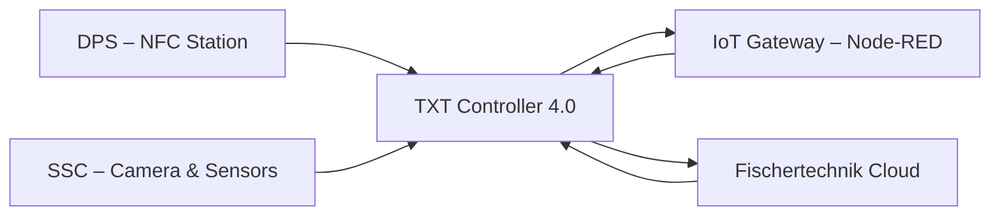

# 02.9 TXT Controller 4.0

## 1. Descrizione Generale
Il **TXT Controller 4.0** è il micro‑controller embedded che funge da nodo IoT, sistema di supervisione locale e interfaccia tra mondo fisico e mondo digitale nella Learning Factory 4.0. È responsabile di:
- **gestire la telecamera** e i sensori ambientali della SSC;
- **leggere e scrivere** i tag NFC nella stazione DPS;
- **instradare dati** verso il cloud Fischertechnik tramite MQTT;
- **coordinarsi con IoT Gateway** e PLC per avanzamento produzione;
- eseguire automaticamente il programma `GatewayPLC.py` all’avvio.

È il componente che abilita pienamente la trasformazione cyber‑fisica della microfactory.

---

## 2. Funzione nel Processo Produttivo
Il TXT Controller non esegue controllo real‑time come il PLC, ma si occupa di tutto ciò che riguarda **IoT, tracciabilità e supervisione**:
1. legge lo stato dei tag NFC e invia dati al cloud;
2. riceve dal cloud ordini, aggiornamenti, comandi e li inoltra al gateway/PLC;
3. controlla la telecamera SSC (pan/tilt + immagini);
4. invia misurazioni dei sensori ambientali;
5. mantiene lo storico dati locale quando necessario.

In sintesi: **PLC = controllo del processo**, **TXT = supervisione IoT + dati + cloud**.

---

## 3. Architettura del Sistema
### 3.1 Hardware
- CPU embedded ARM
- Modulo Wi‑Fi integrato
- Supporto per microSD
- Porte I/O digitali
- Interfaccia con camera e modulo ambientale
- NFC reader per DPS

### 3.2 Software Interno
- Sistema operativo embedded FT
- Interprete Python (per `GatewayPLC.py`)
- Stack MQTT client
- Servizi RPC interni
- API per telecamera, sensori e NFC

### 3.3 Programmi Principali
Il TXT esegue automaticamente:
```
GatewayPLC.py
```
Funzioni del programma:
- connettersi al gateway via MQTT;
- comunicare con PLC tramite messaggi edge;
- gestire telecamera SSC;
- gestire NFC DPS;
- aggiornare cloud in tempo reale.

---

## 4. Comunicazione MQTT
Il TXT usa MQTT per comunicare sia con l’IoT Gateway sia con il cloud.

### 4.1 Topic Principali
| Topic | Direzione | Descrizione |
|--------|-----------|-------------|
| `/factory/txt/env` | TXT → Cloud | Sensori ambientali |
| `/factory/txt/nfc` | TXT → Cloud | Lettura NFC |
| `/factory/txt/cmd` | Cloud → TXT | Comandi cloud |
| `/factory/plc/sync` | Gateway → TXT | Sincronizzazione PLC |

### 4.2 Messaggi Tipici
- **NFC_READ** → invio UID + dati
- **NFC_WRITE_OK** → conferma scrittura
- **CAMERA_SNAPSHOT** → immagine salvata
- **ENV_UPDATE** → valori sensori

---

## 5. Interfacciamento con Altre Stazioni
### 5.1 DPS (NFC)
- Lettura UID
- Scrittura stato ordine
- Integrazione digital twin

### 5.2 SSC (Camera + Sensori)
- Comando pan/tilt
- Streaming dati ambientali
- Salvataggio immagini

### 5.3 IoT Gateway
- Ricezione comandi da PLC via OPC‑UA bridge
- Invio segnali a PLC tramite Gateway

### 5.4 Cloud Fischertechnik
- Dashboard ordini
- Storico dati
- Stato generale fabbrica

---

## 6. Diagramma Funzionale


---

## 7. AutoLoad & AutoStart
Il TXT supporta due modalità chiave:
### **AutoLoad**
All'avvio il TXT carica automaticamente il programma Python più recente.

### **AutoStart**
Il programma viene eseguito senza necessità di intervento manuale.

Queste funzioni assicurano:
- riattivazione automatica dopo riavvio,
- ripresa della produzione senza interruzioni,
- comportamento coerente con esigenze industriali.

---

## 8. Errori Comuni e Diagnostica
### Errori Wi‑Fi
- rete non trovata
- password errata
- DHCP non assegnato dal TP‑Link

### Errori NFC
- tag fuori portata
- UID non leggibile
- scrittura non riuscita

### Errori Telecamera
- pan/tilt bloccato
- snapshot non salvato

### Diagnostica
- Dashboard Cloud
- Node‑RED → Monitor TXT
- Log Python su TXT

---

## 9. Ruolo nel Contesto Industry 4.0
Il TXT è un **edge device avanzato**, responsabile di:
- collegare fisico e digitale,
- sincronizzare cloud e PLC,
- raccogliere dati per analisi,
- supportare decisioni operative.

È la componente che rende la Learning Factory un sistema **cyber‑fisico completo**.

---

## 10. Collegamenti con Altri Moduli
- [[02.5_SSC_Sensor_Station_Camera.md]]
- [[02.6_DPS_Input_Output_NFC.md]]
- [[02.8_IoT_Gateway_RaspberryPi.md]]

