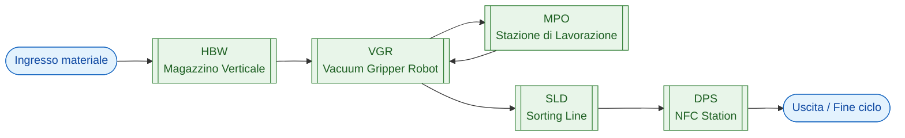
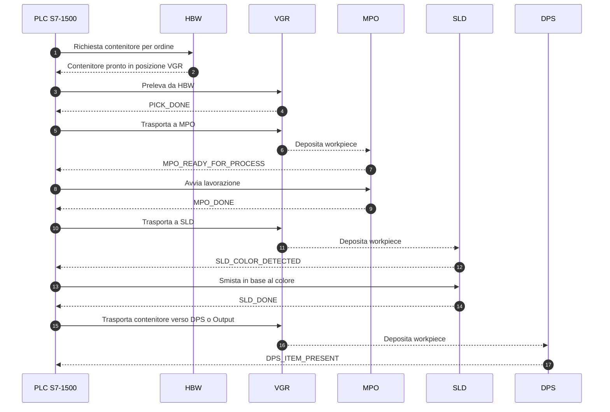
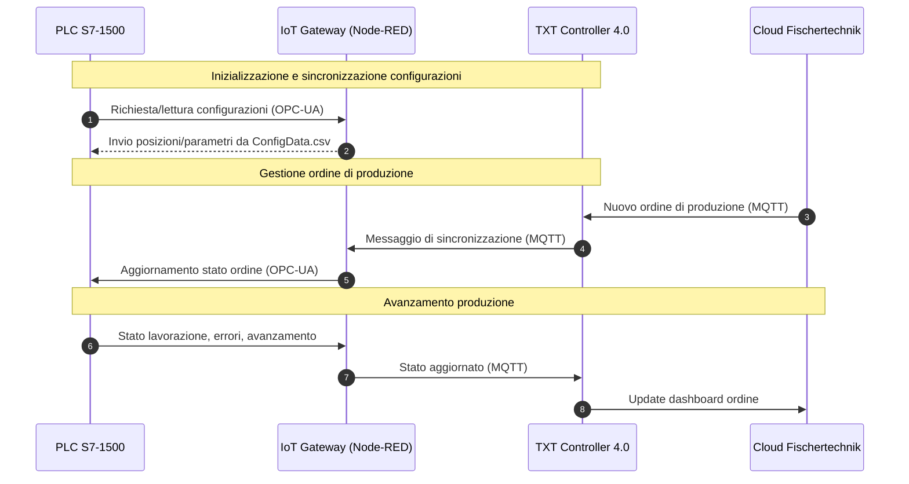
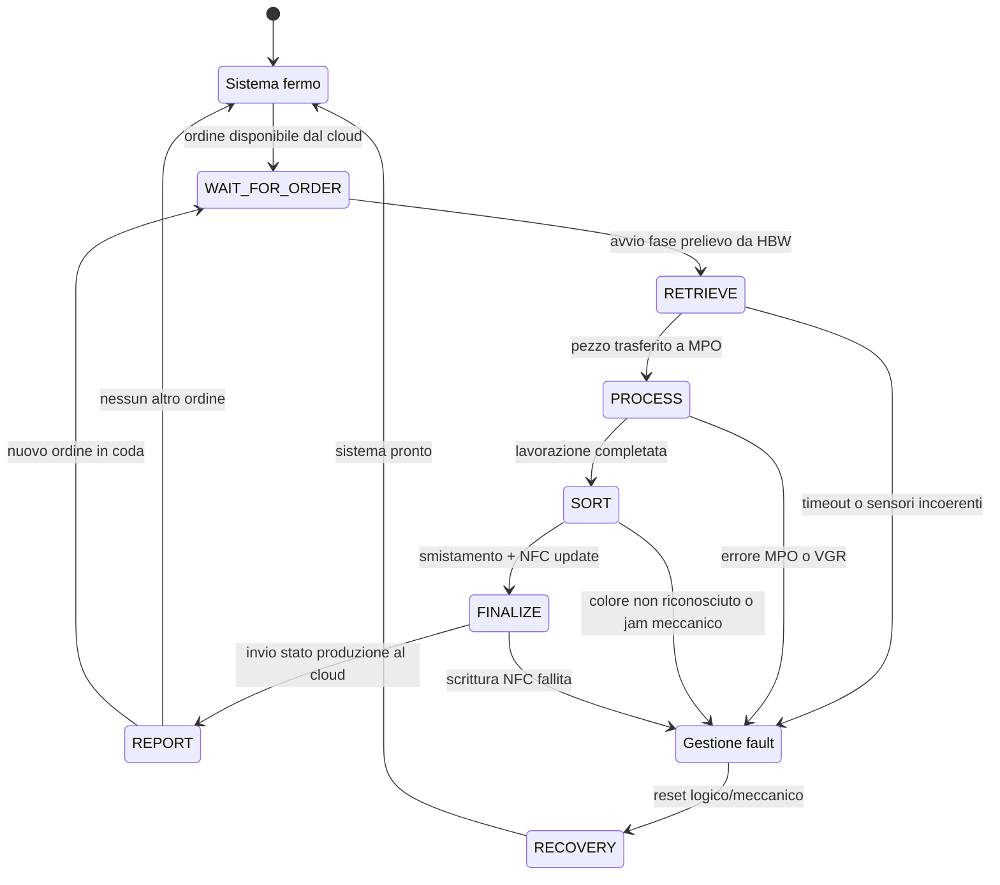
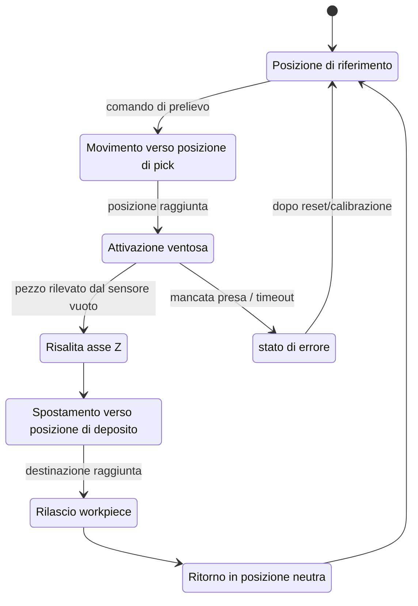
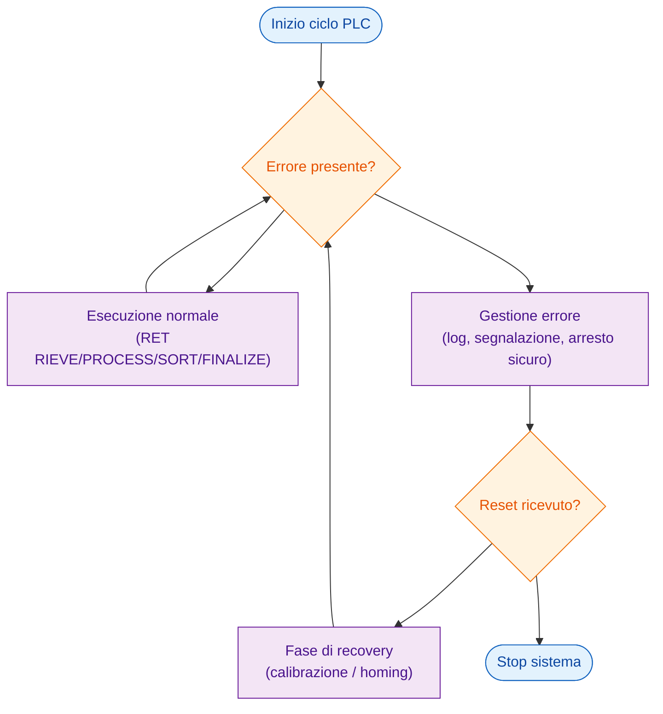

# 03. Flussi Operativi della Microfactory

In questa sezione vengono modellati i **flussi logici e operativi** della Learning Factory 4.0, con particolare attenzione a:
- flusso produttivo end-to-end (material flow),
- interazione tra le stazioni meccatroniche e il PLC,
- flusso di comunicazione tra PLC, IoT Gateway, TXT Controller e Cloud,
- stati operativi globali del sistema (state machine).

L’obiettivo è fornire una vista **concettuale e architetturale** della microfactory, complementare alla descrizione puntuale dei singoli moduli hardware (sezione 02).

---

## 03.1 Flusso Produttivo End-to-End (Material Flow)

Questa flowchart rappresenta il percorso tipico di un workpiece dalla fase di ingresso fino all’uscita, attraversando tutte le principali stazioni.

Questa rappresentazione serve come **overview compatta** per spiegare il percorso standard del pezzo all’interno della fabbrica.

---

## 03.2 Sequence Diagram – Interazione PLC e Stazioni Meccatroniche

Di seguito un **sequence diagram** semplificato che mostra la sequenza di messaggi tra PLC e stazioni principali durante l’elaborazione di un singolo workpiece.

Questo diagramma è utile per spiegare la **coreografia di controllo** implementata nel PLC tramite i vari blocchi funzionali.

---

## 03.3 Sequence Diagram – Flusso di Comunicazione IoT (PLC ↔ Gateway ↔ TXT ↔ Cloud)

Qui viene rappresentato il flusso dei dati e dei comandi tra i livelli OT/IT.

Questo livello di dettaglio è fondamentale per descrivere la natura **cyber-fisica** del sistema: il PLC controlla il processo, ma l’IoT Gateway e il TXT gestiscono comunicazione, configurazioni e cloud.

---

## 03.4 State Machine – Stati Globali della Microfactory

La seguente macchina a stati descrive gli **stati operativi globali** del sistema, così come coordinati dal PLC.

Questa vista è utile per descrivere il comportamento della **logica di supervisione** implementata nel PLC (tipicamente nel blocco `FB_SYSTEM` o equivalente).

---

## 03.5 State Machine – VGR (Esempio di Sotto-Macchina a Stati)

Come esempio di approfondimento, il VGR può essere modellato come una sotto-macchina a stati.

Questo schema può essere citato e riutilizzato nella descrizione del blocco funzionale `FB_VGR` e nella documentazione degli algoritmi di controllo.

---

## 03.6 Flowchart – Gestione degli Errori

Infine, una flowchart di alto livello per rappresentare la logica generale di gestione degli errori.

Questa parte è particolarmente utile per spiegare, **come il sistema reagisce a condizioni di malfunzionamento**.

---

