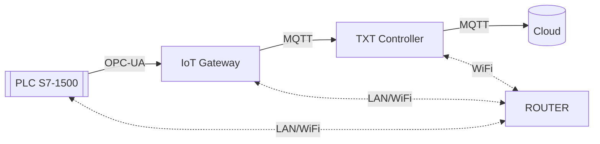
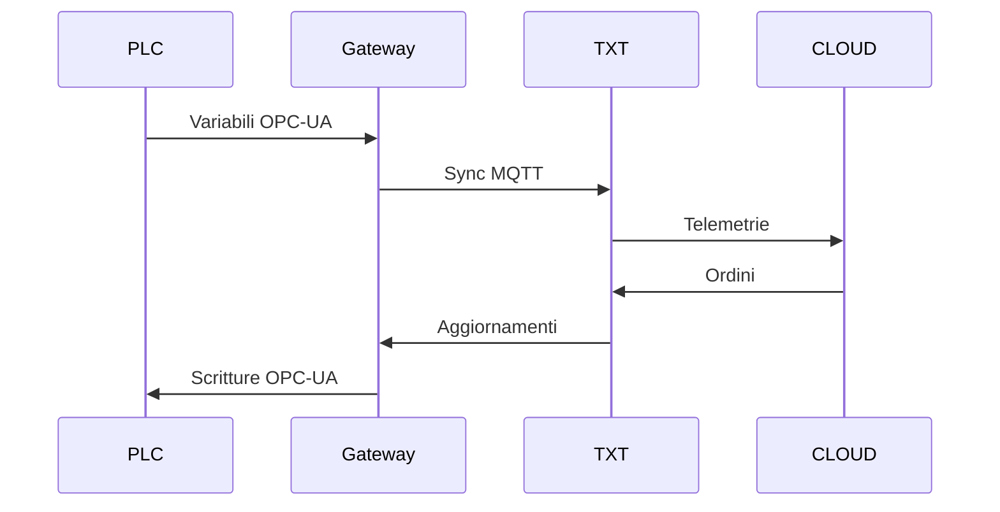

# 04 – Protocolli e Rete

## 1. Architettura di comunicazione
La comunicazione della microfactory combina protocolli industriali e IoT. Il PLC gestisce il controllo di processo tramite OPC-UA, mentre Gateway, TXT e Cloud scambiano dati su MQTT. Il router TP-Link mantiene la rete locale e il collegamento verso Internet.

## 2. OPC-UA (PLC → IoT Gateway)
OPC-UA gestisce lo scambio dati tra PLC e Gateway con modalità affidabile e strutturata. Il PLC espone variabili come posizioni, stati dei moduli, avanzamento del ciclo e segnalazioni d’errore. Il Gateway accede a questi dati tramite sessioni OPC-UA e li utilizza per sincronizzare configurazioni, aggiornare dashboard locali e inoltrare informazioni al resto della catena.

## 3. MQTT (Gateway ↔ TXT ↔ Cloud)
MQTT permette comunicazioni leggere e continue tra Gateway, TXT e Cloud. Il modello publish/subscribe assicura uno scambio dati costante senza appesantire la rete. Il TXT invia telemetrie (sensori, NFC, camera) e riceve ordini o aggiornamenti dal Cloud. I topic principali sono:
- `/factory/txt/env` – dati ambientali SSC
- `/factory/txt/nfc` – letture NFC
- `/factory/txt/cmd` – comandi dal Cloud
- `/factory/plc/sync` – sincronizzazioni tra Gateway e PLC

## 4. Flusso dei dati
Il flusso seguente riassume come viaggiano comandi e informazioni tra i vari livelli.

## 5. Indirizzi IP e rete
La rete interna segue uno schema semplice e stabile:
- Router: `192.168.0.252`
- Gateway: `192.168.0.5`
- TXT: `192.168.0.10`
- PLC: configurato via LAN
- Subnet: `255.255.255.0`
- Router in modalità WISP per collegamento alla rete esterna

## 6. Porte utilizzate
| Servizio | Porta | Funzione |
|---------|--------|----------|
| OPC-UA | 4840 | Scambio PLC–Gateway |
| MQTT | 1883 | Telemetria e comandi |
| HTTP | 1880 | Dashboard Node-RED |

## 7. Sincronizzazione
La sincronizzazione tra livelli avviene in modo continuo:
1. Il Gateway carica `ConfigData.csv` e valuta parametri e posizioni.
2. Il PLC legge i valori tramite OPC-UA e aggiorna la logica di controllo.
3. Il TXT riceve ordini dal Cloud e invia telemetria in tempo reale.
4. Il Gateway traduce messaggi tra TXT e PLC, mantenendo allineati controllo, IoT e Cloud.

## 8. Sicurezza di rete
La rete è isolata all’interno della subnet locale. Il router utilizza WPA2/WPA3 e mantiene separato l’accesso Internet dai dispositivi industriali. Il PLC non è esposto direttamente, mentre il Cloud comunica solo tramite MQTT autenticato.

## 9. Struttura complessiva
L’integrazione tra OPC-UA e MQTT consente alla microfactory di combinare controllo industriale deterministico con funzionalità IoT e supervisione remota, mantenendo la rete semplice e facilmente estendibile.

