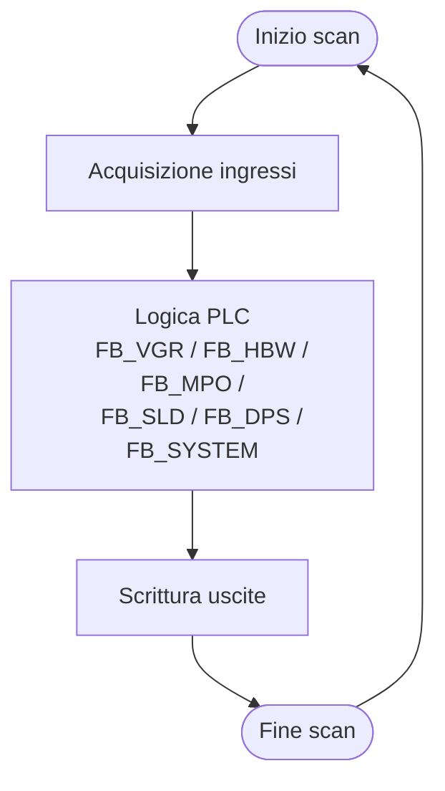
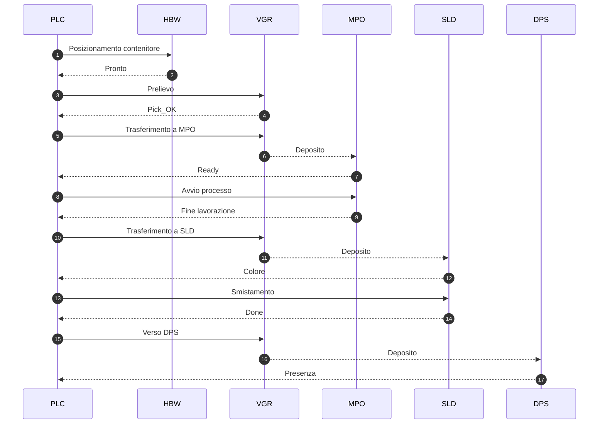
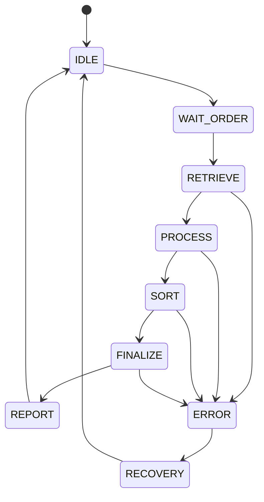

# 05 – Logica di Controllo

## 1. Struttura generale
La logica di controllo coordina tutte le stazioni della microfactory attraverso il PLC Siemens S7‑1500. Il comportamento del sistema è suddiviso in fasi operative con transizioni basate su segnali, sensori e conferme.

## 2. Ciclo principale
Il PLC esegue un ciclo deterministico che comprende:
- lettura ingressi;
- esecuzione dei blocchi funzionali;
- aggiornamento stati;
- scrittura uscite.

## 3. Coordinamento dei moduli
La supervisione globale è gestita dal blocco principale (FB_SYSTEM). Ogni stazione ha un proprio blocco dedicato che gestisce: condizioni di esecuzione, timeout, errori e conferme.

| Blocco | Stazione | Funzioni principali |
|--------|----------|---------------------|
| FB_VGR | VGR | movimenti assi, presa/rilascio, sicurezza finecorsa |
| FB_HBW | HBW | posizionamento verticale/orizzontale, gestione slot |
| FB_MPO | MPO | controllo piano, lavorazione termica, timer |
| FB_SLD | SLD | rilevamento colore, smistamento |
| FB_DPS | DPS | presenza pezzo, sincronizzazione NFC |
| FB_SYSTEM | Sistema | sequenze globali, stati macchina, errori |

## 4. Sequenza operativa
La produzione segue una sequenza fissa gestita dal PLC.

## 5. Stati del sistema

## 6. Gestione errori
Il PLC rileva condizioni anomale tramite sensori, mancate conferme, tempi massimi superati o incoerenze. Le principali categorie sono:
- errori di movimento (assi VGR, HBW, MPO);
- errori di posizione o finecorsa;
- errori di sensori (colore, presenza, NFC);
- timeout operativi.

Il sistema passa allo stato ERROR e attende reset o intervento.

## 7. Transizioni e sincronizzazione
Ogni transizione tra fasi richiede:
- conferma del modulo precedente;
- assenza di errori;
- segnale di pronto per la fase successiva.

La sincronizzazione mantiene coerente l'intera pipeline produttiva.

