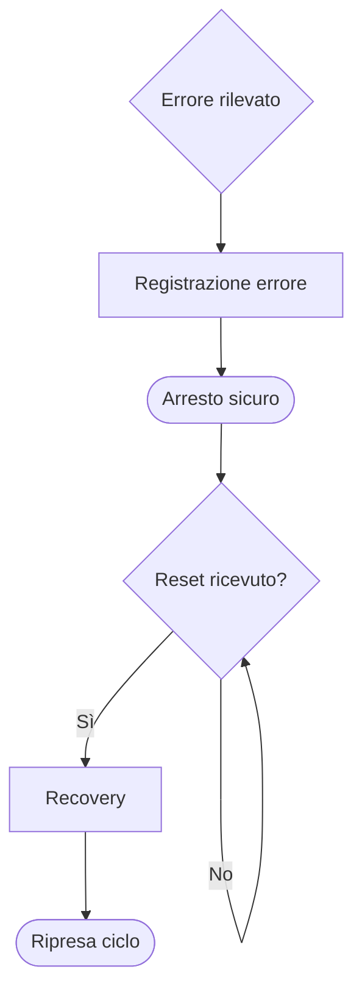
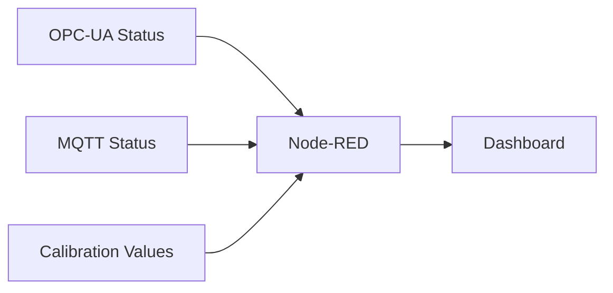
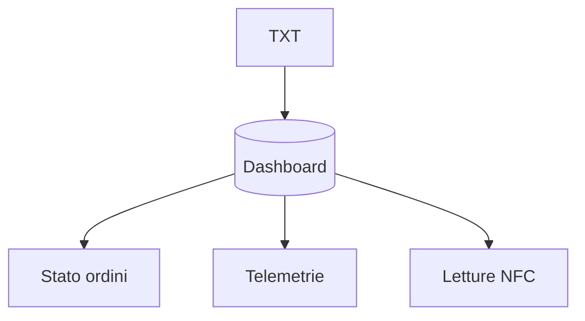

# 06 – Supervisione e Diagnostica

## 1. Struttura generale
La supervisione della microfactory si basa su tre livelli:
- **PLC**: diagnosi locale, errori di processo, stati delle stazioni.
- **IoT Gateway (Node-RED)**: dashboard, log di comunicazione, calibrazioni.
- **TXT Controller / Cloud**: monitoraggio remoto, telemetrie e stato ordini.

---

## 2. Diagnostica PLC
Il PLC effettua controlli continui su sensori, attuatori e tempi di esecuzione.

### 2.1 Tipologie di errore
- Finecorsa non raggiunto.
- Timeout movimento.
- Sensore non coerente.
- Presa VGR non riuscita.
- Colore non rilevato.
- Mancata presenza workpiece.

### 2.2 Segnali diagnostici
- `ERROR_STATE`
- `SENSOR_FAULT`
- `TIMEOUT_FLAG`
- `MODULE_BUSY`
- `MODULE_READY`

### 2.3 Comportamento in errore
Il PLC entra nello stato **ERROR**, interrompe la sequenza e attende un reset.

---

## 3. Diagnostica IoT Gateway (Node-RED)
Il Gateway fornisce strumenti di supervisione in tempo reale tramite dashboard.

### 3.1 Funzioni principali
- Monitoraggio stati PLC via OPC-UA.
- Visualizzazione posizioni e calibrazioni.
- Log MQTT in ingresso/uscita.
- Caricamento/scaricamento `ConfigData.csv`.

### 3.2 Indicatori tipici
- Stato connessione OPC-UA.
- Stato broker MQTT.
- Ultimo messaggio TXT.
- Errori di parsing o sincronizzazione.

---

## 4. Diagnostica TXT Controller
Il TXT si occupa della parte IoT e fornisce:
- valori sensori ambientali;
- risultati letture NFC;
- immagini e movimento camera;
- messaggi di stato verso il Gateway.

### 4.1 Errori tipici
- Lettura NFC fallita.
- Movimenti pan/tilt non eseguiti.
- Mancata connessione Wi-Fi.

### 4.2 Segnali diagnostici MQTT
- `NFC_ERROR`
- `CAMERA_ERROR`
- `WIFI_LOST`
- `ENV_DATA_OK`

---

## 5. Supervisione Cloud
La dashboard Cloud mostra:
- stato ordini;
- avanzamento produzione;
- storico letture NFC;
- telemetrie ambientali;
- immagini acquisite.

---

## 6. Intervento e manutenzione
La gestione operativa in caso di problemi segue un flusso semplice:

1. Identificazione errore (PLC / Gateway / Cloud).
2. Conferma origine (modulo fisico, sensore, comunicazione).
3. Reset modulo tramite HMI o PLC.
4. Verifica movimenti manuali.
5. Ripristino sequenza nel PLC.

---

## 7. Registrazione eventi
Gli eventi possono essere registrati su:
- log PLC (errori e transizioni stati);
- log Node-RED (messaggi OPC-UA e MQTT);
- storico Cloud (azioni su ordini e letture NFC).

---

## 8. Obiettivo della diagnostica
Garantire continuità di funzionamento, individuare rapidamente la causa di un guasto e mantenere sincronizzati tutti i livelli del sistema, dal PLC al Cloud.

