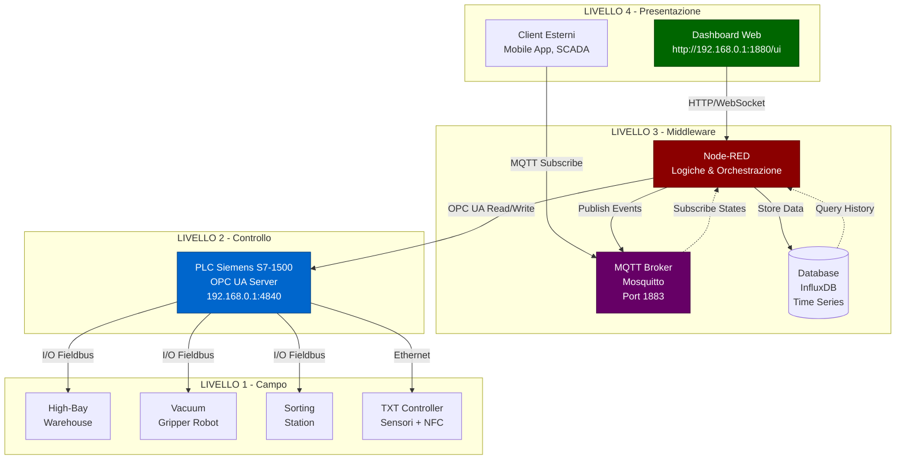
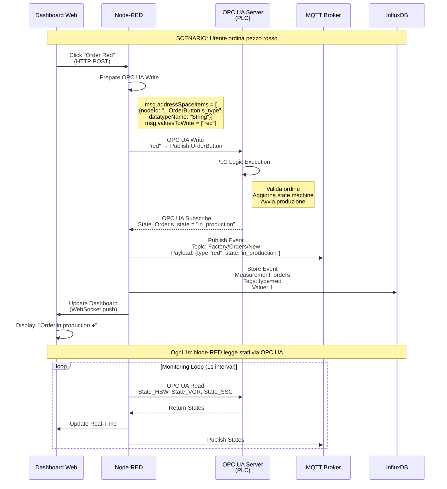
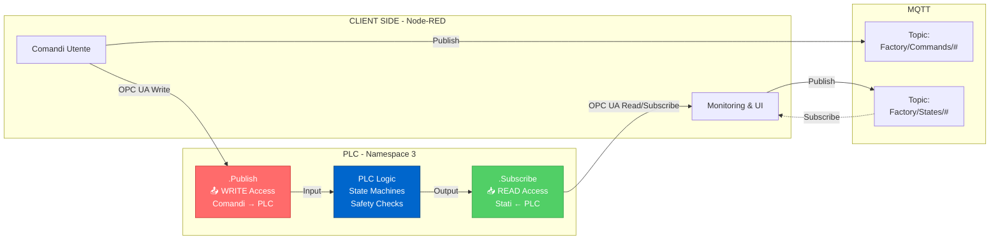
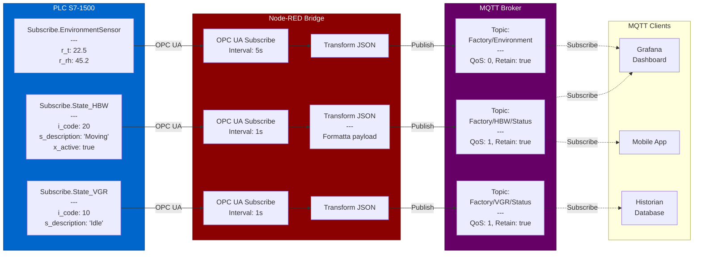
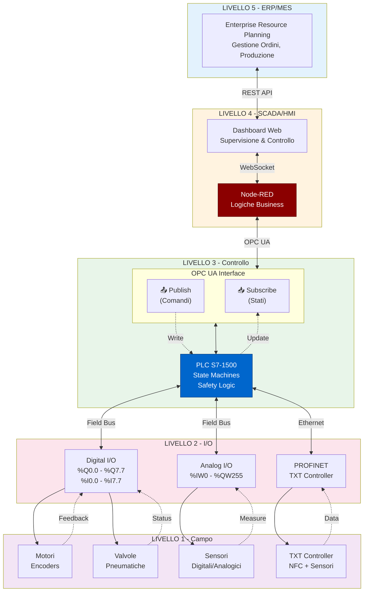
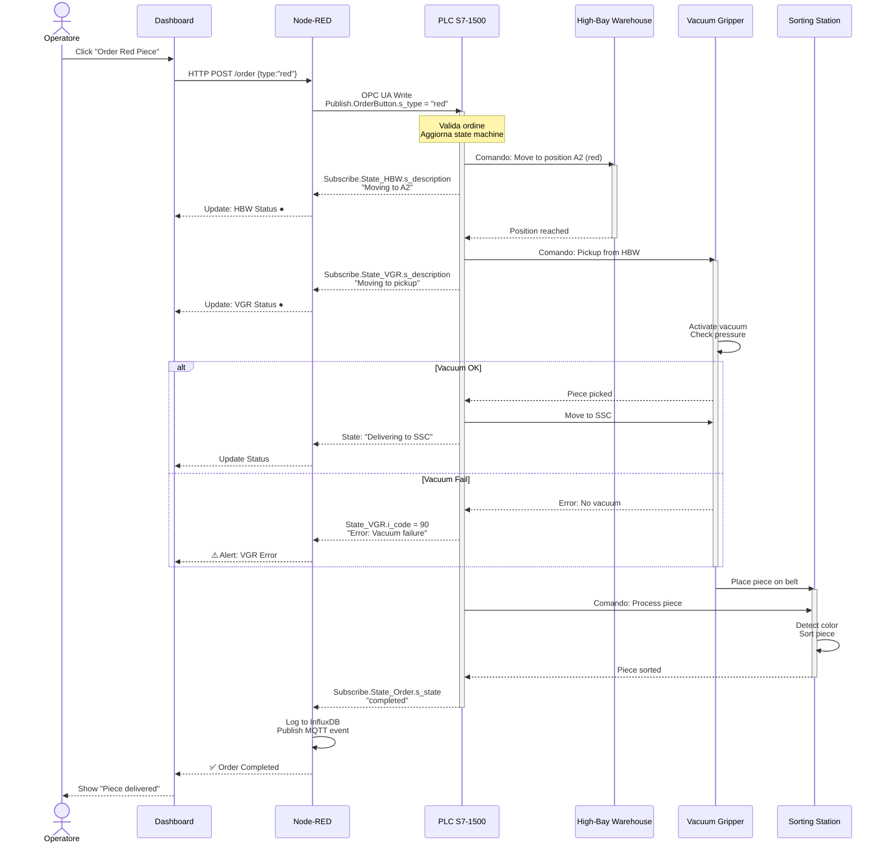
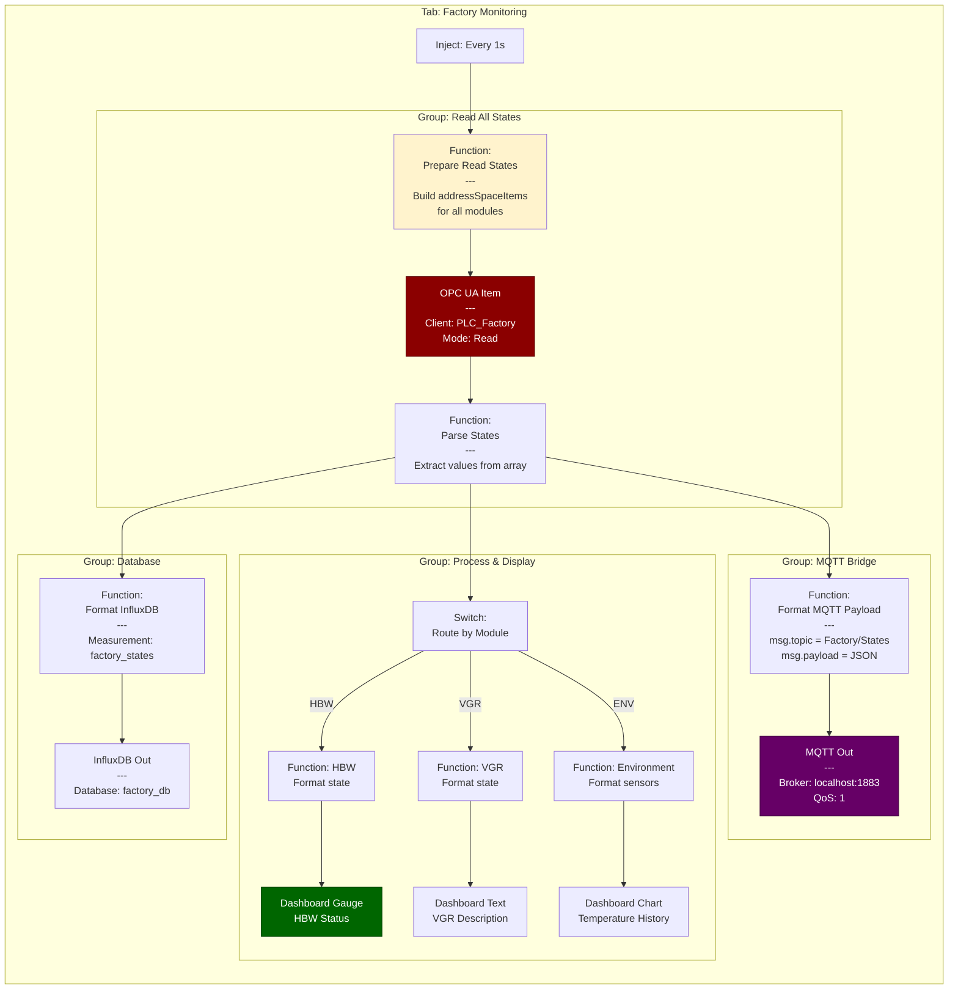

# Diagrammi Architettura Learning Factory 4.0

## 1. Architettura Completa Sistema



---

## 2. Flusso Dati Publish/Subscribe



---

## 3. Logica Publish vs Subscribe



---

## 4. Pattern Node-RED: Comando → Feedback

```mermaid
graph TB
    subgraph "Flow Node-RED"
        START[Dashboard Button<br/>'Move Camera Left']

        FUNC1[Function: Build Command<br/>---<br/>msg.addressSpaceItems = [nodeId]<br/>msg.valuesToWrite = ['relmove_left', 15]]

        WRITE[OPC-UA Write Node<br/>---<br/>Endpoint: 192.168.0.1:4840<br/>NodeId: Publish.PosPanTiltUnit]

        WAIT[Delay 200ms<br/>Tempo esecuzione comando]

        FUNC2[Function: Prepare Read<br/>---<br/>msg.addressSpaceItems = [<br/>  Subscribe.PosPanTiltUnit.r_pan]]

        READ[OPC-UA Read Node<br/>---<br/>Leggi feedback posizione]

        PARSE[Function: Parse Response<br/>---<br/>pan_angle = msg.payload.value[0]]

        UI_UPDATE[Dashboard Gauge<br/>Mostra angolo corrente]

        MQTT_PUB[MQTT Out<br/>---<br/>Topic: Factory/Camera/Position<br/>Payload: {pan: 45, tilt: 30}]

        DB_WRITE[InfluxDB Out<br/>---<br/>Measurement: camera_position<br/>Field: pan_angle]
    end

    START --> FUNC1
    FUNC1 --> WRITE
    WRITE --> WAIT
    WAIT --> FUNC2
    FUNC2 --> READ
    READ --> PARSE
    PARSE --> UI_UPDATE
    PARSE --> MQTT_PUB
    PARSE --> DB_WRITE

    style WRITE fill:#8b0000,stroke:#5a0000,color:#fff
    style READ fill:#8b0000,stroke:#5a0000,color:#fff
    style MQTT_PUB fill:#660066,stroke:#400040,color:#fff
    style UI_UPDATE fill:#006600,stroke:#003d00,color:#fff
```

---

## 5. Bridge OPC UA → MQTT



---

## 6. Architettura a Livelli (Industry 4.0)



---

## 7. Sequence Diagram: Ciclo Completo Produzione



---

## 8. Node-RED Flow Visuale (Esempio Monitoring)



---

## Come Usare i Diagrammi

### In Markdown/GitHub
Copia-incolla direttamente - il rendering Mermaid è automatico

### In Documento Word/PDF
1. Usa editor online: https://mermaid.live
2. Incolla codice Mermaid
3. Esporta come PNG/SVG
4. Inserisci immagine nel documento

### In Presentazione PowerPoint
1. Usa https://mermaid.ink
2. Converti in immagine high-res
3. Drag & drop nella slide

---
